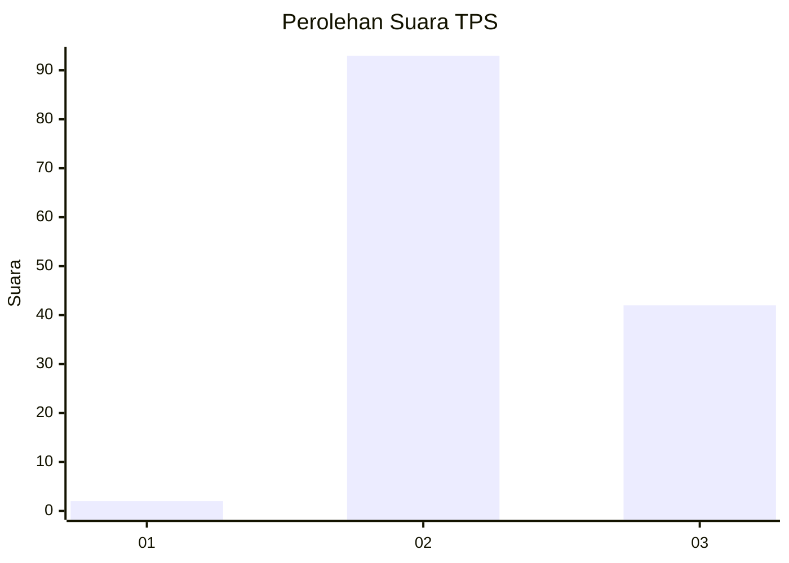
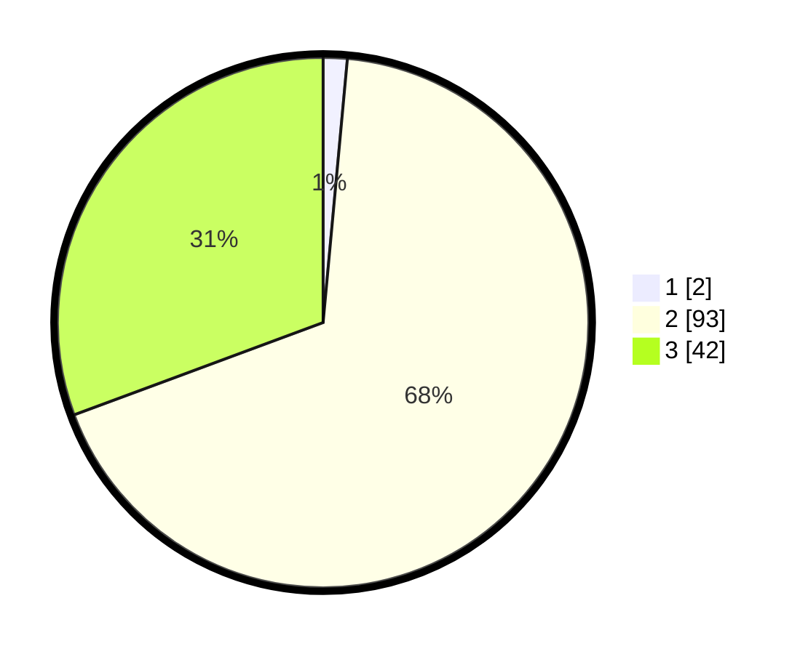

# Hasil

## Grafik

## Tabel

| No. | Nama Paslon    | Suara | Suara (raw) | Persentase |
|:--- |:-------------- | -----:| -----------:| ----------:|
| 1   | ANIES MUHAIMIN | 2     | [2][p-1]    | 1,46       |
| 2   | PRABOWO GIBRAN | 93    | [93][p-2]   | 67,88      |
| 3   | GANJAR MAHFUD  | 42    | [42][p-3]   | 30,66      |

[p-1]: https://github.com/gigit-pemilu/pemilu-2024/blob/main/pilpres/hitung-suara/sub/12-sumatera-utara/sub/14-nias-selatan/sub/12-toma/sub/2009-hilisataro-gewa/sub/001-tps/sub/paslon-1.txt
[p-2]: https://github.com/gigit-pemilu/pemilu-2024/blob/main/pilpres/hitung-suara/sub/12-sumatera-utara/sub/14-nias-selatan/sub/12-toma/sub/2009-hilisataro-gewa/sub/001-tps/sub/paslon-2.txt
[p-3]: https://github.com/gigit-pemilu/pemilu-2024/blob/main/pilpres/hitung-suara/sub/12-sumatera-utara/sub/14-nias-selatan/sub/12-toma/sub/2009-hilisataro-gewa/sub/001-tps/sub/paslon-3.txt

## Foto C Plano

https://sirekap-obj-formc.kpu.go.id/2ba5/pemilu/ppwp/12/14/12/20/09/1214122009001-20240215-041126--e8453253-e464-4c56-a352-3d0abb5cdd4f.jpg

https://sirekap-obj-formc.kpu.go.id/2ba5/pemilu/ppwp/12/14/12/20/09/1214122009001-20240215-041226--5c62f25b-3e70-459d-b3a3-bc60bcf7a88f.jpg

https://sirekap-obj-formc.kpu.go.id/2ba5/pemilu/ppwp/12/14/12/20/09/1214122009001-20240215-041602--8f4fcc7d-34b1-44b3-8bf4-4692b5ca6e71.jpg

## Metadata

| Key        | Value               |
| ---------- | ------------------- |
| Time Stamp | 2024-02-15 15:00:29 |

