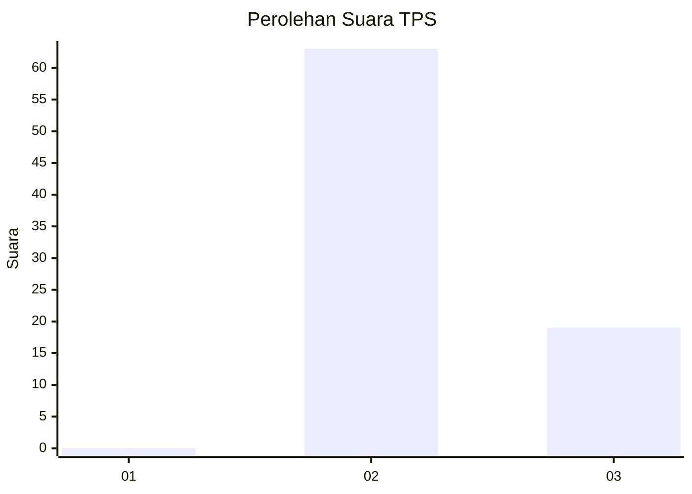
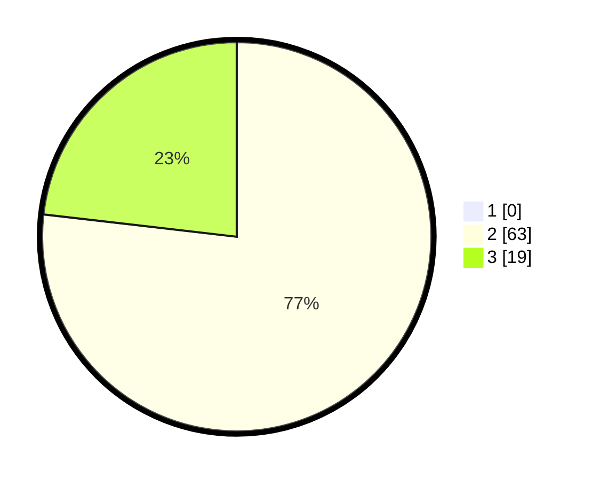

# Hasil

## Grafik

## Tabel

| No. | Nama Paslon    | Suara | Suara (raw) | Persentase |
|:--- |:-------------- | -----:| -----------:| ----------:|
| 1   | ANIES MUHAIMIN | 0     | [0][p-1]    | 0,00       |
| 2   | PRABOWO GIBRAN | 63    | [63][p-2]   | 76,83      |
| 3   | GANJAR MAHFUD  | 19    | [19][p-3]   | 23,17      |

[p-1]: https://github.com/gigit-pemilu/pemilu-2024-12-sumatera-utara/blob/main/pilpres/hitung-suara/sub/12-sumatera-utara/sub/14-nias-selatan/sub/12-toma/sub/2009-hilisataro-gewa/sub/002-tps/sub/paslon-1.txt
[p-2]: https://github.com/gigit-pemilu/pemilu-2024-12-sumatera-utara/blob/main/pilpres/hitung-suara/sub/12-sumatera-utara/sub/14-nias-selatan/sub/12-toma/sub/2009-hilisataro-gewa/sub/002-tps/sub/paslon-2.txt
[p-3]: https://github.com/gigit-pemilu/pemilu-2024-12-sumatera-utara/blob/main/pilpres/hitung-suara/sub/12-sumatera-utara/sub/14-nias-selatan/sub/12-toma/sub/2009-hilisataro-gewa/sub/002-tps/sub/paslon-3.txt

## Foto C Plano

https://sirekap-obj-formc.kpu.go.id/05c8/pemilu/ppwp/12/14/12/20/09/1214122009002-20240215-012602--89a2efae-d679-4879-81e1-0f167578d226.jpg

https://sirekap-obj-formc.kpu.go.id/05c8/pemilu/ppwp/12/14/12/20/09/1214122009002-20240215-014814--df894592-2634-4da9-b899-daec7726411d.jpg

https://sirekap-obj-formc.kpu.go.id/05c8/pemilu/ppwp/12/14/12/20/09/1214122009002-20240215-012837--6dff8394-0ab6-47e7-b5cf-a02e79d4e926.jpg

## Metadata

| Key        | Value               |
| ---------- | ------------------- |
| Time Stamp | 2024-02-15 15:30:25 |

