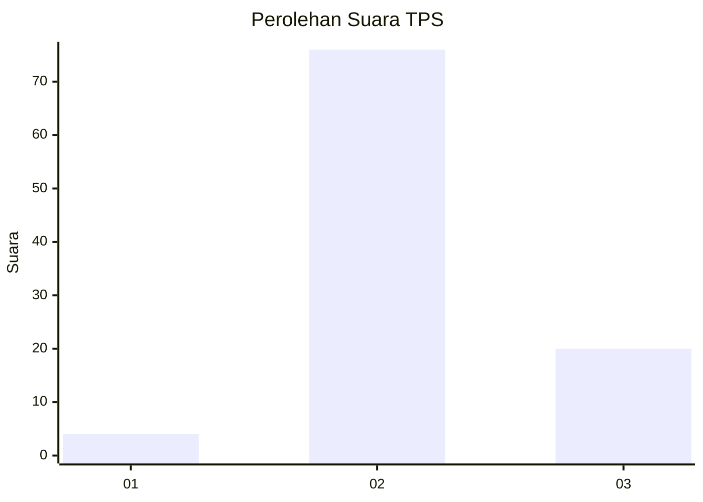

# Hasil

## Grafik

## Tabel

| No. | Nama Paslon    | Suara | Suara (raw) | Persentase |
|:--- |:-------------- | -----:| -----------:| ----------:|
| 1   | ANIES MUHAIMIN | 4     | [4][p-1]    | 4,00       |
| 2   | PRABOWO GIBRAN | 76    | [76][p-2]   | 76,00      |
| 3   | GANJAR MAHFUD  | 20    | [20][p-3]   | 20,00      |

[p-1]: https://github.com/gigit-pemilu/pemilu-2024-12-sumatera-utara/blob/main/pilpres/hitung-suara/sub/12-sumatera-utara/sub/14-nias-selatan/sub/12-toma/sub/2009-hilisataro-gewa/sub/003-tps/sub/paslon-1.txt
[p-2]: https://github.com/gigit-pemilu/pemilu-2024-12-sumatera-utara/blob/main/pilpres/hitung-suara/sub/12-sumatera-utara/sub/14-nias-selatan/sub/12-toma/sub/2009-hilisataro-gewa/sub/003-tps/sub/paslon-2.txt
[p-3]: https://github.com/gigit-pemilu/pemilu-2024-12-sumatera-utara/blob/main/pilpres/hitung-suara/sub/12-sumatera-utara/sub/14-nias-selatan/sub/12-toma/sub/2009-hilisataro-gewa/sub/003-tps/sub/paslon-3.txt

## Foto C Plano

https://sirekap-obj-formc.kpu.go.id/8e8f/pemilu/ppwp/12/14/12/20/09/1214122009003-20240215-032534--e2559429-9c2c-4bf8-a6b1-12fd8c95c461.jpg

https://sirekap-obj-formc.kpu.go.id/8e8f/pemilu/ppwp/12/14/12/20/09/1214122009003-20240215-014134--8fda4b17-cdd4-4e59-b4df-a93feba0bdf7.jpg

https://sirekap-obj-formc.kpu.go.id/8e8f/pemilu/ppwp/12/14/12/20/09/1214122009003-20240215-014325--db604dba-6c02-45dc-a75f-996c2775acd0.jpg

## Metadata

| Key        | Value               |
| ---------- | ------------------- |
| Time Stamp | 2024-02-15 23:29:50 |

