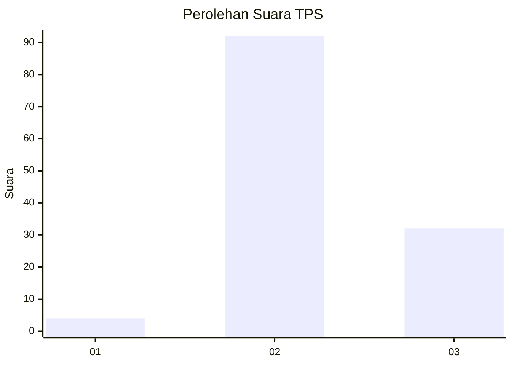
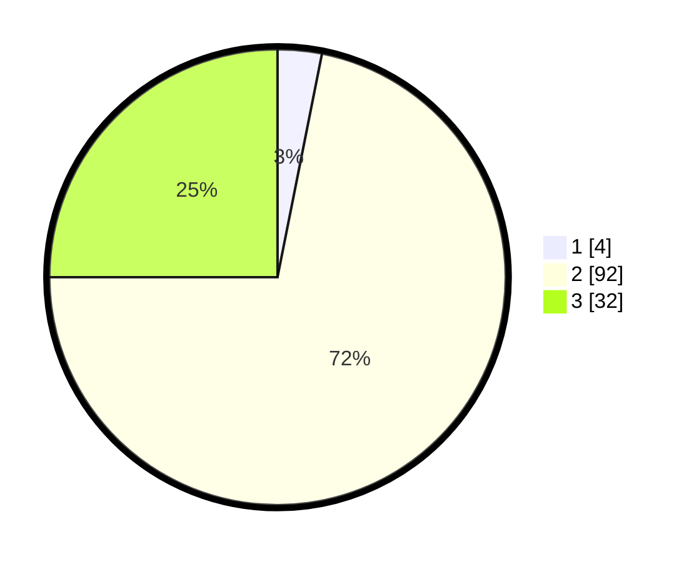

# Hasil

## Grafik

## Tabel

| No. | Nama Paslon    | Suara | Suara (raw) | Persentase |
|:--- |:-------------- | -----:| -----------:| ----------:|
| 1   | ANIES MUHAIMIN | 4     | [4][p-1]    | 3,13       |
| 2   | PRABOWO GIBRAN | 92    | [92][p-2]   | 71,88      |
| 3   | GANJAR MAHFUD  | 32    | [32][p-3]   | 25,00      |

[p-1]: https://github.com/gigit-pemilu/pemilu-2024/blob/main/pilpres/hitung-suara/sub/12-sumatera-utara/sub/14-nias-selatan/sub/12-toma/sub/2014-hilisataro-eho-sofayo/sub/002-tps/sub/paslon-1.txt
[p-2]: https://github.com/gigit-pemilu/pemilu-2024/blob/main/pilpres/hitung-suara/sub/12-sumatera-utara/sub/14-nias-selatan/sub/12-toma/sub/2014-hilisataro-eho-sofayo/sub/002-tps/sub/paslon-2.txt
[p-3]: https://github.com/gigit-pemilu/pemilu-2024/blob/main/pilpres/hitung-suara/sub/12-sumatera-utara/sub/14-nias-selatan/sub/12-toma/sub/2014-hilisataro-eho-sofayo/sub/002-tps/sub/paslon-3.txt

## Foto C Plano

https://sirekap-obj-formc.kpu.go.id/ed6d/pemilu/ppwp/12/14/12/20/14/1214122014002-20240215-064407--a8fdfc7e-16e2-48ac-8dba-a47731524444.jpg

https://sirekap-obj-formc.kpu.go.id/ed6d/pemilu/ppwp/12/14/12/20/14/1214122014002-20240215-064617--3b493b88-8254-4da9-8069-30bc3deb01bf.jpg

https://sirekap-obj-formc.kpu.go.id/ed6d/pemilu/ppwp/12/14/12/20/14/1214122014002-20240215-065158--423fb22f-4710-4fe4-9905-e57ce08ae993.jpg

## Metadata

| Key        | Value               |
| ---------- | ------------------- |
| Time Stamp | 2024-02-15 15:00:29 |

