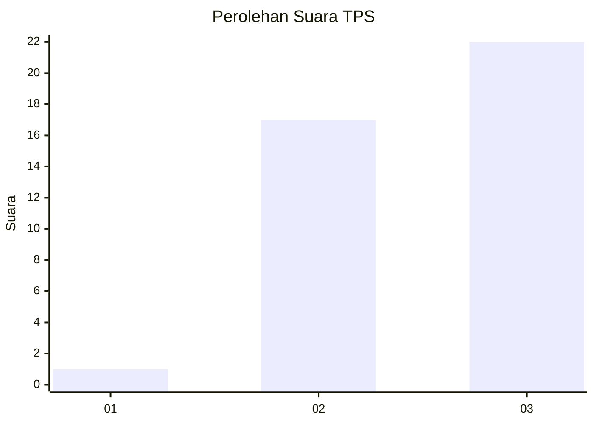
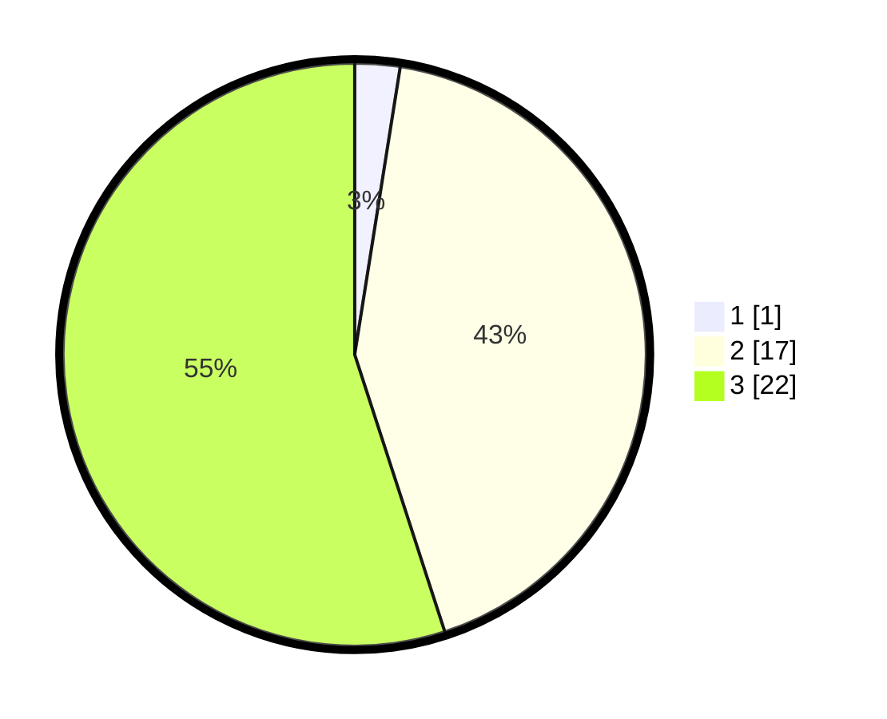

# Hasil

## Grafik

## Tabel

| No. | Nama Paslon    | Suara | Suara (raw) | Persentase |
|:--- |:-------------- | -----:| -----------:| ----------:|
| 1   | ANIES MUHAIMIN | 1     | [1][p-1]    | 2,50       |
| 2   | PRABOWO GIBRAN | 17    | [17][p-2]   | 42,50      |
| 3   | GANJAR MAHFUD  | 22    | [22][p-3]   | 55,00      |

[p-1]: https://github.com/gigit-pemilu/pemilu-2024/blob/main/pilpres/hitung-suara/sub/12-sumatera-utara/sub/14-nias-selatan/sub/13-mazino/sub/2002-hilinawalo-mazino/sub/001-tps/sub/paslon-1.txt
[p-2]: https://github.com/gigit-pemilu/pemilu-2024/blob/main/pilpres/hitung-suara/sub/12-sumatera-utara/sub/14-nias-selatan/sub/13-mazino/sub/2002-hilinawalo-mazino/sub/001-tps/sub/paslon-2.txt
[p-3]: https://github.com/gigit-pemilu/pemilu-2024/blob/main/pilpres/hitung-suara/sub/12-sumatera-utara/sub/14-nias-selatan/sub/13-mazino/sub/2002-hilinawalo-mazino/sub/001-tps/sub/paslon-3.txt

## Foto C Plano

https://sirekap-obj-formc.kpu.go.id/91e1/pemilu/ppwp/12/14/13/20/02/1214132002001-20240215-081804--e5ee7dfe-ebbb-4074-a2c0-8afe4bc3c75f.jpg

https://sirekap-obj-formc.kpu.go.id/91e1/pemilu/ppwp/12/14/13/20/02/1214132002001-20240214-230359--9c2cc97f-5426-41c7-a511-945a277c01ec.jpg

https://sirekap-obj-formc.kpu.go.id/91e1/pemilu/ppwp/12/14/13/20/02/1214132002001-20240214-230532--287f4def-5ffd-4c08-997b-98f53430be37.jpg

## Metadata

| Key        | Value               |
| ---------- | ------------------- |
| Time Stamp | 2024-02-15 15:00:29 |

