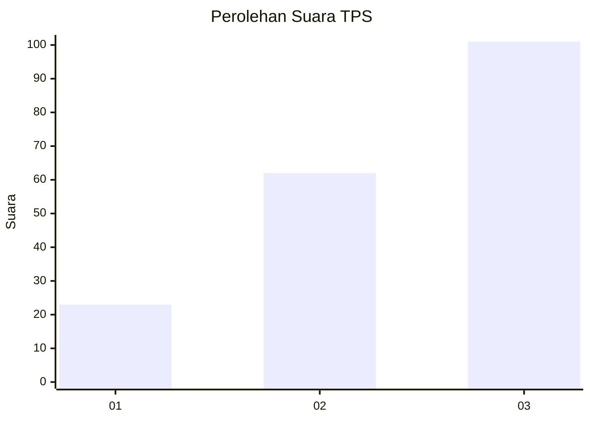
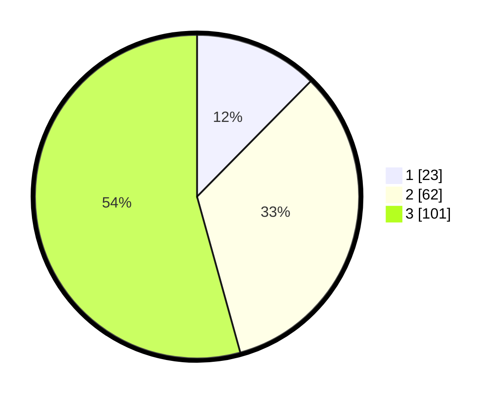

# Hasil

## Grafik

## Tabel

| No. | Nama Paslon    | Suara | Suara (raw) | Persentase |
|:--- |:-------------- | -----:| -----------:| ----------:|
| 1   | ANIES MUHAIMIN | 23    | [23][p-1]   | 12,37      |
| 2   | PRABOWO GIBRAN | 62    | [62][p-2]   | 33,33      |
| 3   | GANJAR MAHFUD  | 101   | [101][p-3]  | 54,30      |

[p-1]: https://github.com/gigit-pemilu/pemilu-2024/blob/main/pilpres/hitung-suara/sub/12-sumatera-utara/sub/14-nias-selatan/sub/13-mazino/sub/2005-hilizoroi-lawa/sub/001-tps/sub/paslon-1.txt
[p-2]: https://github.com/gigit-pemilu/pemilu-2024/blob/main/pilpres/hitung-suara/sub/12-sumatera-utara/sub/14-nias-selatan/sub/13-mazino/sub/2005-hilizoroi-lawa/sub/001-tps/sub/paslon-2.txt
[p-3]: https://github.com/gigit-pemilu/pemilu-2024/blob/main/pilpres/hitung-suara/sub/12-sumatera-utara/sub/14-nias-selatan/sub/13-mazino/sub/2005-hilizoroi-lawa/sub/001-tps/sub/paslon-3.txt

## Foto C Plano

https://sirekap-obj-formc.kpu.go.id/2545/pemilu/ppwp/12/14/13/20/05/1214132005001-20240215-184444--9fa5e1e6-53ca-4ed1-b755-36600f1f152f.jpg

https://sirekap-obj-formc.kpu.go.id/2545/pemilu/ppwp/12/14/13/20/05/1214132005001-20240215-181301--db7e82c7-6606-4957-ab75-fd6bb0271c4c.jpg

https://sirekap-obj-formc.kpu.go.id/2545/pemilu/ppwp/12/14/13/20/05/1214132005001-20240215-181445--918cf3e2-b420-4d62-83d6-213f4518d83b.jpg

## Metadata

| Key        | Value               |
| ---------- | ------------------- |
| Time Stamp | 2024-02-16 00:00:26 |

