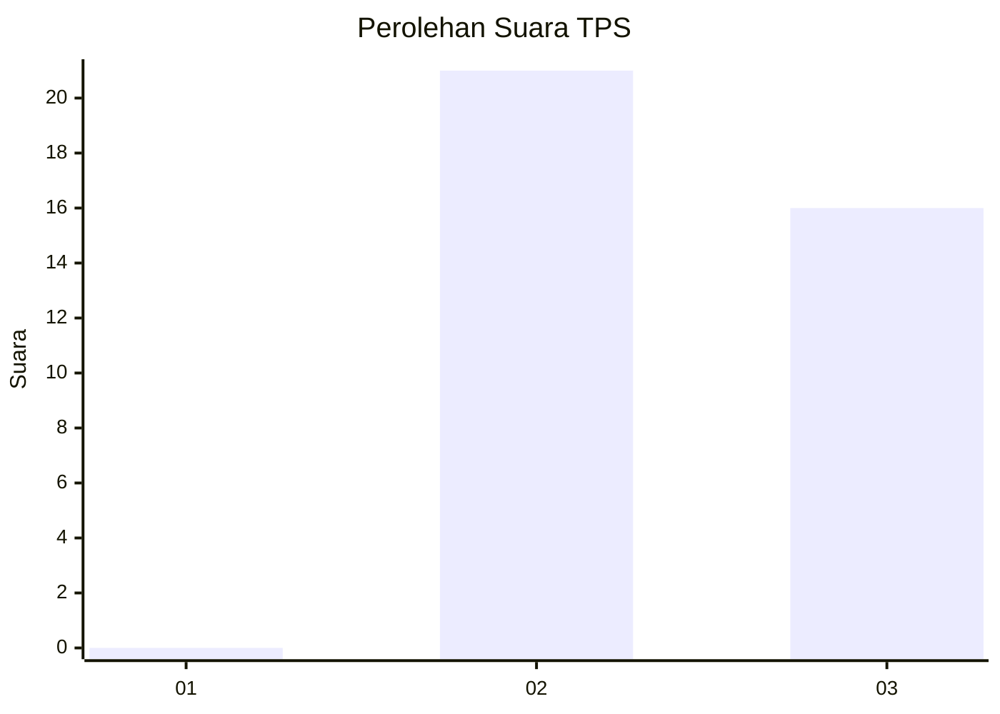
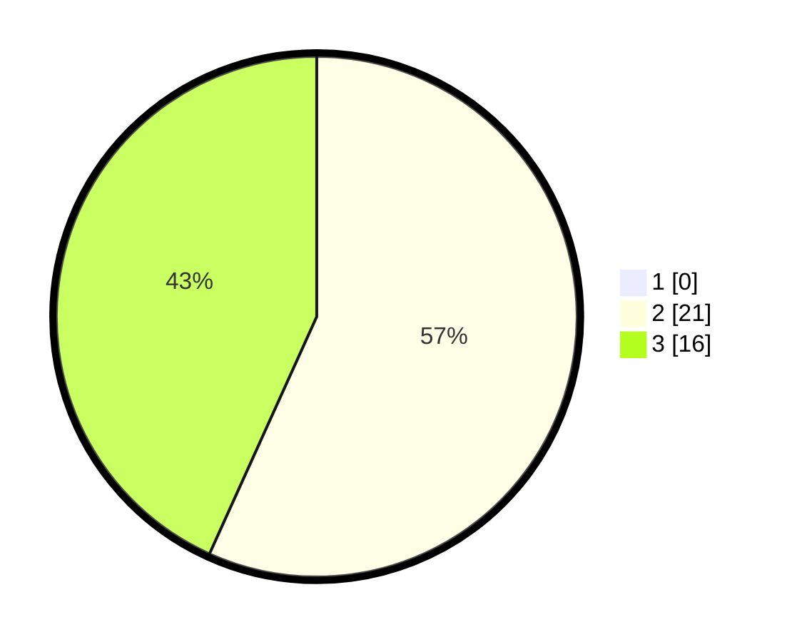

# Hasil

## Grafik

## Tabel

| No. | Nama Paslon    | Suara | Suara (raw) | Persentase |
|:--- |:-------------- | -----:| -----------:| ----------:|
| 1   | ANIES MUHAIMIN | 0     | [0][p-1]    | 0,00       |
| 2   | PRABOWO GIBRAN | 21    | [21][p-2]   | 56,76      |
| 3   | GANJAR MAHFUD  | 16    | [16][p-3]   | 43,24      |

[p-1]: https://github.com/gigit-pemilu/pemilu-2024/blob/main/pilpres/hitung-suara/sub/12-sumatera-utara/sub/14-nias-selatan/sub/13-mazino/sub/2008-hililaza-hilinawalo-mazino/sub/003-tps/sub/paslon-1.txt
[p-2]: https://github.com/gigit-pemilu/pemilu-2024/blob/main/pilpres/hitung-suara/sub/12-sumatera-utara/sub/14-nias-selatan/sub/13-mazino/sub/2008-hililaza-hilinawalo-mazino/sub/003-tps/sub/paslon-2.txt
[p-3]: https://github.com/gigit-pemilu/pemilu-2024/blob/main/pilpres/hitung-suara/sub/12-sumatera-utara/sub/14-nias-selatan/sub/13-mazino/sub/2008-hililaza-hilinawalo-mazino/sub/003-tps/sub/paslon-3.txt

## Foto C Plano

https://sirekap-obj-formc.kpu.go.id/4257/pemilu/ppwp/12/14/13/20/08/1214132008003-20240215-143646--06125e89-ae38-4bbb-b187-59905daf6564.jpg

https://sirekap-obj-formc.kpu.go.id/4257/pemilu/ppwp/12/14/13/20/08/1214132008003-20240215-143705--77c8a06c-36e9-4d1f-8648-de86a5d03338.jpg

https://sirekap-obj-formc.kpu.go.id/4257/pemilu/ppwp/12/14/13/20/08/1214132008003-20240215-143723--4edf7d1d-e3f9-4ae4-a786-af28d5de4b16.jpg

## Metadata

| Key        | Value               |
| ---------- | ------------------- |
| Time Stamp | 2024-02-15 23:29:50 |

