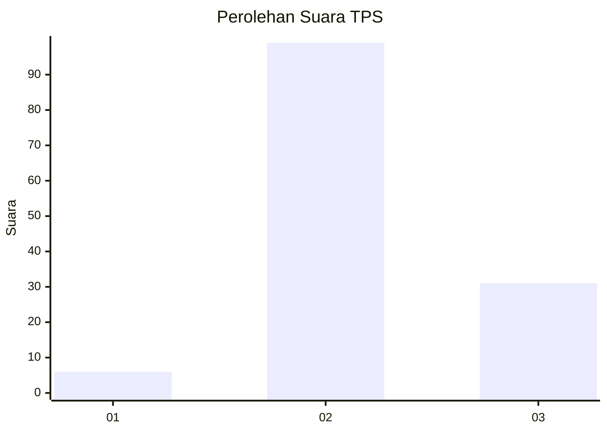
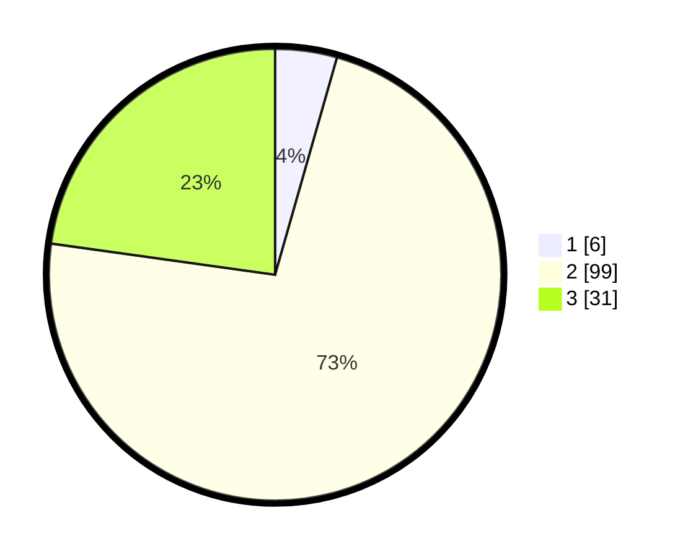

# Hasil

## Grafik

## Tabel

| No. | Nama Paslon    | Suara | Suara (raw) | Persentase |
|:--- |:-------------- | -----:| -----------:| ----------:|
| 1   | ANIES MUHAIMIN | 6     | [6][p-1]    | 4,41       |
| 2   | PRABOWO GIBRAN | 99    | [99][p-2]   | 72,79      |
| 3   | GANJAR MAHFUD  | 31    | [31][p-3]   | 22,79      |

[p-1]: https://github.com/gigit-pemilu/pemilu-2024/blob/main/pilpres/hitung-suara/sub/12-sumatera-utara/sub/14-nias-selatan/sub/14-umbunasi/sub/2012-umbunasi/sub/001-tps/sub/paslon-1.txt
[p-2]: https://github.com/gigit-pemilu/pemilu-2024/blob/main/pilpres/hitung-suara/sub/12-sumatera-utara/sub/14-nias-selatan/sub/14-umbunasi/sub/2012-umbunasi/sub/001-tps/sub/paslon-2.txt
[p-3]: https://github.com/gigit-pemilu/pemilu-2024/blob/main/pilpres/hitung-suara/sub/12-sumatera-utara/sub/14-nias-selatan/sub/14-umbunasi/sub/2012-umbunasi/sub/001-tps/sub/paslon-3.txt

## Foto C Plano

https://sirekap-obj-formc.kpu.go.id/6c73/pemilu/ppwp/12/14/14/20/12/1214142012001-20240215-012726--5774f63c-f806-44cd-8dbe-09afad0cf980.jpg

https://sirekap-obj-formc.kpu.go.id/6c73/pemilu/ppwp/12/14/14/20/12/1214142012001-20240214-233521--8591c728-c01b-4bb9-88a6-7b3f05792797.jpg

https://sirekap-obj-formc.kpu.go.id/6c73/pemilu/ppwp/12/14/14/20/12/1214142012001-20240214-233834--c3b062cc-fab8-4700-9e06-517435c8d484.jpg

## Metadata

| Key        | Value               |
| ---------- | ------------------- |
| Time Stamp | 2024-02-25 15:00:00 |

