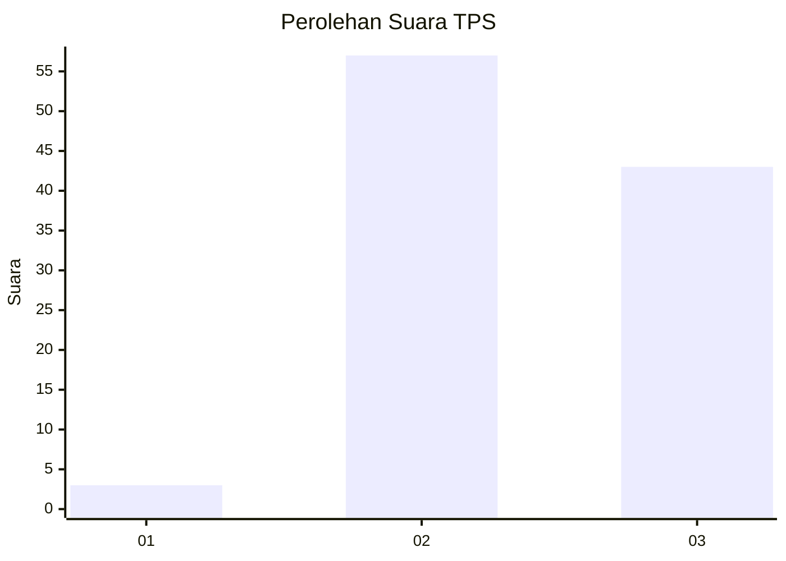
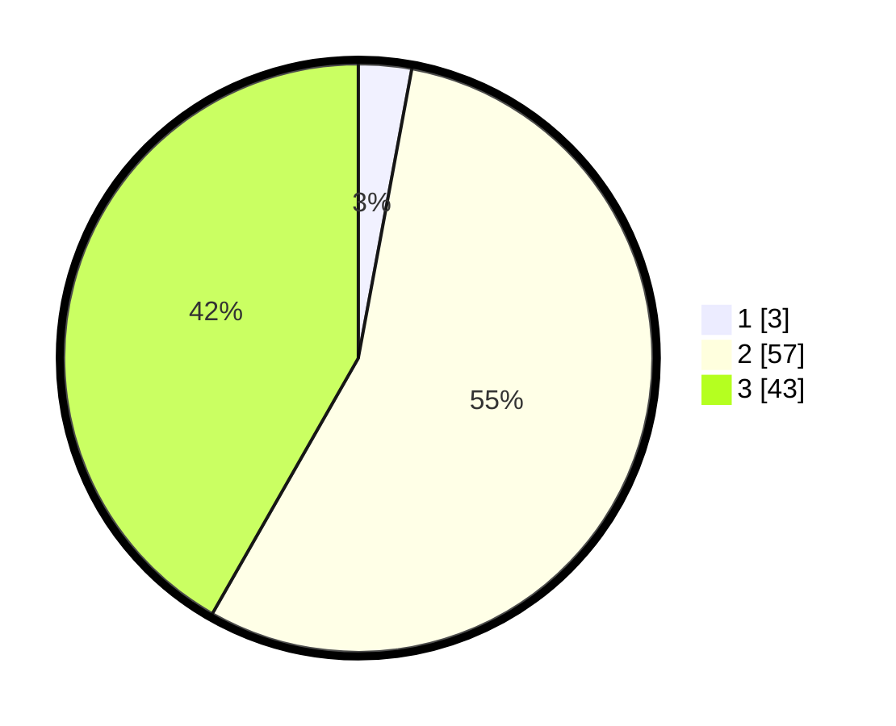

# Hasil

## Grafik

## Tabel

| No. | Nama Paslon    | Suara | Suara (raw) | Persentase |
|:--- |:-------------- | -----:| -----------:| ----------:|
| 1   | ANIES MUHAIMIN | 3     | [3][p-1]    | 2,91       |
| 2   | PRABOWO GIBRAN | 57    | [57][p-2]   | 55,34      |
| 3   | GANJAR MAHFUD  | 43    | [43][p-3]   | 41,75      |

[p-1]: https://github.com/gigit-pemilu/pemilu-2024-12-sumatera-utara/blob/main/pilpres/hitung-suara/sub/12-sumatera-utara/sub/14-nias-selatan/sub/15-aramo/sub/2002-hiliorudua/sub/001-tps/sub/paslon-1.txt
[p-2]: https://github.com/gigit-pemilu/pemilu-2024-12-sumatera-utara/blob/main/pilpres/hitung-suara/sub/12-sumatera-utara/sub/14-nias-selatan/sub/15-aramo/sub/2002-hiliorudua/sub/001-tps/sub/paslon-2.txt
[p-3]: https://github.com/gigit-pemilu/pemilu-2024-12-sumatera-utara/blob/main/pilpres/hitung-suara/sub/12-sumatera-utara/sub/14-nias-selatan/sub/15-aramo/sub/2002-hiliorudua/sub/001-tps/sub/paslon-3.txt

## Foto C Plano

https://sirekap-obj-formc.kpu.go.id/d40d/pemilu/ppwp/12/14/15/20/02/1214152002001-20240215-134958--eaa460df-bbea-45a4-bd81-c3cdb6993614.jpg

https://sirekap-obj-formc.kpu.go.id/d40d/pemilu/ppwp/12/14/15/20/02/1214152002001-20240215-135012--2ceac6a3-28d6-48af-afc2-277ec7a426b0.jpg

https://sirekap-obj-formc.kpu.go.id/d40d/pemilu/ppwp/12/14/15/20/02/1214152002001-20240215-135027--4052b8e1-6856-445c-9aa9-e218c3563c2a.jpg

## Metadata

| Key        | Value               |
| ---------- | ------------------- |
| Time Stamp | 2024-02-15 23:29:50 |

