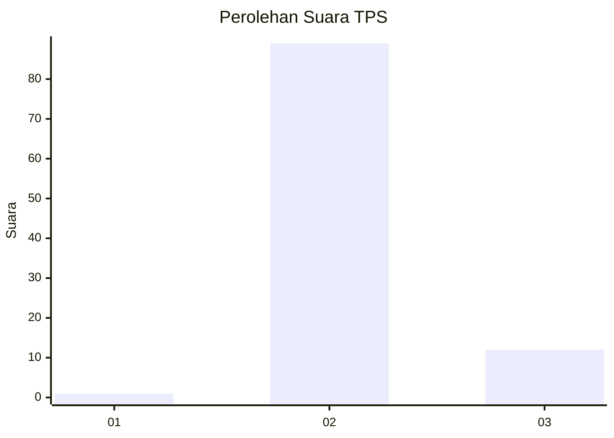
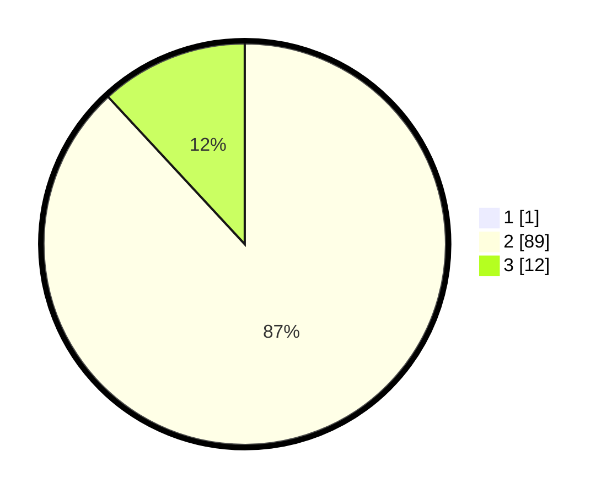

# Hasil

## Grafik

## Tabel

| No. | Nama Paslon    | Suara | Suara (raw) | Persentase |
|:--- |:-------------- | -----:| -----------:| ----------:|
| 1   | ANIES MUHAIMIN | 1     | [1][p-1]    | 0,98       |
| 2   | PRABOWO GIBRAN | 89    | [89][p-2]   | 87,25      |
| 3   | GANJAR MAHFUD  | 12    | [12][p-3]   | 11,76      |

[p-1]: https://github.com/gigit-pemilu/pemilu-2024/blob/main/pilpres/hitung-suara/sub/12-sumatera-utara/sub/14-nias-selatan/sub/15-aramo/sub/2002-hiliorudua/sub/002-tps/sub/paslon-1.txt
[p-2]: https://github.com/gigit-pemilu/pemilu-2024/blob/main/pilpres/hitung-suara/sub/12-sumatera-utara/sub/14-nias-selatan/sub/15-aramo/sub/2002-hiliorudua/sub/002-tps/sub/paslon-2.txt
[p-3]: https://github.com/gigit-pemilu/pemilu-2024/blob/main/pilpres/hitung-suara/sub/12-sumatera-utara/sub/14-nias-selatan/sub/15-aramo/sub/2002-hiliorudua/sub/002-tps/sub/paslon-3.txt

## Foto C Plano

https://sirekap-obj-formc.kpu.go.id/4807/pemilu/ppwp/12/14/15/20/02/1214152002002-20240215-134450--642c7bfa-d1d1-4081-9ad7-2b70d777823f.jpg

https://sirekap-obj-formc.kpu.go.id/4807/pemilu/ppwp/12/14/15/20/02/1214152002002-20240215-134651--1d4b3a11-1103-44b3-b315-16c6a9f24f8e.jpg

https://sirekap-obj-formc.kpu.go.id/4807/pemilu/ppwp/12/14/15/20/02/1214152002002-20240215-134750--7e822362-a158-4ebf-b2d8-c452c3644ca3.jpg

## Metadata

| Key        | Value               |
| ---------- | ------------------- |
| Time Stamp | 2024-02-15 18:00:26 |

