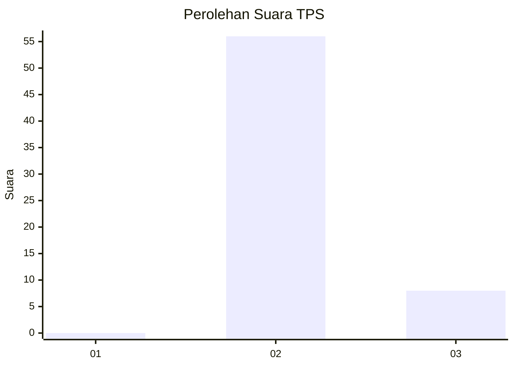
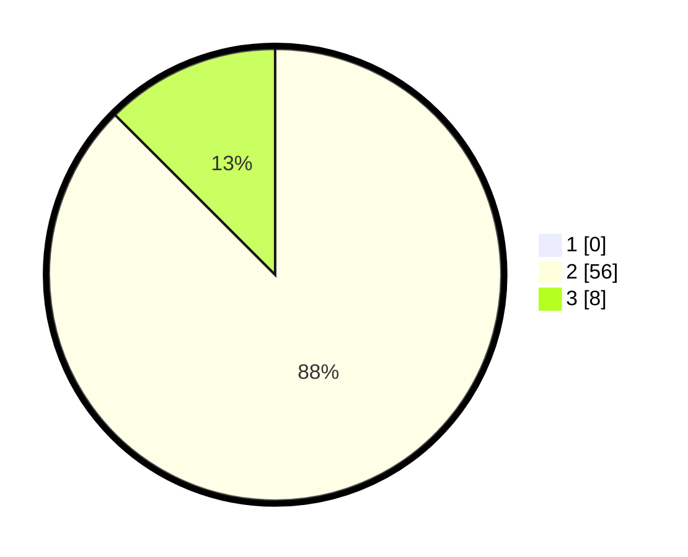

# Hasil

## Grafik

## Tabel

| No. | Nama Paslon    | Suara | Suara (raw) | Persentase |
|:--- |:-------------- | -----:| -----------:| ----------:|
| 1   | ANIES MUHAIMIN | 0     | [0][p-1]    | 0,00       |
| 2   | PRABOWO GIBRAN | 56    | [56][p-2]   | 87,50      |
| 3   | GANJAR MAHFUD  | 8     | [8][p-3]    | 12,50      |

[p-1]: https://github.com/gigit-pemilu/pemilu-2024-12-sumatera-utara/blob/main/pilpres/hitung-suara/sub/12-sumatera-utara/sub/14-nias-selatan/sub/15-aramo/sub/2010-hilimagiao/sub/002-tps/sub/paslon-1.txt
[p-2]: https://github.com/gigit-pemilu/pemilu-2024-12-sumatera-utara/blob/main/pilpres/hitung-suara/sub/12-sumatera-utara/sub/14-nias-selatan/sub/15-aramo/sub/2010-hilimagiao/sub/002-tps/sub/paslon-2.txt
[p-3]: https://github.com/gigit-pemilu/pemilu-2024-12-sumatera-utara/blob/main/pilpres/hitung-suara/sub/12-sumatera-utara/sub/14-nias-selatan/sub/15-aramo/sub/2010-hilimagiao/sub/002-tps/sub/paslon-3.txt

## Foto C Plano

https://sirekap-obj-formc.kpu.go.id/f2d8/pemilu/ppwp/12/14/15/20/10/1214152010002-20240218-184514--f1e945ce-45a2-4c18-9bb8-7cba6d83890b.jpg

https://sirekap-obj-formc.kpu.go.id/f2d8/pemilu/ppwp/12/14/15/20/10/1214152010002-20240218-184733--56a2a961-d856-4f8b-85c1-c2c6faac3738.jpg

https://sirekap-obj-formc.kpu.go.id/f2d8/pemilu/ppwp/12/14/15/20/10/1214152010002-20240218-184845--e06c4bce-cb37-4ae7-b700-e7f36bfd08d5.jpg

## Metadata

| Key        | Value               |
| ---------- | ------------------- |
| Time Stamp | 2024-02-20 12:00:00 |

