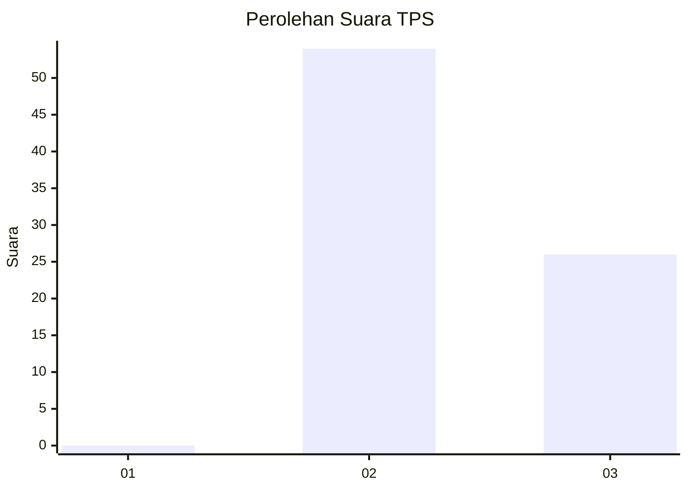
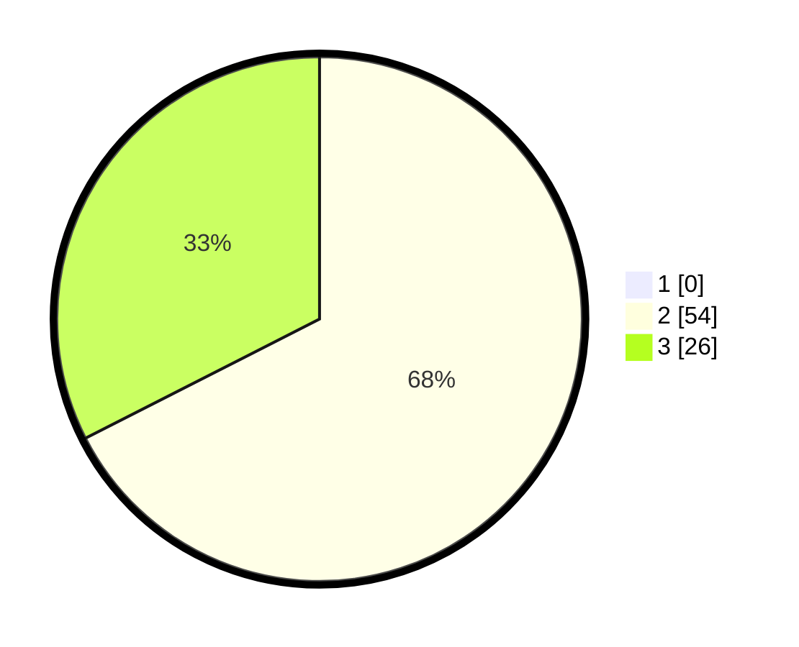

# Hasil

## Grafik

## Tabel

| No. | Nama Paslon    | Suara | Suara (raw) | Persentase |
|:--- |:-------------- | -----:| -----------:| ----------:|
| 1   | ANIES MUHAIMIN | 0     | [0][p-1]    | 0,00       |
| 2   | PRABOWO GIBRAN | 54    | [54][p-2]   | 67,50      |
| 3   | GANJAR MAHFUD  | 26    | [26][p-3]   | 32,50      |

[p-1]: https://github.com/gigit-pemilu/pemilu-2024/blob/main/pilpres/hitung-suara/sub/12-sumatera-utara/sub/14-nias-selatan/sub/15-aramo/sub/2017-hiligumbu/sub/001-tps/sub/paslon-1.txt
[p-2]: https://github.com/gigit-pemilu/pemilu-2024/blob/main/pilpres/hitung-suara/sub/12-sumatera-utara/sub/14-nias-selatan/sub/15-aramo/sub/2017-hiligumbu/sub/001-tps/sub/paslon-2.txt
[p-3]: https://github.com/gigit-pemilu/pemilu-2024/blob/main/pilpres/hitung-suara/sub/12-sumatera-utara/sub/14-nias-selatan/sub/15-aramo/sub/2017-hiligumbu/sub/001-tps/sub/paslon-3.txt

## Foto C Plano

https://sirekap-obj-formc.kpu.go.id/8da7/pemilu/ppwp/12/14/15/20/17/1214152017001-20240215-110419--fb387f85-28ae-4ed1-83f1-a4d85a707a06.jpg

https://sirekap-obj-formc.kpu.go.id/8da7/pemilu/ppwp/12/14/15/20/17/1214152017001-20240215-110650--ee1e316c-35ff-4504-9231-202d715b01db.jpg

https://sirekap-obj-formc.kpu.go.id/8da7/pemilu/ppwp/12/14/15/20/17/1214152017001-20240215-094132--577471bb-324c-4565-9632-491464f26783.jpg

## Metadata

| Key        | Value               |
| ---------- | ------------------- |
| Time Stamp | 2024-02-15 15:00:29 |

