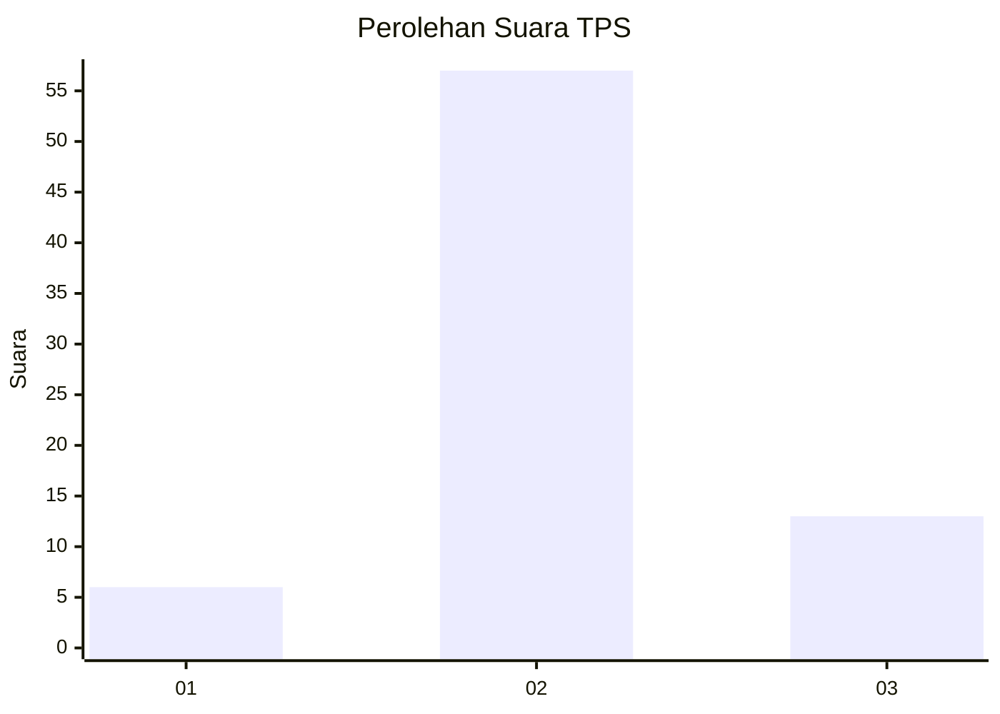
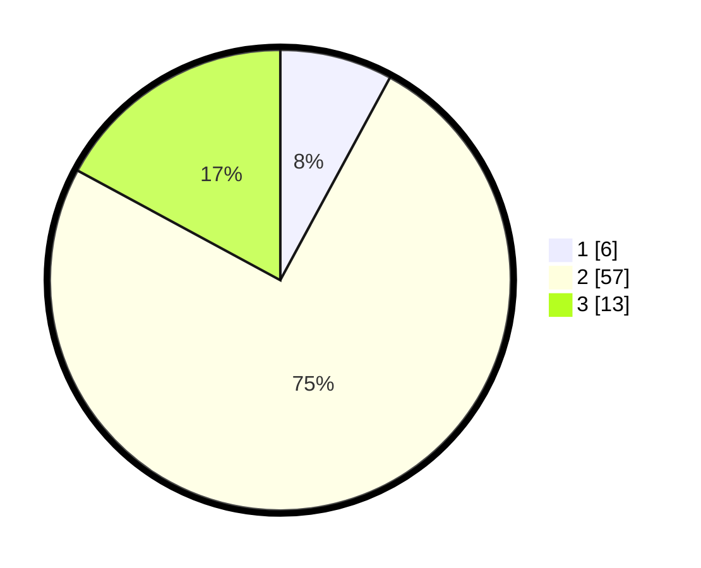

# Hasil

## Grafik

## Tabel

| No. | Nama Paslon    | Suara | Suara (raw) | Persentase |
|:--- |:-------------- | -----:| -----------:| ----------:|
| 1   | ANIES MUHAIMIN | 6     | [6][p-1]    | 7,89       |
| 2   | PRABOWO GIBRAN | 57    | [57][p-2]   | 75,00      |
| 3   | GANJAR MAHFUD  | 13    | [13][p-3]   | 17,11      |

[p-1]: https://github.com/gigit-pemilu/pemilu-2024-12-sumatera-utara/blob/main/pilpres/hitung-suara/sub/12-sumatera-utara/sub/14-nias-selatan/sub/16-pulau-pulau-batu-timur/sub/2002-labuhan-bazau/sub/001-tps/sub/paslon-1.txt
[p-2]: https://github.com/gigit-pemilu/pemilu-2024-12-sumatera-utara/blob/main/pilpres/hitung-suara/sub/12-sumatera-utara/sub/14-nias-selatan/sub/16-pulau-pulau-batu-timur/sub/2002-labuhan-bazau/sub/001-tps/sub/paslon-2.txt
[p-3]: https://github.com/gigit-pemilu/pemilu-2024-12-sumatera-utara/blob/main/pilpres/hitung-suara/sub/12-sumatera-utara/sub/14-nias-selatan/sub/16-pulau-pulau-batu-timur/sub/2002-labuhan-bazau/sub/001-tps/sub/paslon-3.txt

## Foto C Plano

https://sirekap-obj-formc.kpu.go.id/512c/pemilu/ppwp/12/14/16/20/02/1214162002001-20240215-170520--48a3bddb-fac4-488f-864e-1d714ab2c322.jpg

https://sirekap-obj-formc.kpu.go.id/512c/pemilu/ppwp/12/14/16/20/02/1214162002001-20240215-170720--0735913a-9135-46fa-987f-ae6c8ee56007.jpg

https://sirekap-obj-formc.kpu.go.id/512c/pemilu/ppwp/12/14/16/20/02/1214162002001-20240215-170826--fd80dec7-aaf0-4326-9db7-442c988b5306.jpg

## Metadata

| Key        | Value               |
| ---------- | ------------------- |
| Time Stamp | 2024-02-15 21:01:18 |

