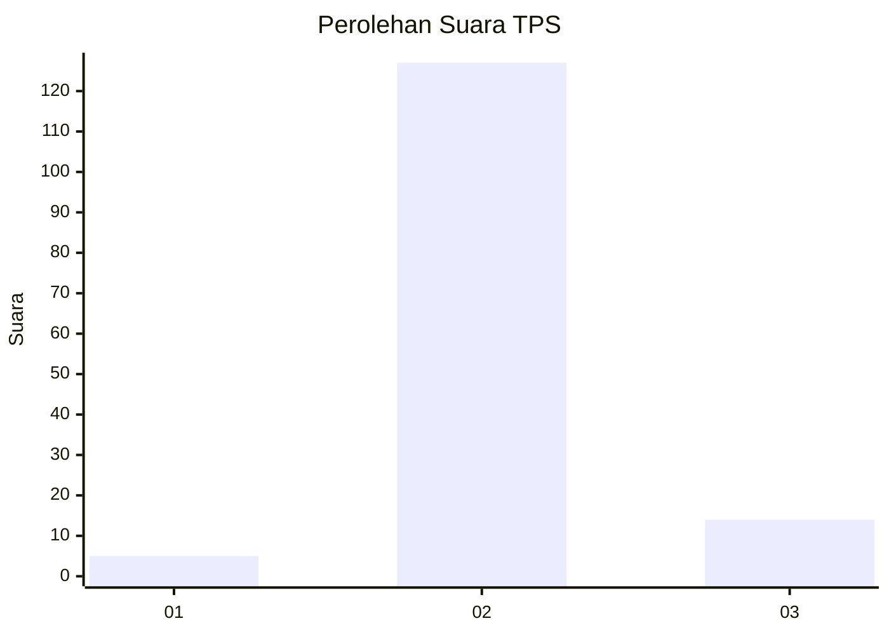
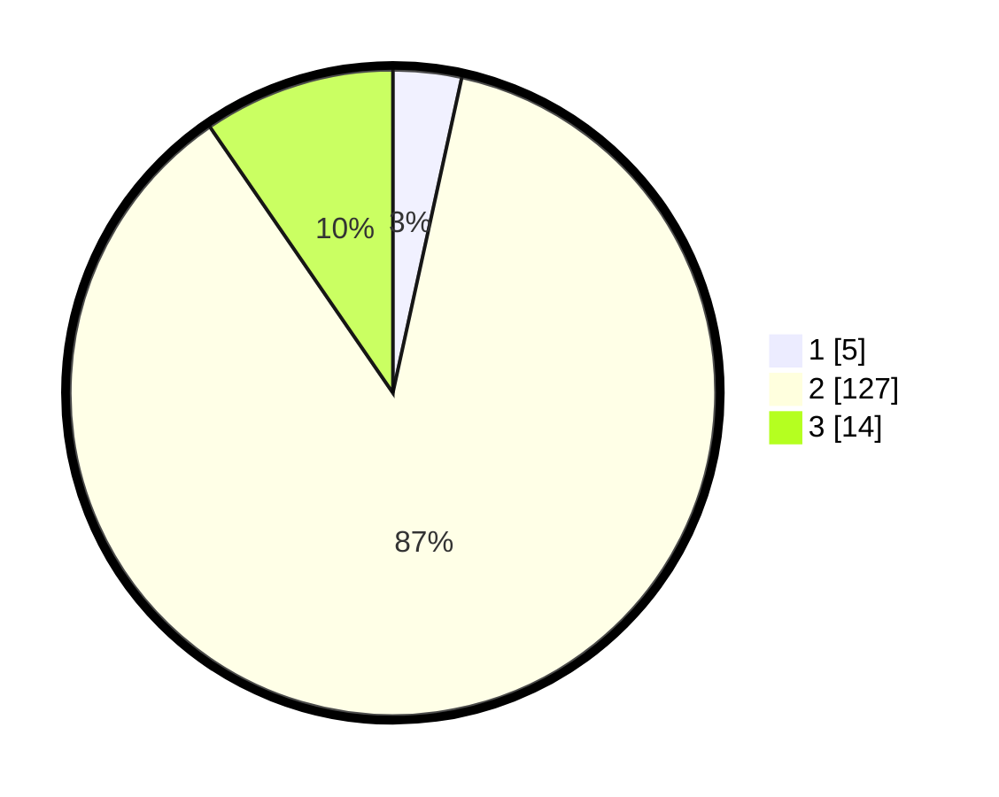

# Hasil

## Grafik

## Tabel

| No. | Nama Paslon    | Suara | Suara (raw) | Persentase |
|:--- |:-------------- | -----:| -----------:| ----------:|
| 1   | ANIES MUHAIMIN | 5     | [5][p-1]    | 3,42       |
| 2   | PRABOWO GIBRAN | 127   | [127][p-2]  | 86,99      |
| 3   | GANJAR MAHFUD  | 14    | [14][p-3]   | 9,59       |

[p-1]: https://github.com/gigit-pemilu/pemilu-2024-12-sumatera-utara/blob/main/pilpres/hitung-suara/sub/12-sumatera-utara/sub/14-nias-selatan/sub/16-pulau-pulau-batu-timur/sub/2007-adam/sub/001-tps/sub/paslon-1.txt
[p-2]: https://github.com/gigit-pemilu/pemilu-2024-12-sumatera-utara/blob/main/pilpres/hitung-suara/sub/12-sumatera-utara/sub/14-nias-selatan/sub/16-pulau-pulau-batu-timur/sub/2007-adam/sub/001-tps/sub/paslon-2.txt
[p-3]: https://github.com/gigit-pemilu/pemilu-2024-12-sumatera-utara/blob/main/pilpres/hitung-suara/sub/12-sumatera-utara/sub/14-nias-selatan/sub/16-pulau-pulau-batu-timur/sub/2007-adam/sub/001-tps/sub/paslon-3.txt

## Foto C Plano

https://sirekap-obj-formc.kpu.go.id/e15e/pemilu/ppwp/12/14/16/20/07/1214162007001-20240215-080530--b38cfcd5-d73f-402d-ba96-7282c65f4f2e.jpg

https://sirekap-obj-formc.kpu.go.id/e15e/pemilu/ppwp/12/14/16/20/07/1214162007001-20240215-080752--52ec7800-658a-45e5-b92e-52f96c5c2ccd.jpg

https://sirekap-obj-formc.kpu.go.id/e15e/pemilu/ppwp/12/14/16/20/07/1214162007001-20240215-081142--60d98659-864b-4888-a8f5-e678ccc99ce6.jpg

## Metadata

| Key        | Value               |
| ---------- | ------------------- |
| Time Stamp | 2024-02-15 17:00:25 |

