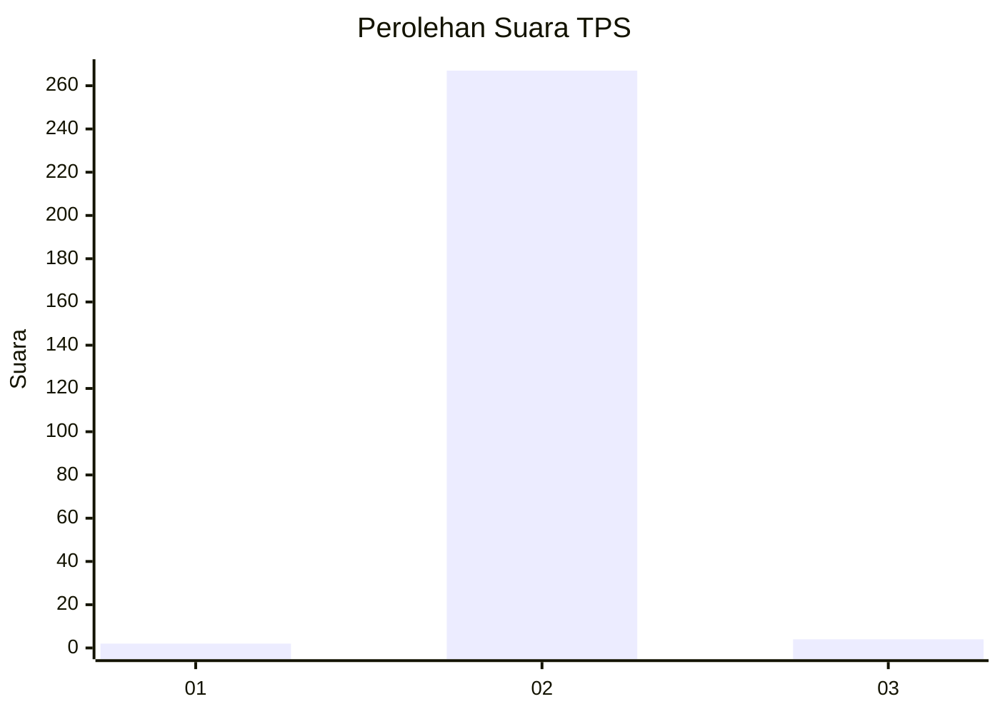
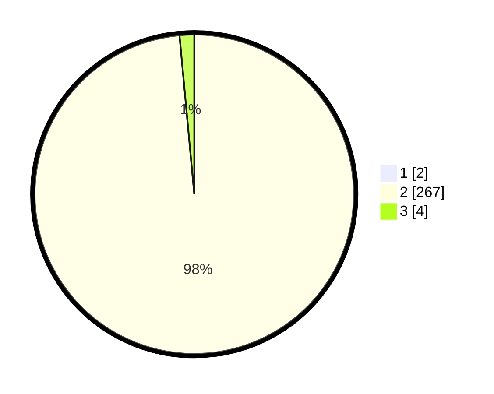

# Hasil

## Grafik

## Tabel

| No. | Nama Paslon    | Suara | Suara (raw) | Persentase |
|:--- |:-------------- | -----:| -----------:| ----------:|
| 1   | ANIES MUHAIMIN | 2     | [2][p-1]    | 0,73       |
| 2   | PRABOWO GIBRAN | 267   | [267][p-2]  | 97,80      |
| 3   | GANJAR MAHFUD  | 4     | [4][p-3]    | 1,47       |

[p-1]: https://github.com/gigit-pemilu/pemilu-2024-12-sumatera-utara/blob/main/pilpres/hitung-suara/sub/12-sumatera-utara/sub/14-nias-selatan/sub/17-mazo/sub/2005-orahuahili/sub/002-tps/sub/paslon-1.txt
[p-2]: https://github.com/gigit-pemilu/pemilu-2024-12-sumatera-utara/blob/main/pilpres/hitung-suara/sub/12-sumatera-utara/sub/14-nias-selatan/sub/17-mazo/sub/2005-orahuahili/sub/002-tps/sub/paslon-2.txt
[p-3]: https://github.com/gigit-pemilu/pemilu-2024-12-sumatera-utara/blob/main/pilpres/hitung-suara/sub/12-sumatera-utara/sub/14-nias-selatan/sub/17-mazo/sub/2005-orahuahili/sub/002-tps/sub/paslon-3.txt

## Foto C Plano

https://sirekap-obj-formc.kpu.go.id/47bc/pemilu/ppwp/12/14/17/20/05/1214172005002-20240215-185629--70a3c799-99a4-4a16-b347-e46e53aa9246.jpg

https://sirekap-obj-formc.kpu.go.id/47bc/pemilu/ppwp/12/14/17/20/05/1214172005002-20240215-193018--ce067537-6eaf-4ac0-aab5-5f3ed8eda307.jpg

https://sirekap-obj-formc.kpu.go.id/47bc/pemilu/ppwp/12/14/17/20/05/1214172005002-20240215-185756--7f23d2a5-2282-4976-8f42-f2c215fb1efb.jpg

## Metadata

| Key        | Value               |
| ---------- | ------------------- |
| Time Stamp | 2024-02-15 21:01:18 |

