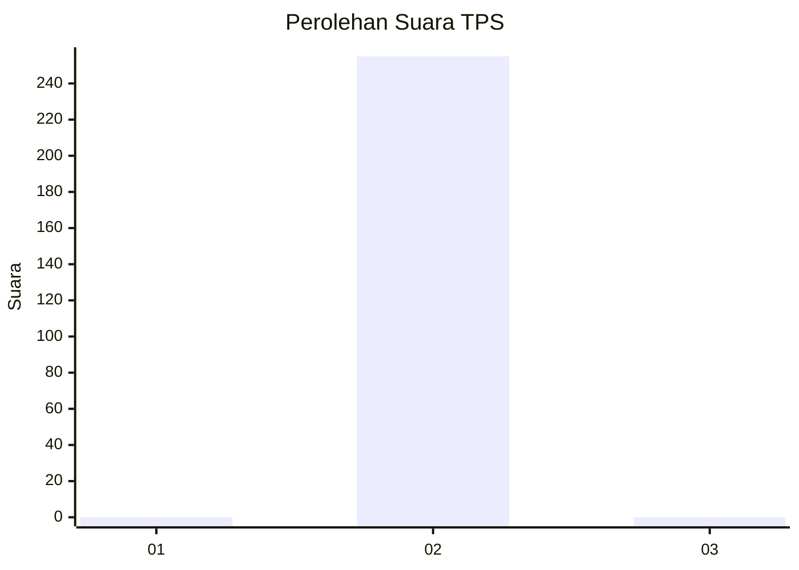
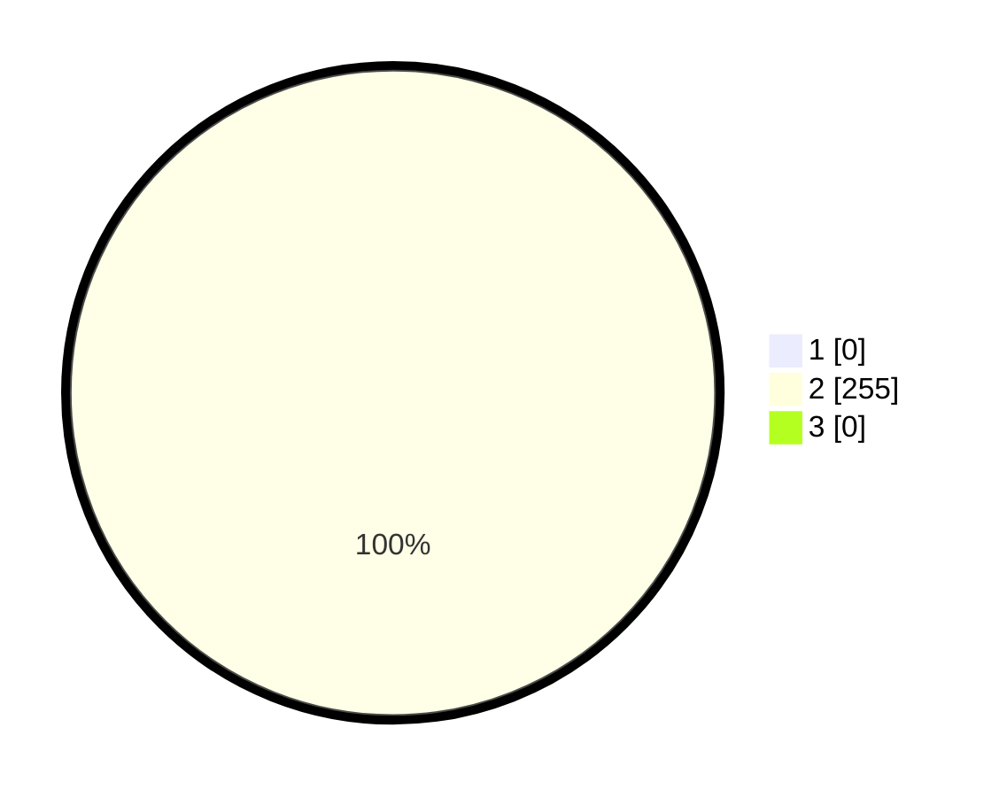

# Hasil

## Grafik

## Tabel

| No. | Nama Paslon    | Suara | Suara (raw) | Persentase |
|:--- |:-------------- | -----:| -----------:| ----------:|
| 1   | ANIES MUHAIMIN | 0     | [0][p-1]    | 0,00       |
| 2   | PRABOWO GIBRAN | 255   | [255][p-2]  | 100,00     |
| 3   | GANJAR MAHFUD  | 0     | [0][p-3]    | 0,00       |

[p-1]: https://github.com/gigit-pemilu/pemilu-2024/blob/main/pilpres/hitung-suara/sub/12-sumatera-utara/sub/14-nias-selatan/sub/17-mazo/sub/2005-orahuahili/sub/003-tps/sub/paslon-1.txt
[p-2]: https://github.com/gigit-pemilu/pemilu-2024/blob/main/pilpres/hitung-suara/sub/12-sumatera-utara/sub/14-nias-selatan/sub/17-mazo/sub/2005-orahuahili/sub/003-tps/sub/paslon-2.txt
[p-3]: https://github.com/gigit-pemilu/pemilu-2024/blob/main/pilpres/hitung-suara/sub/12-sumatera-utara/sub/14-nias-selatan/sub/17-mazo/sub/2005-orahuahili/sub/003-tps/sub/paslon-3.txt

## Foto C Plano

https://sirekap-obj-formc.kpu.go.id/6a51/pemilu/ppwp/12/14/17/20/05/1214172005003-20240215-204202--6812a6fe-166e-4315-824c-f8141df848d7.jpg

https://sirekap-obj-formc.kpu.go.id/6a51/pemilu/ppwp/12/14/17/20/05/1214172005003-20240215-170142--921c4838-0db0-45cb-8b72-93cf274b7f7b.jpg

https://sirekap-obj-formc.kpu.go.id/6a51/pemilu/ppwp/12/14/17/20/05/1214172005003-20240215-170354--9b9f07b7-da34-49b7-ad8d-82d5112dc8be.jpg

## Metadata

| Key        | Value               |
| ---------- | ------------------- |
| Time Stamp | 2024-02-15 22:30:27 |

