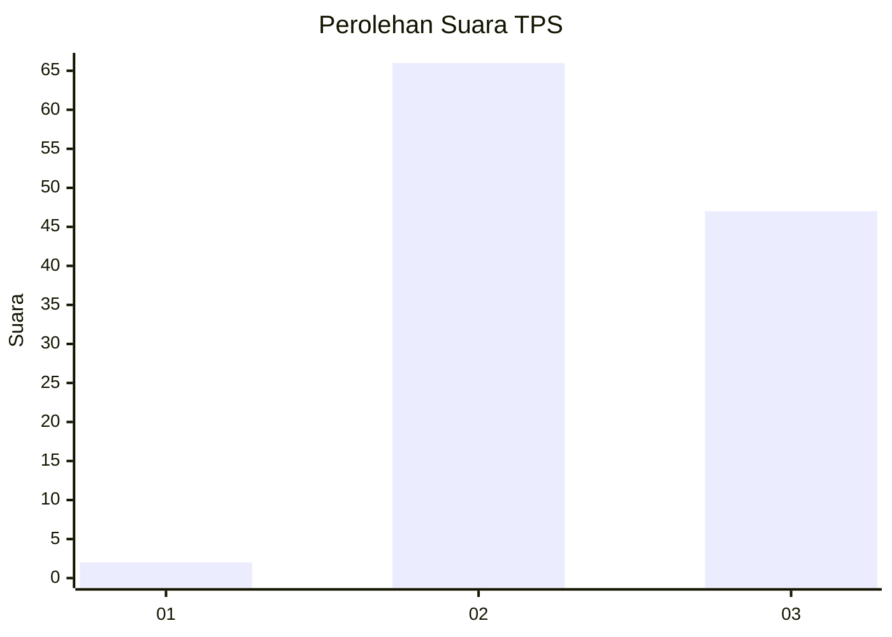
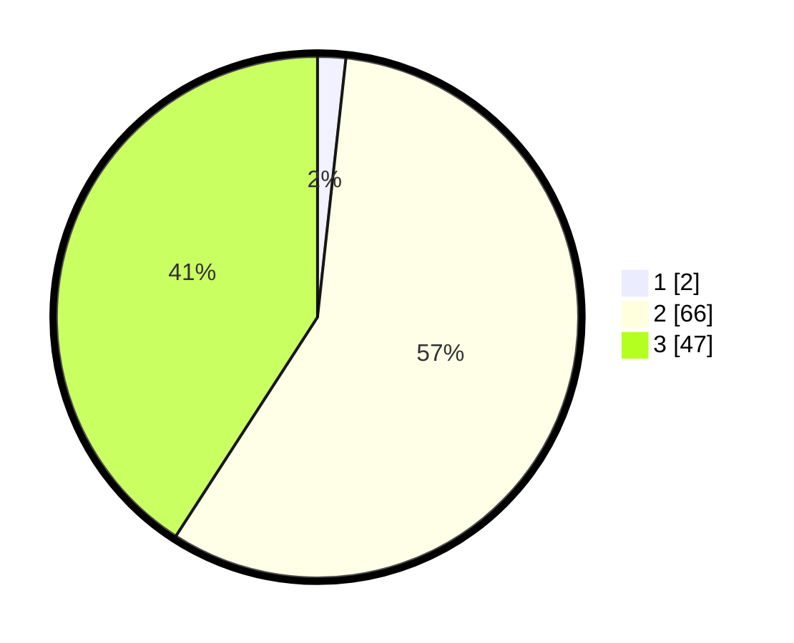

# Hasil

## Grafik

## Tabel

| No. | Nama Paslon    | Suara | Suara (raw) | Persentase |
|:--- |:-------------- | -----:| -----------:| ----------:|
| 1   | ANIES MUHAIMIN | 2     | [2][p-1]    | 1,74       |
| 2   | PRABOWO GIBRAN | 66    | [66][p-2]   | 57,39      |
| 3   | GANJAR MAHFUD  | 47    | [47][p-3]   | 40,87      |

[p-1]: https://github.com/gigit-pemilu/pemilu-2024-12-sumatera-utara/blob/main/pilpres/hitung-suara/sub/12-sumatera-utara/sub/14-nias-selatan/sub/17-mazo/sub/2006-ulu-mazo/sub/003-tps/sub/paslon-1.txt
[p-2]: https://github.com/gigit-pemilu/pemilu-2024-12-sumatera-utara/blob/main/pilpres/hitung-suara/sub/12-sumatera-utara/sub/14-nias-selatan/sub/17-mazo/sub/2006-ulu-mazo/sub/003-tps/sub/paslon-2.txt
[p-3]: https://github.com/gigit-pemilu/pemilu-2024-12-sumatera-utara/blob/main/pilpres/hitung-suara/sub/12-sumatera-utara/sub/14-nias-selatan/sub/17-mazo/sub/2006-ulu-mazo/sub/003-tps/sub/paslon-3.txt

## Foto C Plano

https://sirekap-obj-formc.kpu.go.id/66f1/pemilu/ppwp/12/14/17/20/06/1214172006003-20240216-142828--77c3443c-ceb4-48c4-8de0-0f6744703f4e.jpg

https://sirekap-obj-formc.kpu.go.id/66f1/pemilu/ppwp/12/14/17/20/06/1214172006003-20240216-142829--396f011e-68c8-4ca7-bba8-5080e239fa35.jpg

https://sirekap-obj-formc.kpu.go.id/66f1/pemilu/ppwp/12/14/17/20/06/1214172006003-20240216-142829--3ac09e00-5ff5-486b-995f-8b5f0aea1148.jpg

## Metadata

| Key        | Value               |
| ---------- | ------------------- |
| Time Stamp | 2024-02-16 21:01:00 |

## DATA PEMILIH TETAP

Jumlah pemilih dalam DPT: **115**.
 * L: **50**.
 * P: **65**.

## DATA PENGGUNA HAK PILIH

Jumlah pengguna hak pilih dalam DPT: **115**.
 * L: **50**.
 * P: **65**.

Jumlah pengguna hak pilih dalam DPTb: **115**.
 * L: **50**.
 * P: **65**.

Jumlah pengguna hak pilih dalam DPK: **115**.
 * L: **50**.
 * P: **65**.

Jumlah pengguna hak pilih: **115**.
 * L: **50**.
 * P: **65**.

## JUMLAH SUARA SAH DAN TIDAK SAH

JUMLAH SELURUH SUARA SAH: **115**.

JUMLAH SUARA TIDAK SAH: **2**.

JUMLAH SELURUH SUARA SAH DAN SUARA TIDAK SAH: **117**.

