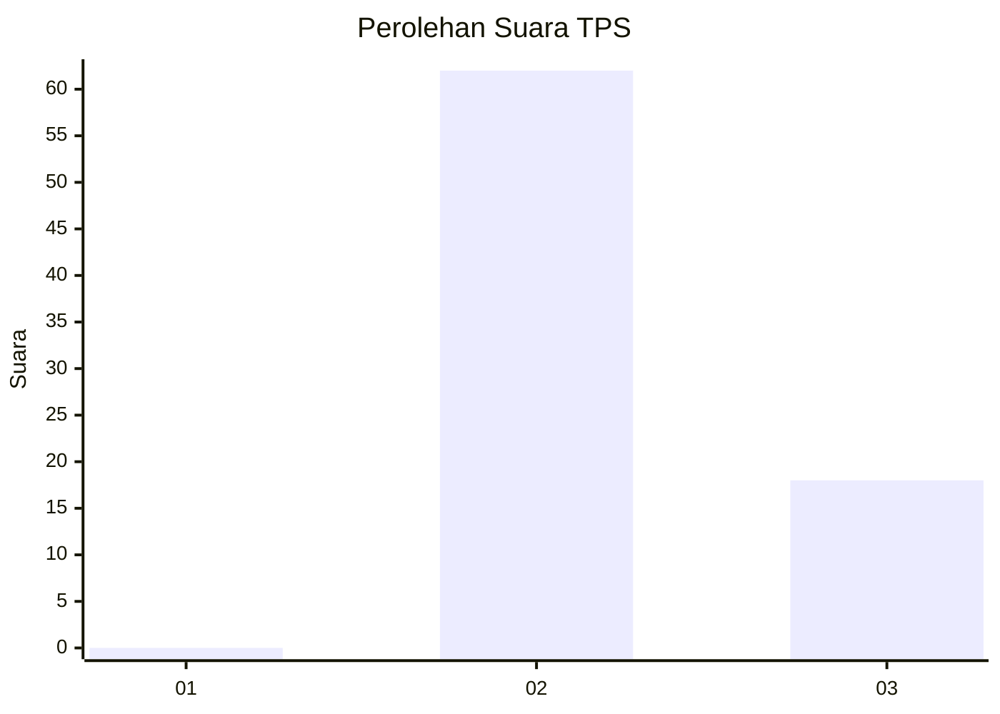
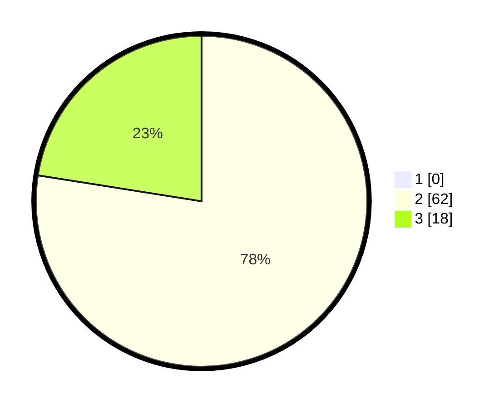

# Hasil

## Grafik

## Tabel

| No. | Nama Paslon    | Suara | Suara (raw) | Persentase |
|:--- |:-------------- | -----:| -----------:| ----------:|
| 1   | ANIES MUHAIMIN | 0     | [0][p-1]    | 0,00       |
| 2   | PRABOWO GIBRAN | 62    | [62][p-2]   | 77,50      |
| 3   | GANJAR MAHFUD  | 18    | [18][p-3]   | 22,50      |

[p-1]: https://github.com/gigit-pemilu/pemilu-2024/blob/main/pilpres/hitung-suara/sub/12-sumatera-utara/sub/14-nias-selatan/sub/17-mazo/sub/2007-guigui/sub/001-tps/sub/paslon-1.txt
[p-2]: https://github.com/gigit-pemilu/pemilu-2024/blob/main/pilpres/hitung-suara/sub/12-sumatera-utara/sub/14-nias-selatan/sub/17-mazo/sub/2007-guigui/sub/001-tps/sub/paslon-2.txt
[p-3]: https://github.com/gigit-pemilu/pemilu-2024/blob/main/pilpres/hitung-suara/sub/12-sumatera-utara/sub/14-nias-selatan/sub/17-mazo/sub/2007-guigui/sub/001-tps/sub/paslon-3.txt

## Foto C Plano

https://sirekap-obj-formc.kpu.go.id/2390/pemilu/ppwp/12/14/17/20/07/1214172007001-20240215-005734--95b7a131-48d3-4e9f-a148-c33cb62954aa.jpg

https://sirekap-obj-formc.kpu.go.id/2390/pemilu/ppwp/12/14/17/20/07/1214172007001-20240214-232928--fe293e8b-5812-4eef-b081-aeadc8a1eaf9.jpg

https://sirekap-obj-formc.kpu.go.id/2390/pemilu/ppwp/12/14/17/20/07/1214172007001-20240214-233150--5e48fb2c-7828-4f57-822e-926583795ded.jpg

## Metadata

| Key        | Value               |
| ---------- | ------------------- |
| Time Stamp | 2024-02-15 21:30:27 |

