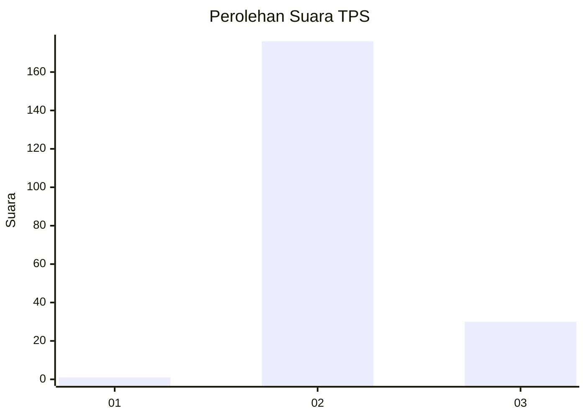
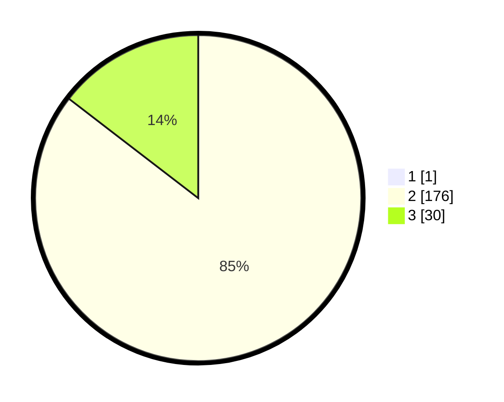

# Hasil

## Grafik

## Tabel

| No. | Nama Paslon    | Suara | Suara (raw) | Persentase |
|:--- |:-------------- | -----:| -----------:| ----------:|
| 1   | ANIES MUHAIMIN | 1     | [1][p-1]    | 0,48       |
| 2   | PRABOWO GIBRAN | 176   | [176][p-2]  | 85,02      |
| 3   | GANJAR MAHFUD  | 30    | [30][p-3]   | 14,49      |

[p-1]: https://github.com/gigit-pemilu/pemilu-2024/blob/main/pilpres/hitung-suara/sub/12-sumatera-utara/sub/14-nias-selatan/sub/18-fanayama/sub/2001-bawomataluo/sub/001-tps/sub/paslon-1.txt
[p-2]: https://github.com/gigit-pemilu/pemilu-2024/blob/main/pilpres/hitung-suara/sub/12-sumatera-utara/sub/14-nias-selatan/sub/18-fanayama/sub/2001-bawomataluo/sub/001-tps/sub/paslon-2.txt
[p-3]: https://github.com/gigit-pemilu/pemilu-2024/blob/main/pilpres/hitung-suara/sub/12-sumatera-utara/sub/14-nias-selatan/sub/18-fanayama/sub/2001-bawomataluo/sub/001-tps/sub/paslon-3.txt

## Foto C Plano

https://sirekap-obj-formc.kpu.go.id/d8de/pemilu/ppwp/12/14/18/20/01/1214182001001-20240215-000208--474ea16d-9a81-442f-8319-305126a0dcd6.jpg

https://sirekap-obj-formc.kpu.go.id/d8de/pemilu/ppwp/12/14/18/20/01/1214182001001-20240215-010528--989ac897-bca2-445d-8c69-6ea9be44c50a.jpg

https://sirekap-obj-formc.kpu.go.id/d8de/pemilu/ppwp/12/14/18/20/01/1214182001001-20240215-002140--a3e658fa-4006-4b38-818e-54bdda37f615.jpg

## Metadata

| Key        | Value               |
| ---------- | ------------------- |
| Time Stamp | 2024-02-20 12:00:00 |

