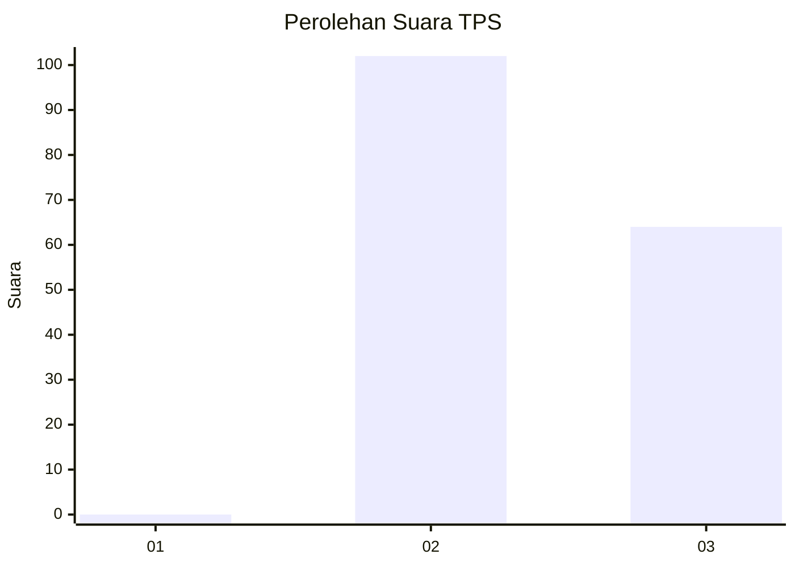
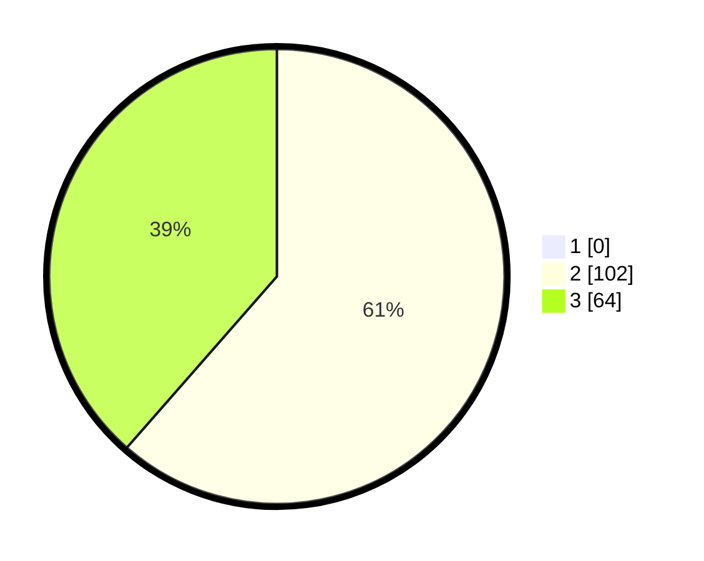

# Hasil

## Grafik

## Tabel

| No. | Nama Paslon    | Suara | Suara (raw) | Persentase |
|:--- |:-------------- | -----:| -----------:| ----------:|
| 1   | ANIES MUHAIMIN | 0     | [0][p-1]    | 0,00       |
| 2   | PRABOWO GIBRAN | 102   | [102][p-2]  | 61,45      |
| 3   | GANJAR MAHFUD  | 64    | [64][p-3]   | 38,55      |

[p-1]: https://github.com/gigit-pemilu/pemilu-2024/blob/main/pilpres/hitung-suara/sub/12-sumatera-utara/sub/14-nias-selatan/sub/18-fanayama/sub/2001-bawomataluo/sub/005-tps/sub/paslon-1.txt
[p-2]: https://github.com/gigit-pemilu/pemilu-2024/blob/main/pilpres/hitung-suara/sub/12-sumatera-utara/sub/14-nias-selatan/sub/18-fanayama/sub/2001-bawomataluo/sub/005-tps/sub/paslon-2.txt
[p-3]: https://github.com/gigit-pemilu/pemilu-2024/blob/main/pilpres/hitung-suara/sub/12-sumatera-utara/sub/14-nias-selatan/sub/18-fanayama/sub/2001-bawomataluo/sub/005-tps/sub/paslon-3.txt

## Foto C Plano

https://sirekap-obj-formc.kpu.go.id/0905/pemilu/ppwp/12/14/18/20/01/1214182001005-20240214-231753--93f28d6b-3a10-456e-84ca-3bbd3b057f10.jpg

https://sirekap-obj-formc.kpu.go.id/0905/pemilu/ppwp/12/14/18/20/01/1214182001005-20240214-232203--24954113-e7fc-4006-9769-858e847a5d93.jpg

https://sirekap-obj-formc.kpu.go.id/0905/pemilu/ppwp/12/14/18/20/01/1214182001005-20240214-232308--a4952594-7759-4ac9-b08f-c834b32af4b3.jpg

## Metadata

| Key        | Value               |
| ---------- | ------------------- |
| Time Stamp | 2024-02-20 12:00:00 |

