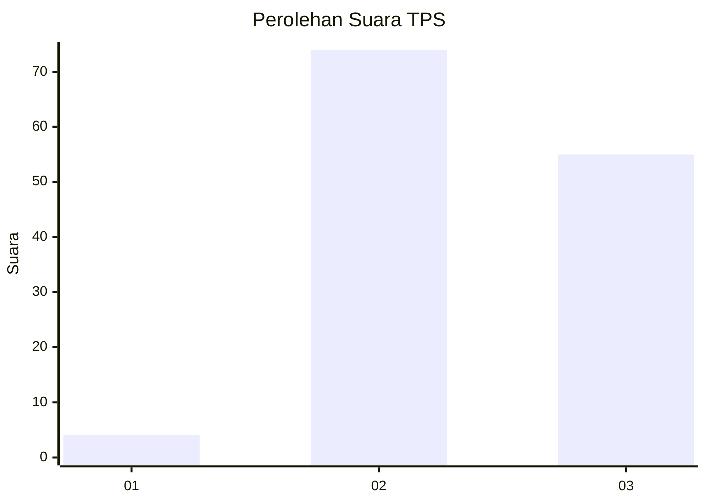
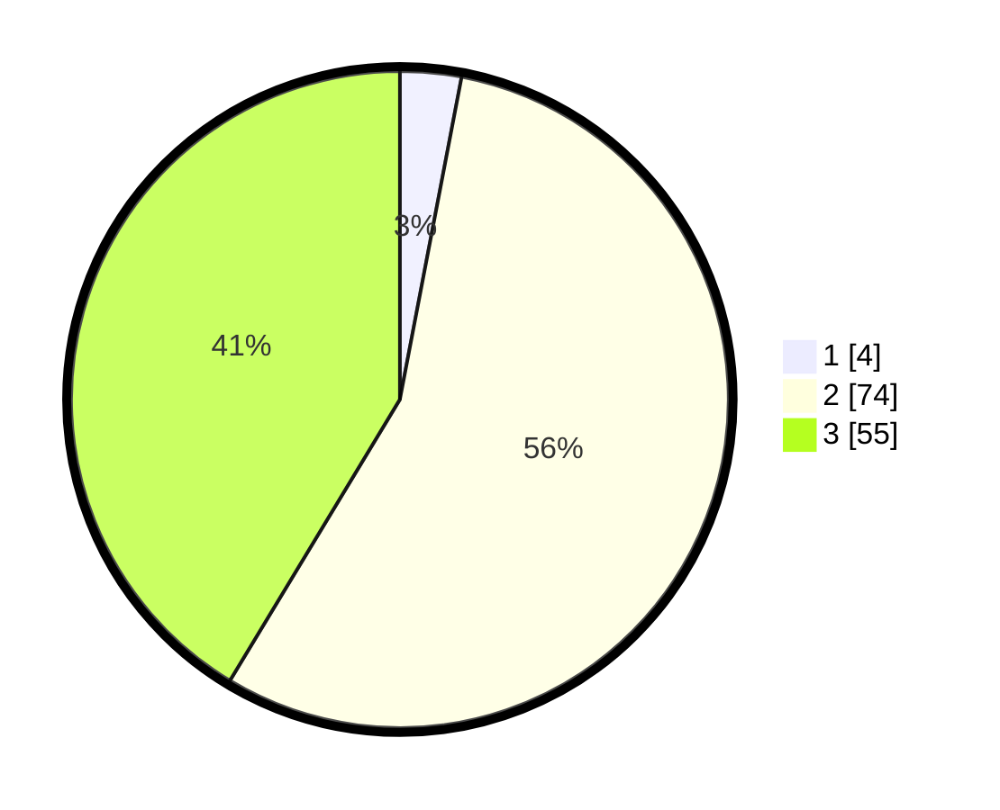

# Hasil

## Grafik

## Tabel

| No. | Nama Paslon    | Suara | Suara (raw) | Persentase |
|:--- |:-------------- | -----:| -----------:| ----------:|
| 1   | ANIES MUHAIMIN | 4     | [4][p-1]    | 3,01       |
| 2   | PRABOWO GIBRAN | 74    | [74][p-2]   | 55,64      |
| 3   | GANJAR MAHFUD  | 55    | [55][p-3]   | 41,35      |

[p-1]: https://github.com/gigit-pemilu/pemilu-2024/blob/main/pilpres/hitung-suara/sub/12-sumatera-utara/sub/14-nias-selatan/sub/18-fanayama/sub/2001-bawomataluo/sub/006-tps/sub/paslon-1.txt
[p-2]: https://github.com/gigit-pemilu/pemilu-2024/blob/main/pilpres/hitung-suara/sub/12-sumatera-utara/sub/14-nias-selatan/sub/18-fanayama/sub/2001-bawomataluo/sub/006-tps/sub/paslon-2.txt
[p-3]: https://github.com/gigit-pemilu/pemilu-2024/blob/main/pilpres/hitung-suara/sub/12-sumatera-utara/sub/14-nias-selatan/sub/18-fanayama/sub/2001-bawomataluo/sub/006-tps/sub/paslon-3.txt

## Foto C Plano

https://sirekap-obj-formc.kpu.go.id/3788/pemilu/ppwp/12/14/18/20/01/1214182001006-20240215-103849--b60db1d0-44ee-4f65-bbd5-6774f445b3c8.jpg

https://sirekap-obj-formc.kpu.go.id/3788/pemilu/ppwp/12/14/18/20/01/1214182001006-20240215-104248--8f3f8780-017c-40ec-9bd7-287858658b13.jpg

https://sirekap-obj-formc.kpu.go.id/3788/pemilu/ppwp/12/14/18/20/01/1214182001006-20240215-114733--270f2b7d-53f0-4a13-9c90-f7ad4f7575da.jpg

## Metadata

| Key        | Value               |
| ---------- | ------------------- |
| Time Stamp | 2024-02-20 12:00:00 |

