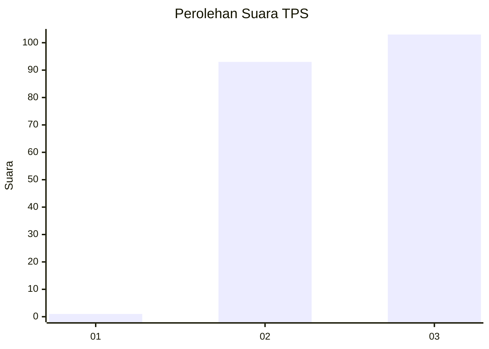
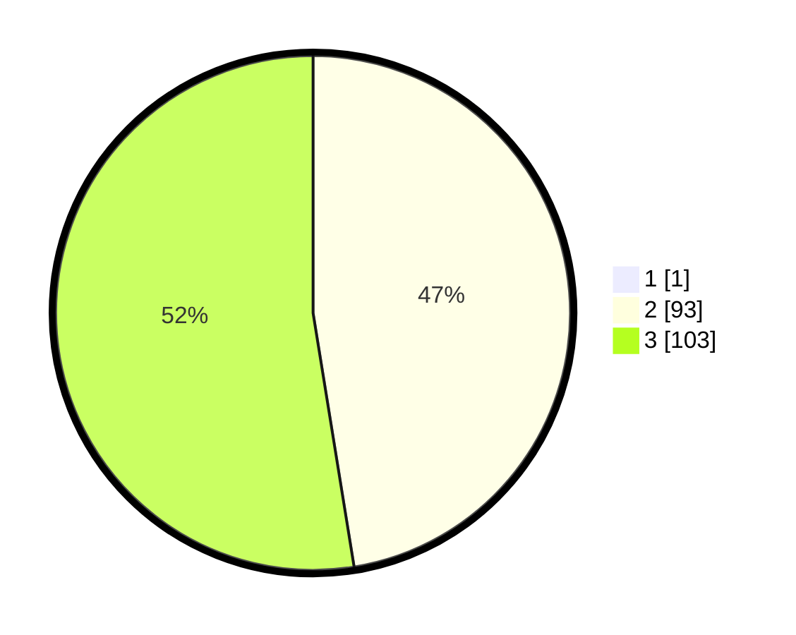

# Hasil

## Grafik

## Tabel

| No. | Nama Paslon    | Suara | Suara (raw) | Persentase |
|:--- |:-------------- | -----:| -----------:| ----------:|
| 1   | ANIES MUHAIMIN | 1     | [1][p-1]    | 0,51       |
| 2   | PRABOWO GIBRAN | 93    | [93][p-2]   | 47,21      |
| 3   | GANJAR MAHFUD  | 103   | [103][p-3]  | 52,28      |

[p-1]: https://github.com/gigit-pemilu/pemilu-2024-12-sumatera-utara/blob/main/pilpres/hitung-suara/sub/12-sumatera-utara/sub/14-nias-selatan/sub/18-fanayama/sub/2001-bawomataluo/sub/010-tps/sub/paslon-1.txt
[p-2]: https://github.com/gigit-pemilu/pemilu-2024-12-sumatera-utara/blob/main/pilpres/hitung-suara/sub/12-sumatera-utara/sub/14-nias-selatan/sub/18-fanayama/sub/2001-bawomataluo/sub/010-tps/sub/paslon-2.txt
[p-3]: https://github.com/gigit-pemilu/pemilu-2024-12-sumatera-utara/blob/main/pilpres/hitung-suara/sub/12-sumatera-utara/sub/14-nias-selatan/sub/18-fanayama/sub/2001-bawomataluo/sub/010-tps/sub/paslon-3.txt

## Foto C Plano

https://sirekap-obj-formc.kpu.go.id/10c0/pemilu/ppwp/12/14/18/20/01/1214182001010-20240215-021733--136094b9-2279-45f6-a0fc-f0829f136ff8.jpg

https://sirekap-obj-formc.kpu.go.id/10c0/pemilu/ppwp/12/14/18/20/01/1214182001010-20240215-022307--bab61fa1-0ac9-418b-9a55-7ec7eb97e187.jpg

https://sirekap-obj-formc.kpu.go.id/10c0/pemilu/ppwp/12/14/18/20/01/1214182001010-20240215-022109--2e39c6ce-7a47-4f3f-8c72-c7894cd47624.jpg

## Metadata

| Key        | Value               |
| ---------- | ------------------- |
| Time Stamp | 2024-02-20 12:00:00 |

