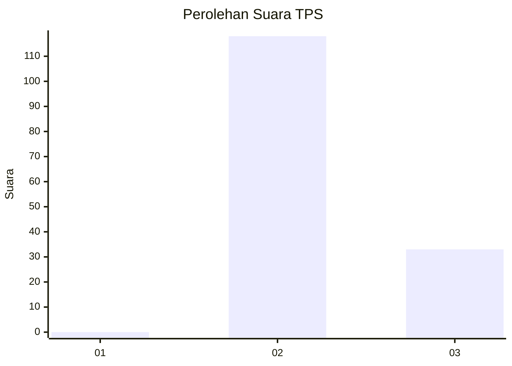
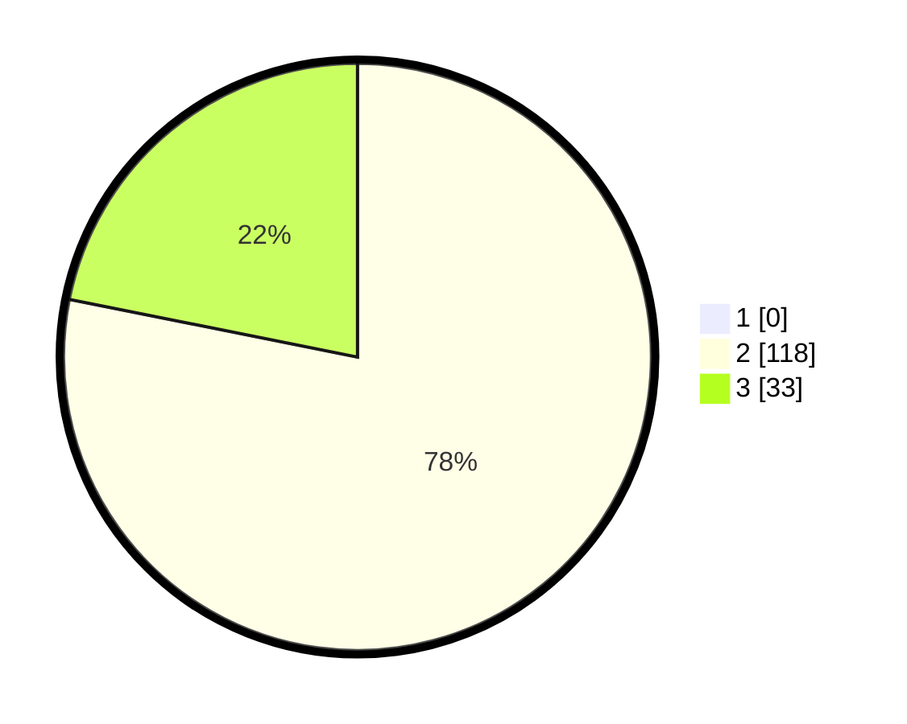

# Hasil

## Grafik

## Tabel

| No. | Nama Paslon    | Suara | Suara (raw) | Persentase |
|:--- |:-------------- | -----:| -----------:| ----------:|
| 1   | ANIES MUHAIMIN | 0     | [0][p-1]    | 0,00       |
| 2   | PRABOWO GIBRAN | 118   | [118][p-2]  | 78,15      |
| 3   | GANJAR MAHFUD  | 33    | [33][p-3]   | 21,85      |

[p-1]: https://github.com/gigit-pemilu/pemilu-2024/blob/main/pilpres/hitung-suara/sub/12-sumatera-utara/sub/14-nias-selatan/sub/18-fanayama/sub/2002-orahili-fau/sub/003-tps/sub/paslon-1.txt
[p-2]: https://github.com/gigit-pemilu/pemilu-2024/blob/main/pilpres/hitung-suara/sub/12-sumatera-utara/sub/14-nias-selatan/sub/18-fanayama/sub/2002-orahili-fau/sub/003-tps/sub/paslon-2.txt
[p-3]: https://github.com/gigit-pemilu/pemilu-2024/blob/main/pilpres/hitung-suara/sub/12-sumatera-utara/sub/14-nias-selatan/sub/18-fanayama/sub/2002-orahili-fau/sub/003-tps/sub/paslon-3.txt

## Foto C Plano

https://sirekap-obj-formc.kpu.go.id/31a0/pemilu/ppwp/12/14/18/20/02/1214182002003-20240215-094637--00139b77-9d66-4fe2-9b6e-0b108c84a3fb.jpg

https://sirekap-obj-formc.kpu.go.id/31a0/pemilu/ppwp/12/14/18/20/02/1214182002003-20240215-094751--07e7f6de-ec52-41a8-aec7-72fc5a950aa3.jpg

https://sirekap-obj-formc.kpu.go.id/31a0/pemilu/ppwp/12/14/18/20/02/1214182002003-20240215-094946--42df33f6-0fdf-4d22-8c5c-44469c844098.jpg

## Metadata

| Key        | Value               |
| ---------- | ------------------- |
| Time Stamp | 2024-02-15 15:30:25 |

