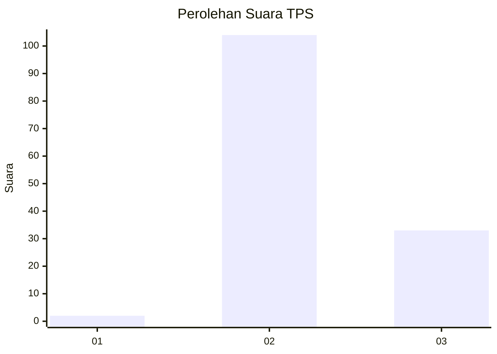
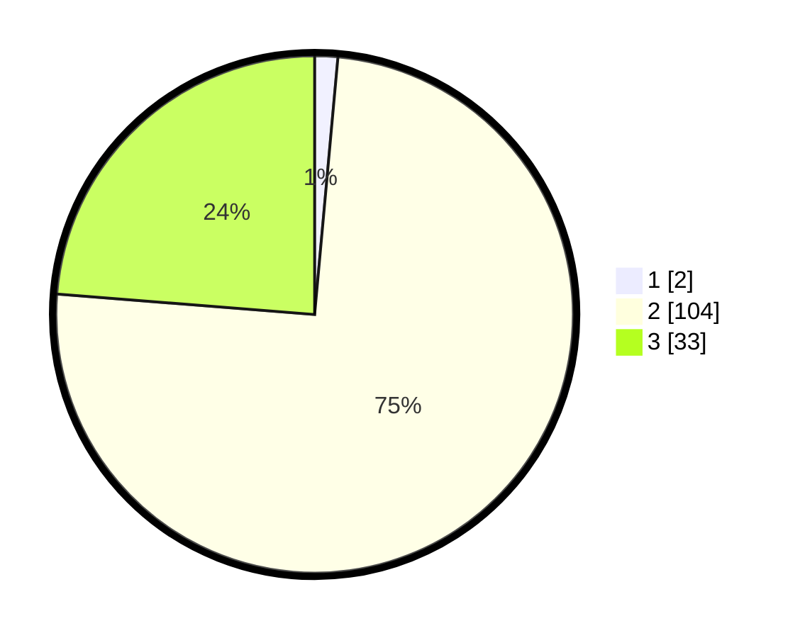

# Hasil

## Grafik

## Tabel

| No. | Nama Paslon    | Suara | Suara (raw) | Persentase |
|:--- |:-------------- | -----:| -----------:| ----------:|
| 1   | ANIES MUHAIMIN | 2     | [2][p-1]    | 1,44       |
| 2   | PRABOWO GIBRAN | 104   | [104][p-2]  | 74,82      |
| 3   | GANJAR MAHFUD  | 33    | [33][p-3]   | 23,74      |

[p-1]: https://github.com/gigit-pemilu/pemilu-2024/blob/main/pilpres/hitung-suara/sub/12-sumatera-utara/sub/14-nias-selatan/sub/18-fanayama/sub/2008-lahusa-fau/sub/001-tps/sub/paslon-1.txt
[p-2]: https://github.com/gigit-pemilu/pemilu-2024/blob/main/pilpres/hitung-suara/sub/12-sumatera-utara/sub/14-nias-selatan/sub/18-fanayama/sub/2008-lahusa-fau/sub/001-tps/sub/paslon-2.txt
[p-3]: https://github.com/gigit-pemilu/pemilu-2024/blob/main/pilpres/hitung-suara/sub/12-sumatera-utara/sub/14-nias-selatan/sub/18-fanayama/sub/2008-lahusa-fau/sub/001-tps/sub/paslon-3.txt

## Foto C Plano

https://sirekap-obj-formc.kpu.go.id/c104/pemilu/ppwp/12/14/18/20/08/1214182008001-20240214-221733--0d435f52-29ae-4b46-a3c4-3869096dc741.jpg

https://sirekap-obj-formc.kpu.go.id/c104/pemilu/ppwp/12/14/18/20/08/1214182008001-20240214-222621--9ed6452c-5aec-4245-8413-743339538134.jpg

https://sirekap-obj-formc.kpu.go.id/c104/pemilu/ppwp/12/14/18/20/08/1214182008001-20240214-222805--5f3a9e2d-4ad6-4918-8294-61e6fbe3197d.jpg

## Metadata

| Key        | Value               |
| ---------- | ------------------- |
| Time Stamp | 2024-02-15 12:00:28 |

