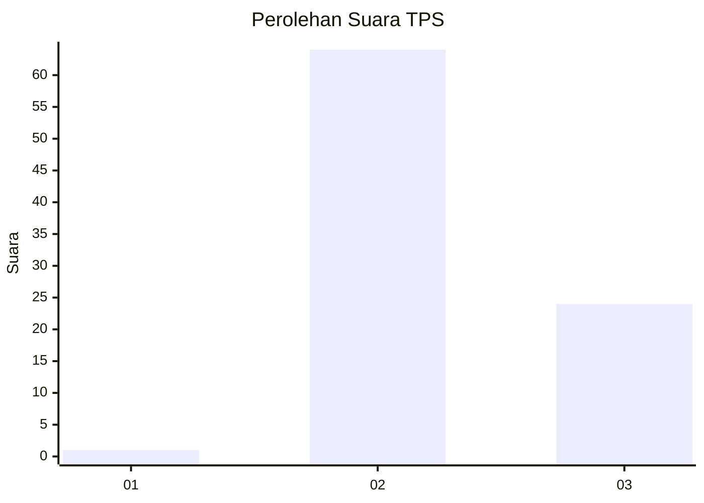
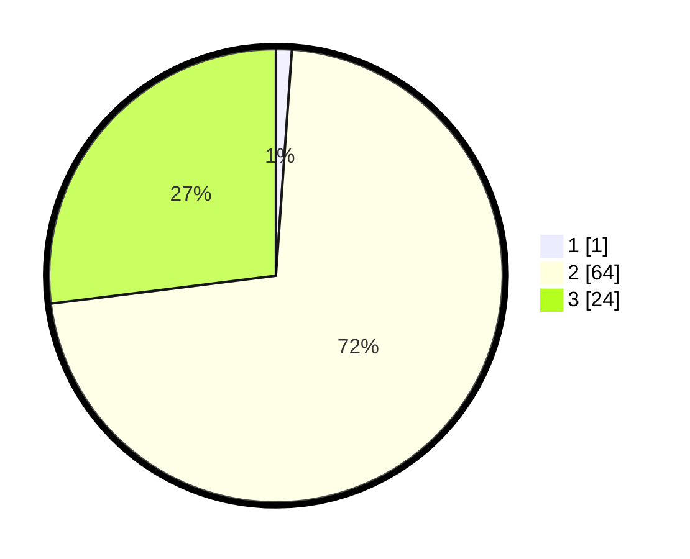

# Hasil

## Grafik

## Tabel

| No. | Nama Paslon    | Suara | Suara (raw) | Persentase |
|:--- |:-------------- | -----:| -----------:| ----------:|
| 1   | ANIES MUHAIMIN | 1     | [1][p-1]    | 1,12       |
| 2   | PRABOWO GIBRAN | 64    | [64][p-2]   | 71,91      |
| 3   | GANJAR MAHFUD  | 24    | [24][p-3]   | 26,97      |

[p-1]: https://github.com/gigit-pemilu/pemilu-2024-12-sumatera-utara/blob/main/pilpres/hitung-suara/sub/12-sumatera-utara/sub/14-nias-selatan/sub/18-fanayama/sub/2008-lahusa-fau/sub/004-tps/sub/paslon-1.txt
[p-2]: https://github.com/gigit-pemilu/pemilu-2024-12-sumatera-utara/blob/main/pilpres/hitung-suara/sub/12-sumatera-utara/sub/14-nias-selatan/sub/18-fanayama/sub/2008-lahusa-fau/sub/004-tps/sub/paslon-2.txt
[p-3]: https://github.com/gigit-pemilu/pemilu-2024-12-sumatera-utara/blob/main/pilpres/hitung-suara/sub/12-sumatera-utara/sub/14-nias-selatan/sub/18-fanayama/sub/2008-lahusa-fau/sub/004-tps/sub/paslon-3.txt

## Foto C Plano

https://sirekap-obj-formc.kpu.go.id/8db7/pemilu/ppwp/12/14/18/20/08/1214182008004-20240215-082522--74cd9052-eee4-40b8-9d1d-c2e4a4ab676a.jpg

https://sirekap-obj-formc.kpu.go.id/8db7/pemilu/ppwp/12/14/18/20/08/1214182008004-20240215-082805--ca1ae83d-17d3-4867-a2cc-c41c63591cc6.jpg

https://sirekap-obj-formc.kpu.go.id/8db7/pemilu/ppwp/12/14/18/20/08/1214182008004-20240214-222312--b6284112-af3d-425d-9197-018b9f93516a.jpg

## Metadata

| Key        | Value               |
| ---------- | ------------------- |
| Time Stamp | 2024-02-20 12:00:00 |

