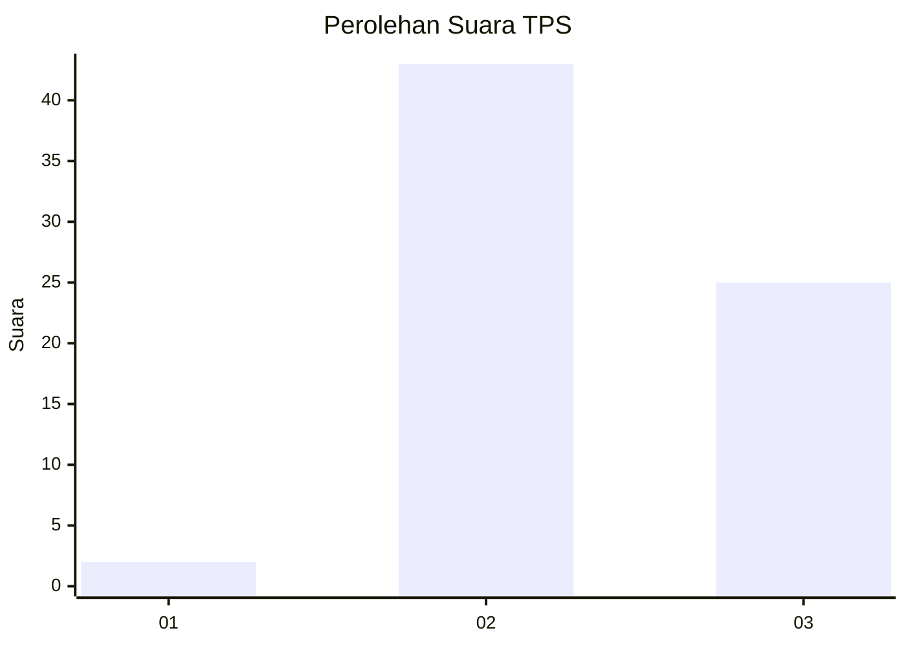
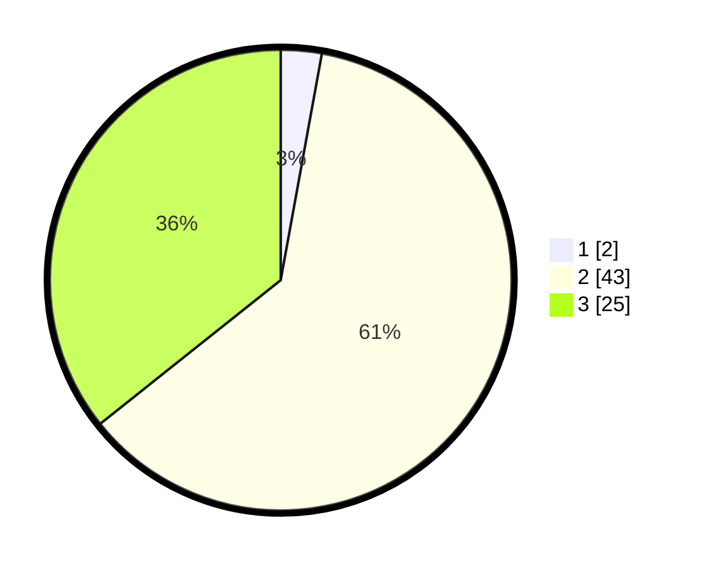

# Hasil

## Grafik

## Tabel

| No. | Nama Paslon    | Suara | Suara (raw) | Persentase |
|:--- |:-------------- | -----:| -----------:| ----------:|
| 1   | ANIES MUHAIMIN | 2     | [2][p-1]    | 2,86       |
| 2   | PRABOWO GIBRAN | 43    | [43][p-2]   | 61,43      |
| 3   | GANJAR MAHFUD  | 25    | [25][p-3]   | 35,71      |

[p-1]: https://github.com/gigit-pemilu/pemilu-2024-12-sumatera-utara/blob/main/pilpres/hitung-suara/sub/12-sumatera-utara/sub/14-nias-selatan/sub/18-fanayama/sub/2012-hiliofonaluo/sub/002-tps/sub/paslon-1.txt
[p-2]: https://github.com/gigit-pemilu/pemilu-2024-12-sumatera-utara/blob/main/pilpres/hitung-suara/sub/12-sumatera-utara/sub/14-nias-selatan/sub/18-fanayama/sub/2012-hiliofonaluo/sub/002-tps/sub/paslon-2.txt
[p-3]: https://github.com/gigit-pemilu/pemilu-2024-12-sumatera-utara/blob/main/pilpres/hitung-suara/sub/12-sumatera-utara/sub/14-nias-selatan/sub/18-fanayama/sub/2012-hiliofonaluo/sub/002-tps/sub/paslon-3.txt

## Foto C Plano

https://sirekap-obj-formc.kpu.go.id/850e/pemilu/ppwp/12/14/18/20/12/1214182012002-20240215-102316--bb8cddc9-7e7d-478c-9d11-1af153f33105.jpg

https://sirekap-obj-formc.kpu.go.id/850e/pemilu/ppwp/12/14/18/20/12/1214182012002-20240215-102626--1c0d7340-0291-4b51-be38-21a7573a5a6c.jpg

https://sirekap-obj-formc.kpu.go.id/850e/pemilu/ppwp/12/14/18/20/12/1214182012002-20240215-102929--303437bf-9df3-49dc-90ea-402081424fd2.jpg

## Metadata

| Key        | Value               |
| ---------- | ------------------- |
| Time Stamp | 2024-02-15 21:01:18 |

