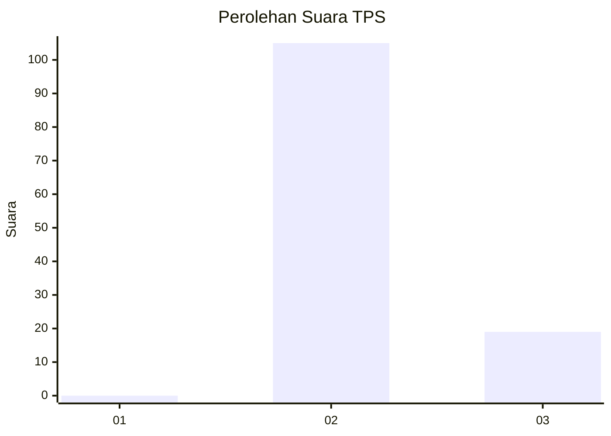
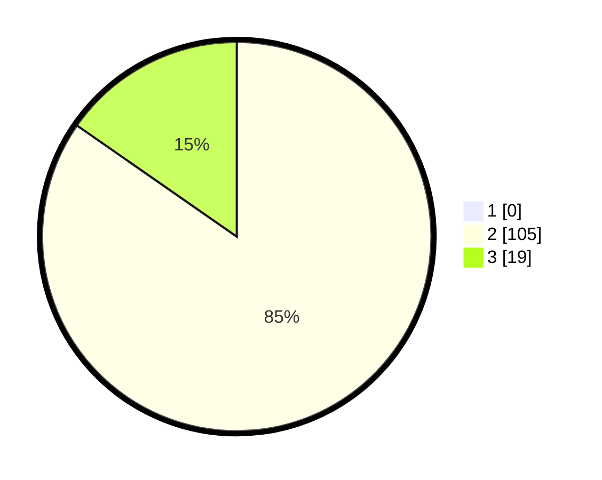

# Hasil

## Grafik

## Tabel

| No. | Nama Paslon    | Suara | Suara (raw) | Persentase |
|:--- |:-------------- | -----:| -----------:| ----------:|
| 1   | ANIES MUHAIMIN | 0     | [0][p-1]    | 0,00       |
| 2   | PRABOWO GIBRAN | 105   | [105][p-2]  | 84,68      |
| 3   | GANJAR MAHFUD  | 19    | [19][p-3]   | 15,32      |

[p-1]: https://github.com/gigit-pemilu/pemilu-2024/blob/main/pilpres/hitung-suara/sub/12-sumatera-utara/sub/14-nias-selatan/sub/18-fanayama/sub/2015-bawofanayama/sub/002-tps/sub/paslon-1.txt
[p-2]: https://github.com/gigit-pemilu/pemilu-2024/blob/main/pilpres/hitung-suara/sub/12-sumatera-utara/sub/14-nias-selatan/sub/18-fanayama/sub/2015-bawofanayama/sub/002-tps/sub/paslon-2.txt
[p-3]: https://github.com/gigit-pemilu/pemilu-2024/blob/main/pilpres/hitung-suara/sub/12-sumatera-utara/sub/14-nias-selatan/sub/18-fanayama/sub/2015-bawofanayama/sub/002-tps/sub/paslon-3.txt

## Foto C Plano

https://sirekap-obj-formc.kpu.go.id/15f1/pemilu/ppwp/12/14/18/20/15/1214182015002-20240215-112926--17fba835-538d-4726-a488-fd8e1b611588.jpg

https://sirekap-obj-formc.kpu.go.id/15f1/pemilu/ppwp/12/14/18/20/15/1214182015002-20240215-110021--84d8d3f4-9bfd-4f65-9104-3441becc10ea.jpg

https://sirekap-obj-formc.kpu.go.id/15f1/pemilu/ppwp/12/14/18/20/15/1214182015002-20240215-110242--7b9278b1-23f1-44bd-afa7-7d0fd9035c0c.jpg

## Metadata

| Key        | Value               |
| ---------- | ------------------- |
| Time Stamp | 2024-02-20 12:00:00 |

