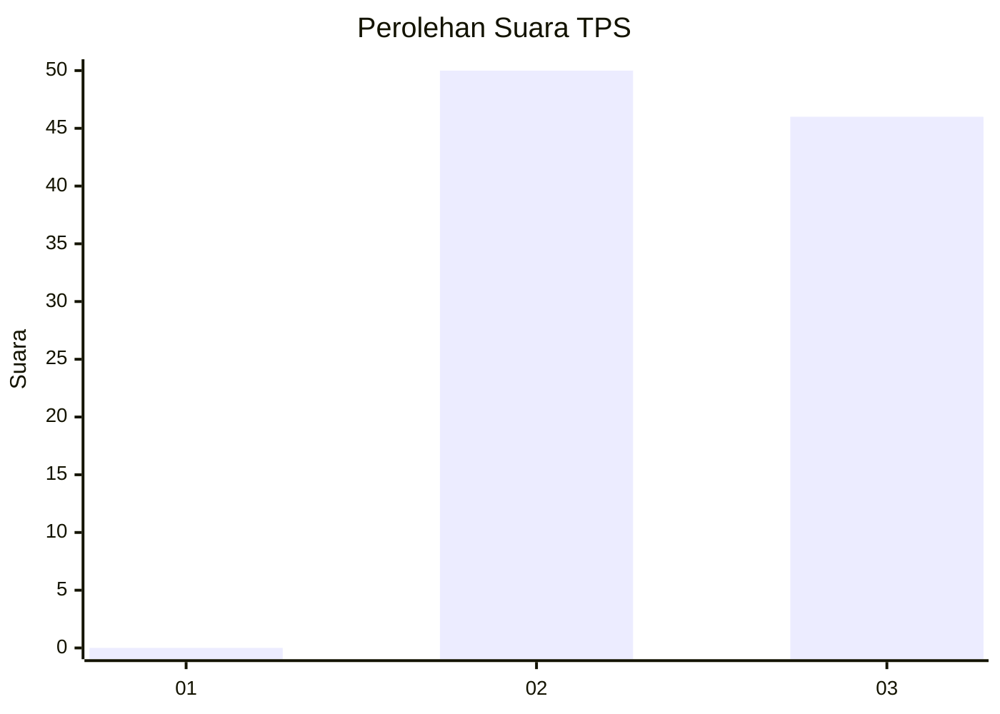
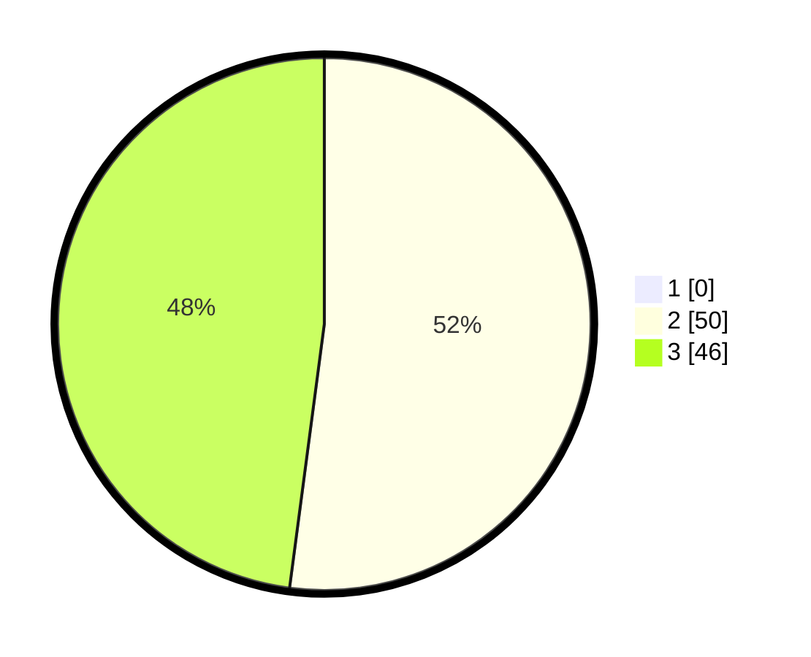

# Hasil

## Grafik

## Tabel

| No. | Nama Paslon    | Suara | Suara (raw) | Persentase |
|:--- |:-------------- | -----:| -----------:| ----------:|
| 1   | ANIES MUHAIMIN | 0     | [0][p-1]    | 0,00       |
| 2   | PRABOWO GIBRAN | 50    | [50][p-2]   | 52,08      |
| 3   | GANJAR MAHFUD  | 46    | [46][p-3]   | 47,92      |

[p-1]: https://github.com/gigit-pemilu/pemilu-2024/blob/main/pilpres/hitung-suara/sub/12-sumatera-utara/sub/14-nias-selatan/sub/18-fanayama/sub/2018-hilisalawa/sub/001-tps/sub/paslon-1.txt
[p-2]: https://github.com/gigit-pemilu/pemilu-2024/blob/main/pilpres/hitung-suara/sub/12-sumatera-utara/sub/14-nias-selatan/sub/18-fanayama/sub/2018-hilisalawa/sub/001-tps/sub/paslon-2.txt
[p-3]: https://github.com/gigit-pemilu/pemilu-2024/blob/main/pilpres/hitung-suara/sub/12-sumatera-utara/sub/14-nias-selatan/sub/18-fanayama/sub/2018-hilisalawa/sub/001-tps/sub/paslon-3.txt

## Foto C Plano

https://sirekap-obj-formc.kpu.go.id/3f90/pemilu/ppwp/12/14/18/20/18/1214182018001-20240214-232404--b6f5b93b-e5c4-44fc-a17a-d2f13f6d8909.jpg

https://sirekap-obj-formc.kpu.go.id/3f90/pemilu/ppwp/12/14/18/20/18/1214182018001-20240214-232704--22dd1c5c-79d7-4bf4-9d7d-3867a78af203.jpg

https://sirekap-obj-formc.kpu.go.id/3f90/pemilu/ppwp/12/14/18/20/18/1214182018001-20240214-233048--04dcce7f-6f22-4f26-8151-7004e80a4006.jpg

## Metadata

| Key        | Value               |
| ---------- | ------------------- |
| Time Stamp | 2024-02-15 21:30:27 |

