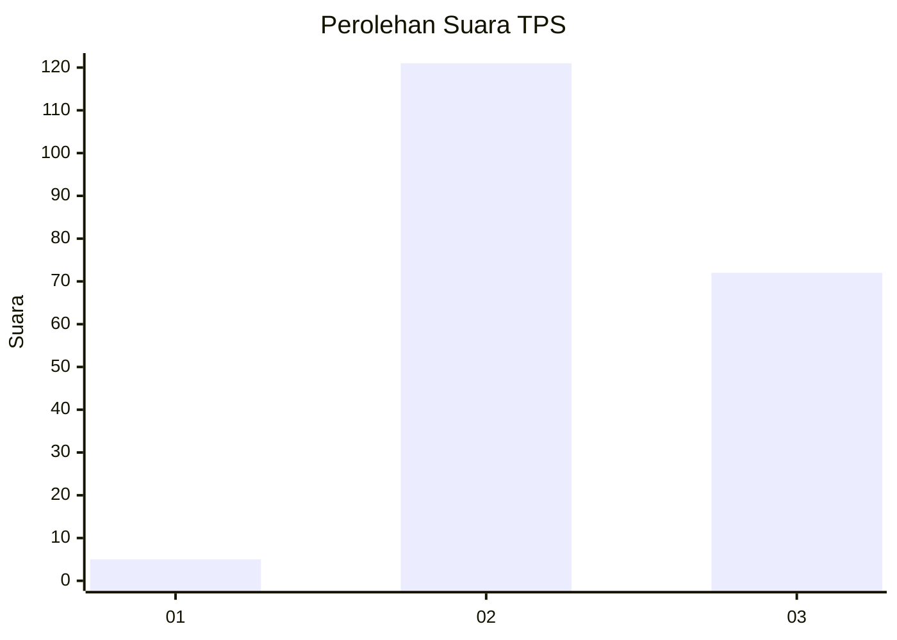
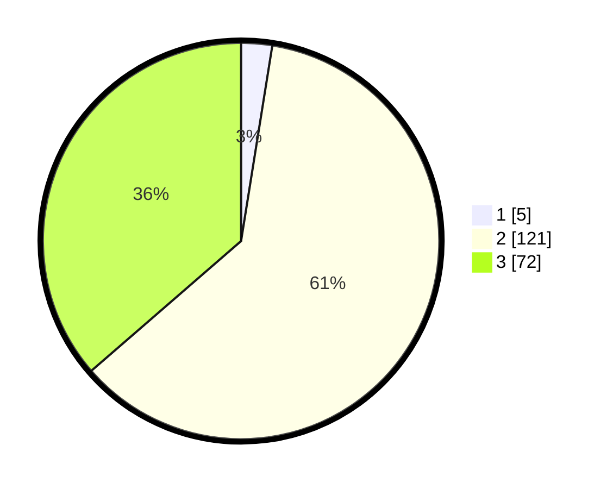

# Hasil

## Grafik

## Tabel

| No. | Nama Paslon    | Suara | Suara (raw) | Persentase |
|:--- |:-------------- | -----:| -----------:| ----------:|
| 1   | ANIES MUHAIMIN | 5     | [5][p-1]    | 2,53       |
| 2   | PRABOWO GIBRAN | 121   | [121][p-2]  | 61,11      |
| 3   | GANJAR MAHFUD  | 72    | [72][p-3]   | 36,36      |

[p-1]: https://github.com/gigit-pemilu/pemilu-2024-12-sumatera-utara/blob/main/pilpres/hitung-suara/sub/12-sumatera-utara/sub/14-nias-selatan/sub/19-ulunoyo/sub/2002-orahili-ulunoyo/sub/001-tps/sub/paslon-1.txt
[p-2]: https://github.com/gigit-pemilu/pemilu-2024-12-sumatera-utara/blob/main/pilpres/hitung-suara/sub/12-sumatera-utara/sub/14-nias-selatan/sub/19-ulunoyo/sub/2002-orahili-ulunoyo/sub/001-tps/sub/paslon-2.txt
[p-3]: https://github.com/gigit-pemilu/pemilu-2024-12-sumatera-utara/blob/main/pilpres/hitung-suara/sub/12-sumatera-utara/sub/14-nias-selatan/sub/19-ulunoyo/sub/2002-orahili-ulunoyo/sub/001-tps/sub/paslon-3.txt

## Foto C Plano

https://sirekap-obj-formc.kpu.go.id/e175/pemilu/ppwp/12/14/19/20/02/1214192002001-20240215-092037--760222a1-75d3-4a30-9f50-73d04cd48892.jpg

https://sirekap-obj-formc.kpu.go.id/e175/pemilu/ppwp/12/14/19/20/02/1214192002001-20240215-092314--dcc91e69-e50c-4e82-ae23-7f93f512d430.jpg

https://sirekap-obj-formc.kpu.go.id/e175/pemilu/ppwp/12/14/19/20/02/1214192002001-20240215-092801--7d1c372f-6d82-49a4-ad2c-3dbf769230a0.jpg

## Metadata

| Key        | Value               |
| ---------- | ------------------- |
| Time Stamp | 2024-02-15 19:30:26 |

