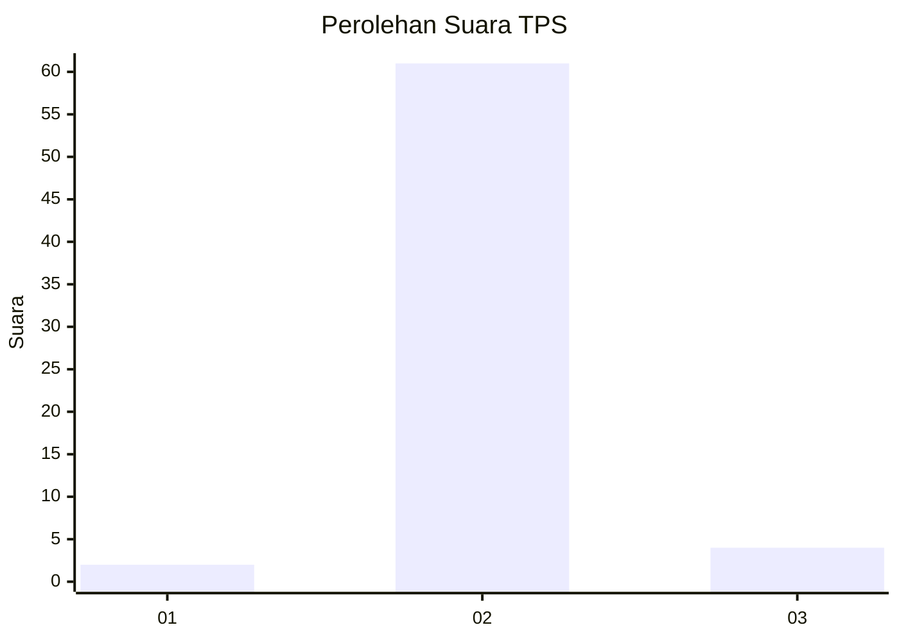
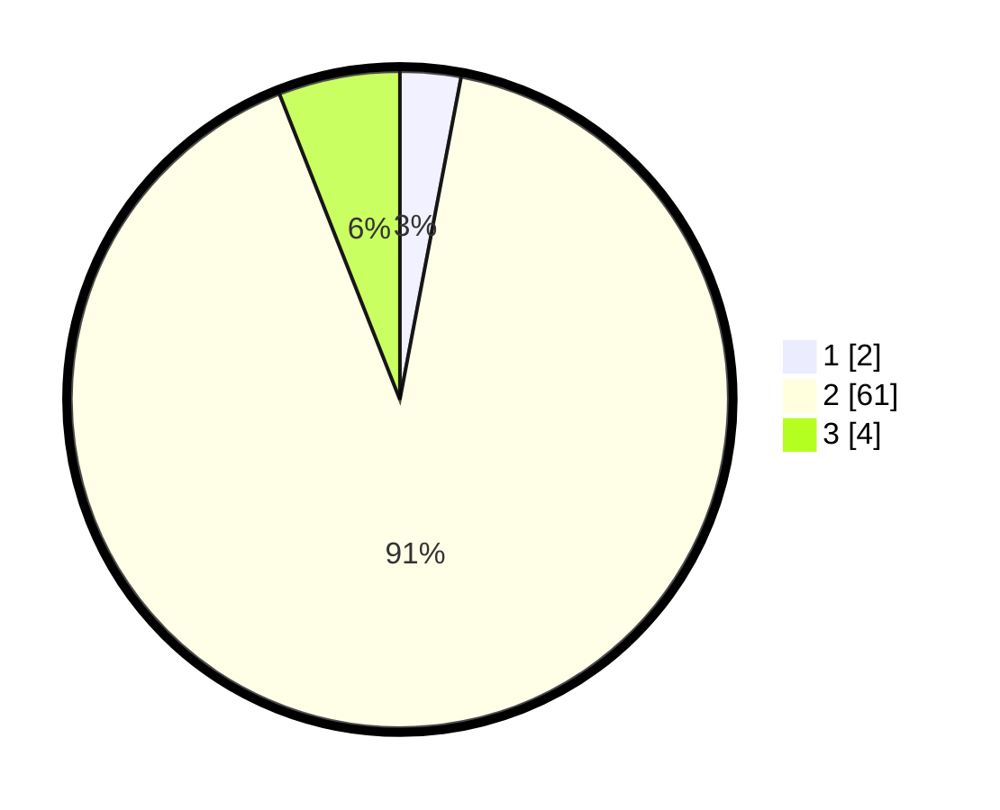

# Hasil

## Grafik

## Tabel

| No. | Nama Paslon    | Suara | Suara (raw) | Persentase |
|:--- |:-------------- | -----:| -----------:| ----------:|
| 1   | ANIES MUHAIMIN | 2     | [2][p-1]    | 2,99       |
| 2   | PRABOWO GIBRAN | 61    | [61][p-2]   | 91,04      |
| 3   | GANJAR MAHFUD  | 4     | [4][p-3]    | 5,97       |

[p-1]: https://github.com/gigit-pemilu/pemilu-2024-12-sumatera-utara/blob/main/pilpres/hitung-suara/sub/12-sumatera-utara/sub/14-nias-selatan/sub/19-ulunoyo/sub/2004-amorosa/sub/002-tps/sub/paslon-1.txt
[p-2]: https://github.com/gigit-pemilu/pemilu-2024-12-sumatera-utara/blob/main/pilpres/hitung-suara/sub/12-sumatera-utara/sub/14-nias-selatan/sub/19-ulunoyo/sub/2004-amorosa/sub/002-tps/sub/paslon-2.txt
[p-3]: https://github.com/gigit-pemilu/pemilu-2024-12-sumatera-utara/blob/main/pilpres/hitung-suara/sub/12-sumatera-utara/sub/14-nias-selatan/sub/19-ulunoyo/sub/2004-amorosa/sub/002-tps/sub/paslon-3.txt

## Foto C Plano

https://sirekap-obj-formc.kpu.go.id/4646/pemilu/ppwp/12/14/19/20/04/1214192004002-20240215-171420--240a47c9-1ee2-4c09-912e-9e0d50ae8040.jpg

https://sirekap-obj-formc.kpu.go.id/4646/pemilu/ppwp/12/14/19/20/04/1214192004002-20240215-171454--e7f773fc-d083-4098-993f-8f08b09f8f7d.jpg

https://sirekap-obj-formc.kpu.go.id/4646/pemilu/ppwp/12/14/19/20/04/1214192004002-20240215-171537--21b69343-af5a-47f2-a871-a71c4e66b2d8.jpg

## Metadata

| Key        | Value               |
| ---------- | ------------------- |
| Time Stamp | 2024-02-15 19:00:26 |

## DATA PEMILIH TETAP

Jumlah pemilih dalam DPT: **186**.
 * L: **93**.
 * P: **93**.

## DATA PENGGUNA HAK PILIH

Jumlah pengguna hak pilih dalam DPT: **154**.
 * L: **78**.
 * P: **76**.

Jumlah pengguna hak pilih dalam DPTb: **0**.
 * L: **0**.
 * P: **0**.

Jumlah pengguna hak pilih dalam DPK: **9**.
 * L: **4**.
 * P: **5**.

Jumlah pengguna hak pilih: **163**.
 * L: **82**.
 * P: **81**.

## JUMLAH SUARA SAH DAN TIDAK SAH

JUMLAH SELURUH SUARA SAH: **67**.

JUMLAH SUARA TIDAK SAH: **97**.

JUMLAH SELURUH SUARA SAH DAN SUARA TIDAK SAH: **164**.

