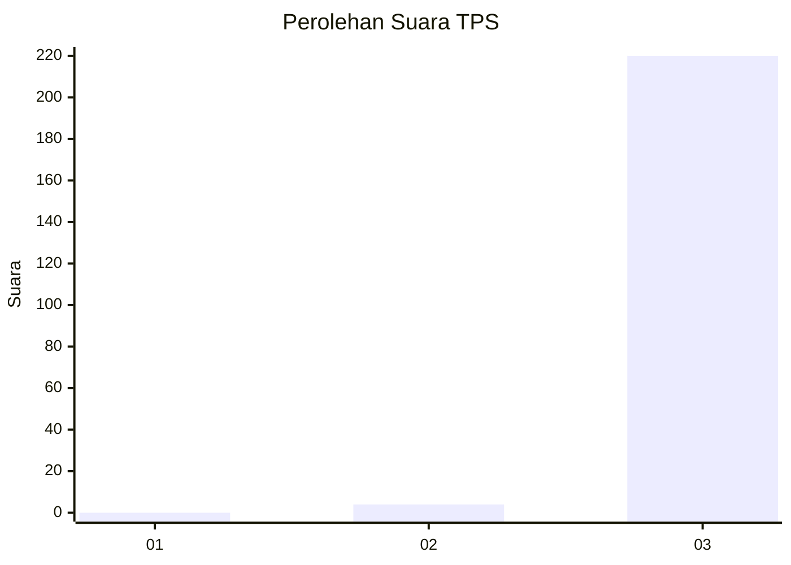
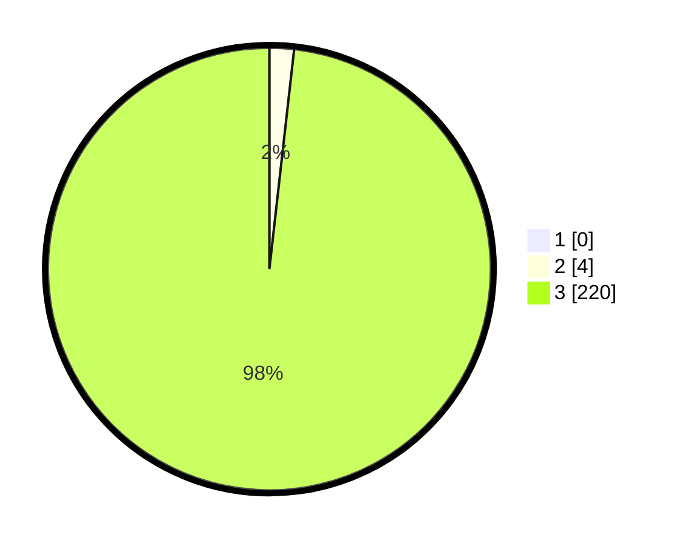

# Hasil

## Grafik

## Tabel

| No. | Nama Paslon    | Suara | Suara (raw) | Persentase |
|:--- |:-------------- | -----:| -----------:| ----------:|
| 1   | ANIES MUHAIMIN | 0     | [0][p-1]    | 0,00       |
| 2   | PRABOWO GIBRAN | 4     | [4][p-2]    | 1,79       |
| 3   | GANJAR MAHFUD  | 220   | [220][p-3]  | 98,21      |

[p-1]: https://github.com/gigit-pemilu/pemilu-2024/blob/main/pilpres/hitung-suara/sub/12-sumatera-utara/sub/14-nias-selatan/sub/19-ulunoyo/sub/2007-hilimaera/sub/002-tps/sub/paslon-1.txt
[p-2]: https://github.com/gigit-pemilu/pemilu-2024/blob/main/pilpres/hitung-suara/sub/12-sumatera-utara/sub/14-nias-selatan/sub/19-ulunoyo/sub/2007-hilimaera/sub/002-tps/sub/paslon-2.txt
[p-3]: https://github.com/gigit-pemilu/pemilu-2024/blob/main/pilpres/hitung-suara/sub/12-sumatera-utara/sub/14-nias-selatan/sub/19-ulunoyo/sub/2007-hilimaera/sub/002-tps/sub/paslon-3.txt

## Foto C Plano

https://sirekap-obj-formc.kpu.go.id/e18a/pemilu/ppwp/12/14/19/20/07/1214192007002-20240215-120543--75346976-101c-4d7d-b99a-3dd158055d6b.jpg

https://sirekap-obj-formc.kpu.go.id/e18a/pemilu/ppwp/12/14/19/20/07/1214192007002-20240215-142339--9ea69e6a-3b2a-42cc-8f9a-8b88886829da.jpg

https://sirekap-obj-formc.kpu.go.id/e18a/pemilu/ppwp/12/14/19/20/07/1214192007002-20240215-115420--5f5b4e55-5442-497b-9e90-91642cbe4bf9.jpg

## Metadata

| Key        | Value               |
| ---------- | ------------------- |
| Time Stamp | 2024-02-15 15:30:25 |

