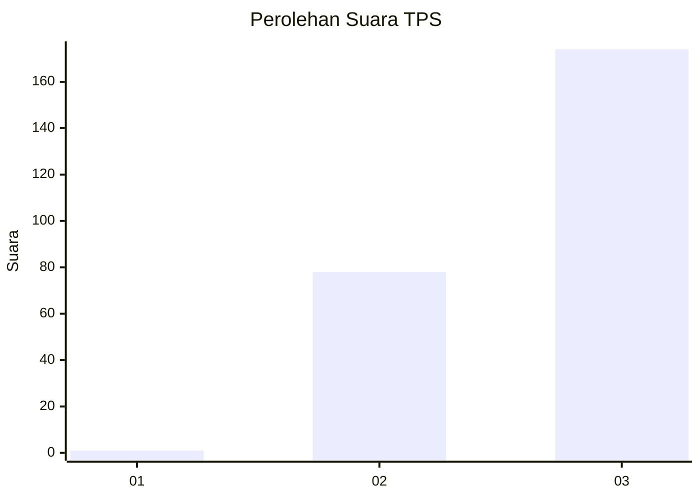
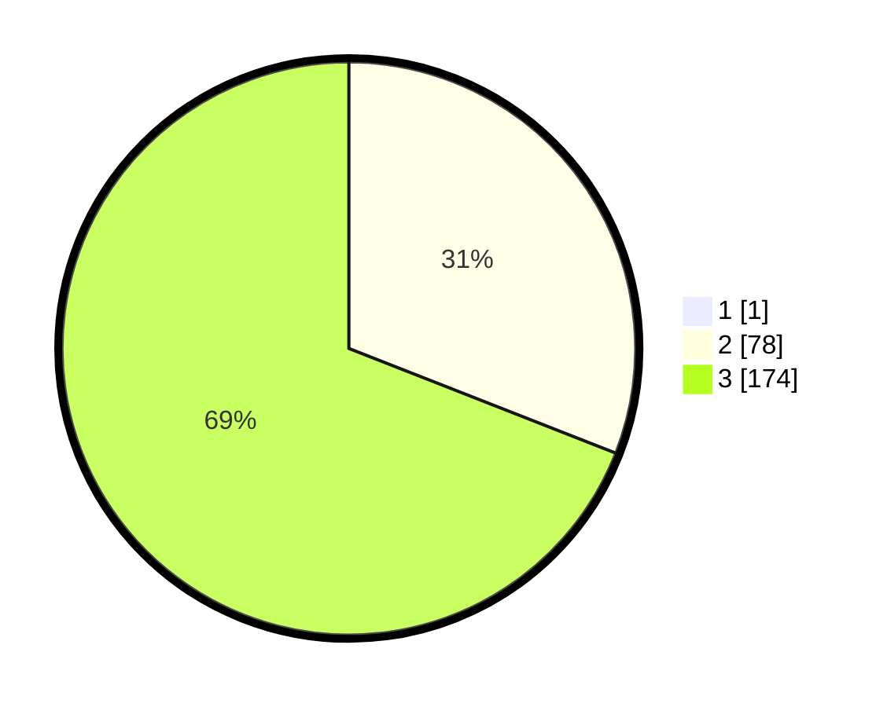

# Hasil

## Grafik

## Tabel

| No. | Nama Paslon    | Suara | Suara (raw) | Persentase |
|:--- |:-------------- | -----:| -----------:| ----------:|
| 1   | ANIES MUHAIMIN | 1     | [1][p-1]    | 0,40       |
| 2   | PRABOWO GIBRAN | 78    | [78][p-2]   | 30,83      |
| 3   | GANJAR MAHFUD  | 174   | [174][p-3]  | 68,77      |

[p-1]: https://github.com/gigit-pemilu/pemilu-2024/blob/main/pilpres/hitung-suara/sub/12-sumatera-utara/sub/14-nias-selatan/sub/19-ulunoyo/sub/2010-hilifakhe/sub/001-tps/sub/paslon-1.txt
[p-2]: https://github.com/gigit-pemilu/pemilu-2024/blob/main/pilpres/hitung-suara/sub/12-sumatera-utara/sub/14-nias-selatan/sub/19-ulunoyo/sub/2010-hilifakhe/sub/001-tps/sub/paslon-2.txt
[p-3]: https://github.com/gigit-pemilu/pemilu-2024/blob/main/pilpres/hitung-suara/sub/12-sumatera-utara/sub/14-nias-selatan/sub/19-ulunoyo/sub/2010-hilifakhe/sub/001-tps/sub/paslon-3.txt

## Foto C Plano

https://sirekap-obj-formc.kpu.go.id/65b3/pemilu/ppwp/12/14/19/20/10/1214192010001-20240215-020951--8e1df934-e1b1-4ca6-952c-205c5aadfa8d.jpg

https://sirekap-obj-formc.kpu.go.id/65b3/pemilu/ppwp/12/14/19/20/10/1214192010001-20240215-021425--4302bbf9-dade-4e89-b7af-1684a56b7475.jpg

https://sirekap-obj-formc.kpu.go.id/65b3/pemilu/ppwp/12/14/19/20/10/1214192010001-20240215-091808--9f2b9b4b-322e-41ea-845e-3c0e448f0b49.jpg

## Metadata

| Key        | Value               |
| ---------- | ------------------- |
| Time Stamp | 2024-02-16 08:00:28 |

