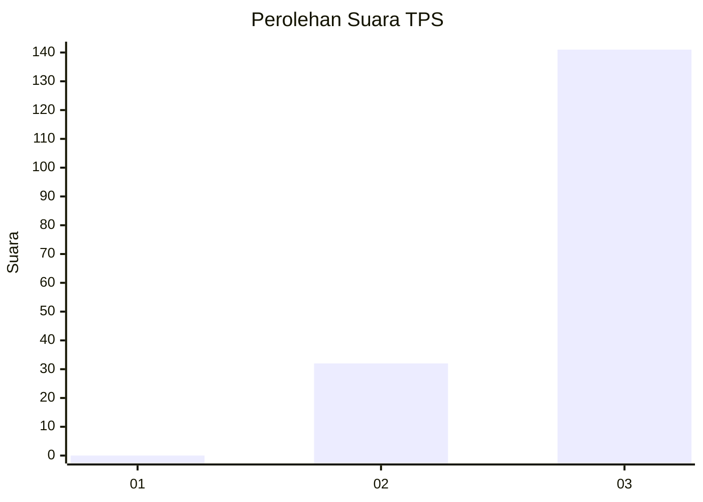
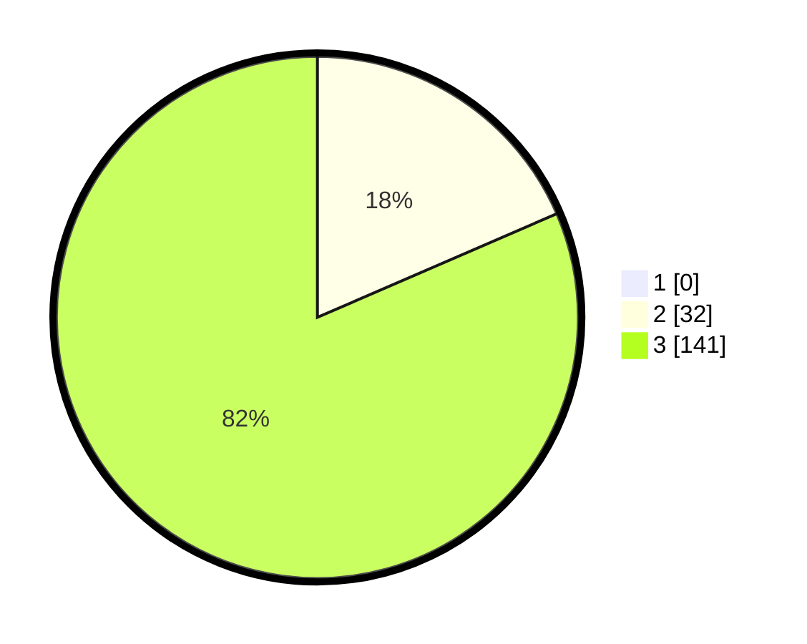

# Hasil

## Grafik

## Tabel

| No. | Nama Paslon    | Suara | Suara (raw) | Persentase |
|:--- |:-------------- | -----:| -----------:| ----------:|
| 1   | ANIES MUHAIMIN | 0     | [0][p-1]    | 0,00       |
| 2   | PRABOWO GIBRAN | 32    | [32][p-2]   | 18,50      |
| 3   | GANJAR MAHFUD  | 141   | [141][p-3]  | 81,50      |

[p-1]: https://github.com/gigit-pemilu/pemilu-2024-12-sumatera-utara/blob/main/pilpres/hitung-suara/sub/12-sumatera-utara/sub/14-nias-selatan/sub/19-ulunoyo/sub/2010-hilifakhe/sub/002-tps/sub/paslon-1.txt
[p-2]: https://github.com/gigit-pemilu/pemilu-2024-12-sumatera-utara/blob/main/pilpres/hitung-suara/sub/12-sumatera-utara/sub/14-nias-selatan/sub/19-ulunoyo/sub/2010-hilifakhe/sub/002-tps/sub/paslon-2.txt
[p-3]: https://github.com/gigit-pemilu/pemilu-2024-12-sumatera-utara/blob/main/pilpres/hitung-suara/sub/12-sumatera-utara/sub/14-nias-selatan/sub/19-ulunoyo/sub/2010-hilifakhe/sub/002-tps/sub/paslon-3.txt

## Foto C Plano

https://sirekap-obj-formc.kpu.go.id/331d/pemilu/ppwp/12/14/19/20/10/1214192010002-20240215-030156--daf0356e-e40a-4483-874f-fe137dacc1b5.jpg

https://sirekap-obj-formc.kpu.go.id/331d/pemilu/ppwp/12/14/19/20/10/1214192010002-20240215-030242--cf8c3619-745d-4f88-af3c-c4cc041ae54e.jpg

https://sirekap-obj-formc.kpu.go.id/331d/pemilu/ppwp/12/14/19/20/10/1214192010002-20240215-030318--022dc836-c39b-4203-9b0f-225b18e57683.jpg

## Metadata

| Key        | Value               |
| ---------- | ------------------- |
| Time Stamp | 2024-02-20 12:00:00 |

