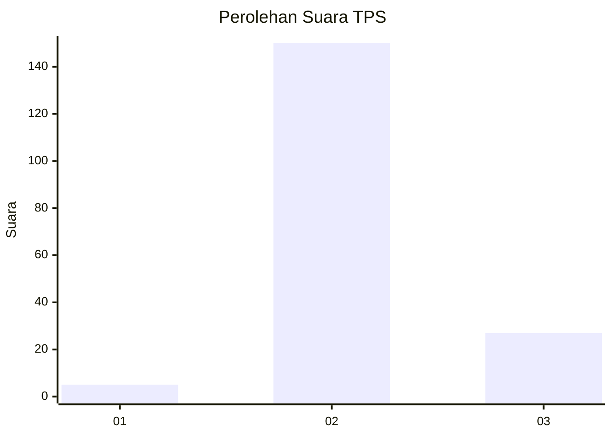
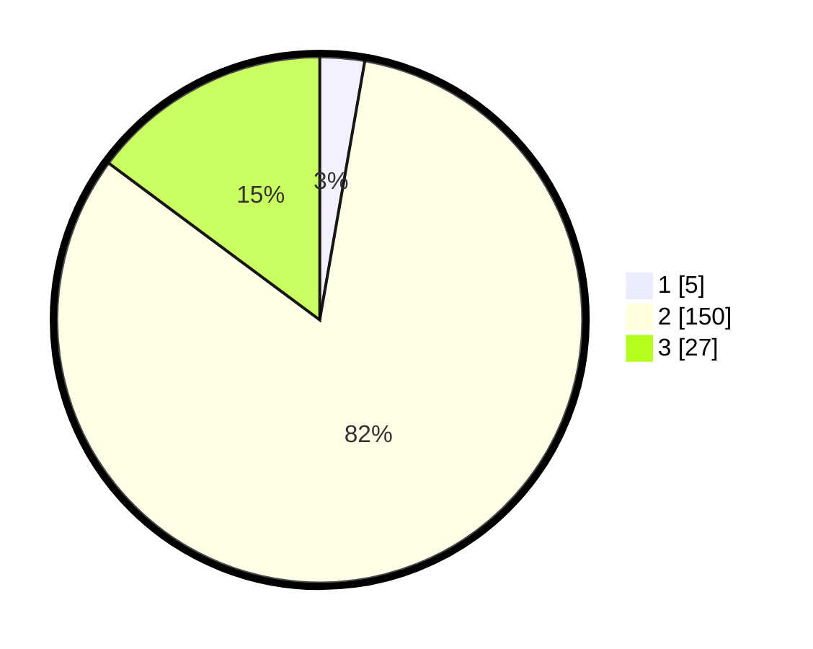

# Hasil

## Grafik

## Tabel

| No. | Nama Paslon    | Suara | Suara (raw) | Persentase |
|:--- |:-------------- | -----:| -----------:| ----------:|
| 1   | ANIES MUHAIMIN | 5     | [5][p-1]    | 2,75       |
| 2   | PRABOWO GIBRAN | 150   | [150][p-2]  | 82,42      |
| 3   | GANJAR MAHFUD  | 27    | [27][p-3]   | 14,84      |

[p-1]: https://github.com/gigit-pemilu/pemilu-2024-12-sumatera-utara/blob/main/pilpres/hitung-suara/sub/12-sumatera-utara/sub/14-nias-selatan/sub/20-huruna/sub/2001-ehosakhozi/sub/001-tps/sub/paslon-1.txt
[p-2]: https://github.com/gigit-pemilu/pemilu-2024-12-sumatera-utara/blob/main/pilpres/hitung-suara/sub/12-sumatera-utara/sub/14-nias-selatan/sub/20-huruna/sub/2001-ehosakhozi/sub/001-tps/sub/paslon-2.txt
[p-3]: https://github.com/gigit-pemilu/pemilu-2024-12-sumatera-utara/blob/main/pilpres/hitung-suara/sub/12-sumatera-utara/sub/14-nias-selatan/sub/20-huruna/sub/2001-ehosakhozi/sub/001-tps/sub/paslon-3.txt

## Foto C Plano

https://sirekap-obj-formc.kpu.go.id/e77a/pemilu/ppwp/12/14/20/20/01/1214202001001-20240215-122405--e89be21a-582c-482a-a58b-beeddd4b119d.jpg

https://sirekap-obj-formc.kpu.go.id/e77a/pemilu/ppwp/12/14/20/20/01/1214202001001-20240215-122519--a9c67abd-418b-423f-b4c7-4a510d35d144.jpg

https://sirekap-obj-formc.kpu.go.id/e77a/pemilu/ppwp/12/14/20/20/01/1214202001001-20240215-094755--a9325b7d-3672-4f7e-b8f8-3fa8b33ea38b.jpg

## Metadata

| Key        | Value               |
| ---------- | ------------------- |
| Time Stamp | 2024-02-20 12:00:00 |

