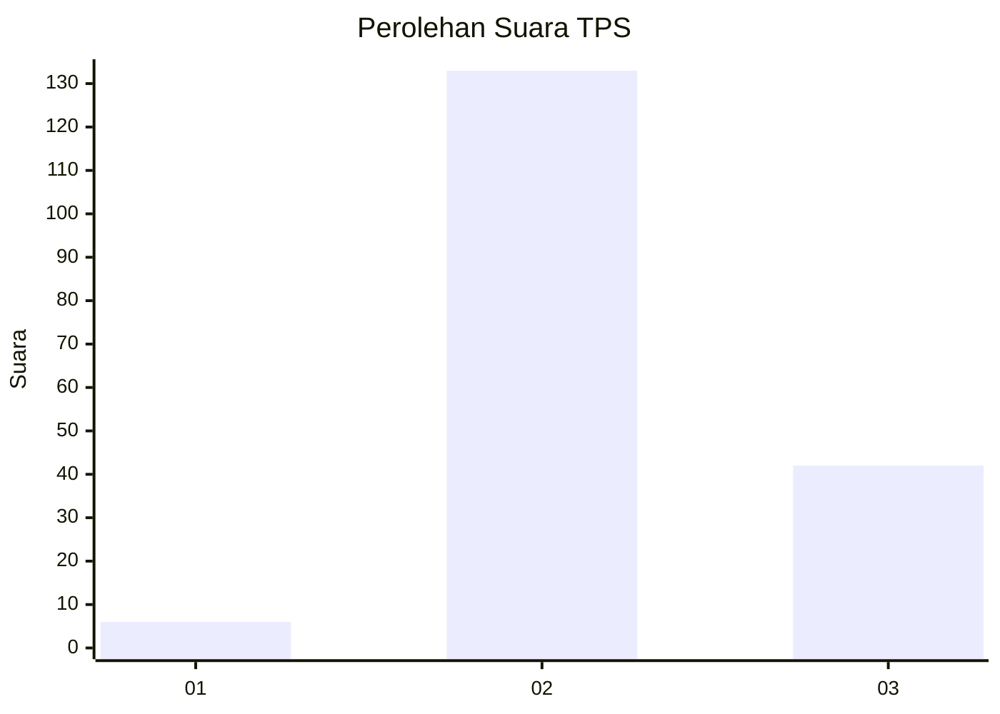
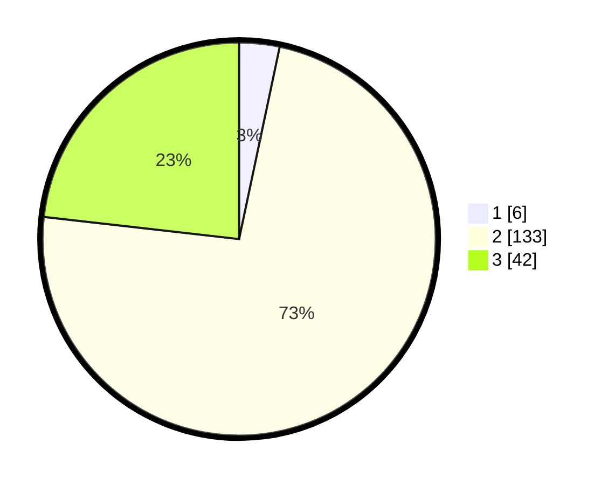

# Hasil

## Grafik

## Tabel

| No. | Nama Paslon    | Suara | Suara (raw) | Persentase |
|:--- |:-------------- | -----:| -----------:| ----------:|
| 1   | ANIES MUHAIMIN | 6     | [6][p-1]    | 3,31       |
| 2   | PRABOWO GIBRAN | 133   | [133][p-2]  | 73,48      |
| 3   | GANJAR MAHFUD  | 42    | [42][p-3]   | 23,20      |

[p-1]: https://github.com/gigit-pemilu/pemilu-2024-12-sumatera-utara/blob/main/pilpres/hitung-suara/sub/12-sumatera-utara/sub/14-nias-selatan/sub/20-huruna/sub/2001-ehosakhozi/sub/002-tps/sub/paslon-1.txt
[p-2]: https://github.com/gigit-pemilu/pemilu-2024-12-sumatera-utara/blob/main/pilpres/hitung-suara/sub/12-sumatera-utara/sub/14-nias-selatan/sub/20-huruna/sub/2001-ehosakhozi/sub/002-tps/sub/paslon-2.txt
[p-3]: https://github.com/gigit-pemilu/pemilu-2024-12-sumatera-utara/blob/main/pilpres/hitung-suara/sub/12-sumatera-utara/sub/14-nias-selatan/sub/20-huruna/sub/2001-ehosakhozi/sub/002-tps/sub/paslon-3.txt

## Foto C Plano

https://sirekap-obj-formc.kpu.go.id/5669/pemilu/ppwp/12/14/20/20/01/1214202001002-20240215-082411--7190ad38-2798-42b7-ad96-7476b299032e.jpg

https://sirekap-obj-formc.kpu.go.id/5669/pemilu/ppwp/12/14/20/20/01/1214202001002-20240215-082832--b3caa9f6-2bb2-45c0-ab95-8d93ebe1871f.jpg

https://sirekap-obj-formc.kpu.go.id/5669/pemilu/ppwp/12/14/20/20/01/1214202001002-20240215-151132--75b2cf0e-571d-49cb-a44a-efdfea0c19cf.jpg

## Metadata

| Key        | Value               |
| ---------- | ------------------- |
| Time Stamp | 2024-02-19 22:00:00 |

