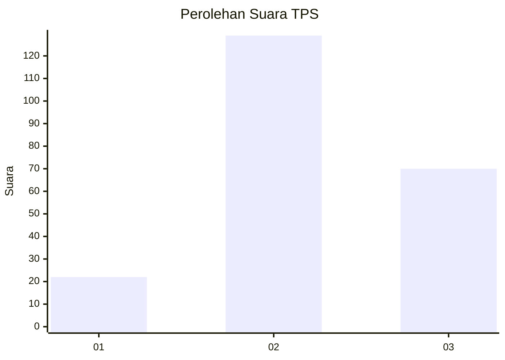
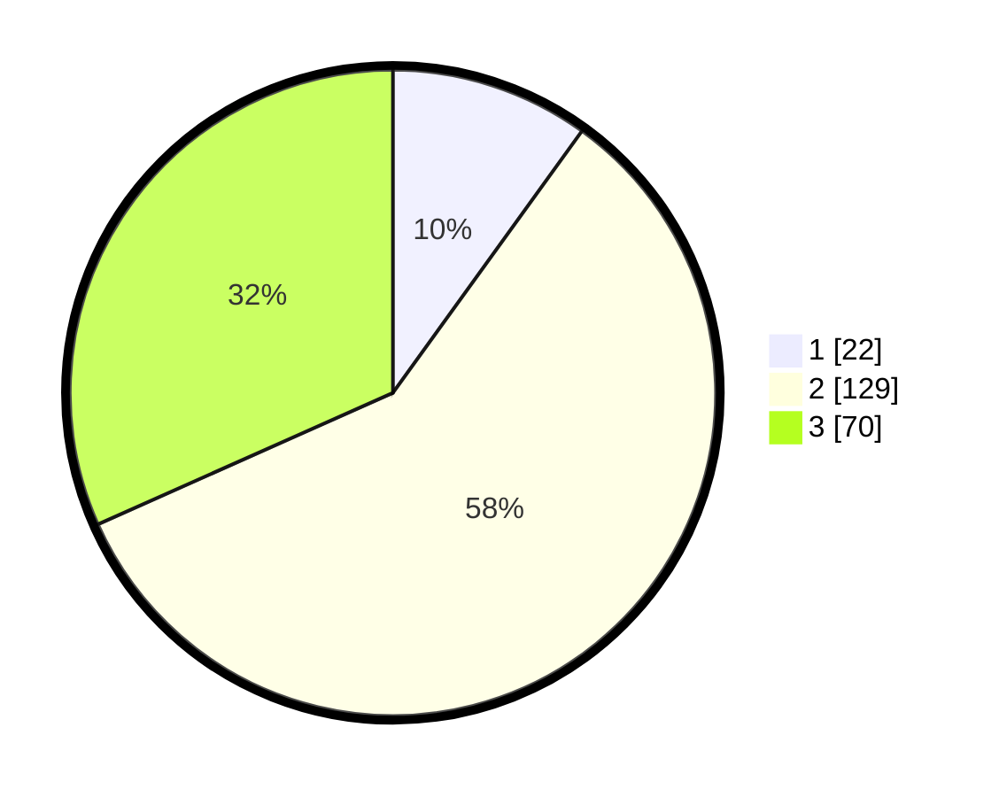

# Hasil

## Grafik

## Tabel

| No. | Nama Paslon    | Suara | Suara (raw) | Persentase |
|:--- |:-------------- | -----:| -----------:| ----------:|
| 1   | ANIES MUHAIMIN | 22    | [22][p-1]   | 9,95       |
| 2   | PRABOWO GIBRAN | 129   | [129][p-2]  | 58,37      |
| 3   | GANJAR MAHFUD  | 70    | [70][p-3]   | 31,67      |

[p-1]: https://github.com/gigit-pemilu/pemilu-2024/blob/main/pilpres/hitung-suara/sub/12-sumatera-utara/sub/14-nias-selatan/sub/20-huruna/sub/2001-ehosakhozi/sub/003-tps/sub/paslon-1.txt
[p-2]: https://github.com/gigit-pemilu/pemilu-2024/blob/main/pilpres/hitung-suara/sub/12-sumatera-utara/sub/14-nias-selatan/sub/20-huruna/sub/2001-ehosakhozi/sub/003-tps/sub/paslon-2.txt
[p-3]: https://github.com/gigit-pemilu/pemilu-2024/blob/main/pilpres/hitung-suara/sub/12-sumatera-utara/sub/14-nias-selatan/sub/20-huruna/sub/2001-ehosakhozi/sub/003-tps/sub/paslon-3.txt

## Foto C Plano

https://sirekap-obj-formc.kpu.go.id/a9bd/pemilu/ppwp/12/14/20/20/01/1214202001003-20240215-121051--313f4b5d-586b-4336-8ad4-6fbf95764258.jpg

https://sirekap-obj-formc.kpu.go.id/a9bd/pemilu/ppwp/12/14/20/20/01/1214202001003-20240215-121519--14e9f1c3-f255-4645-8104-e44b3305370a.jpg

https://sirekap-obj-formc.kpu.go.id/a9bd/pemilu/ppwp/12/14/20/20/01/1214202001003-20240215-121840--e436cd95-be05-41be-ae4c-b219111727ae.jpg

## Metadata

| Key        | Value               |
| ---------- | ------------------- |
| Time Stamp | 2024-02-15 21:30:27 |

