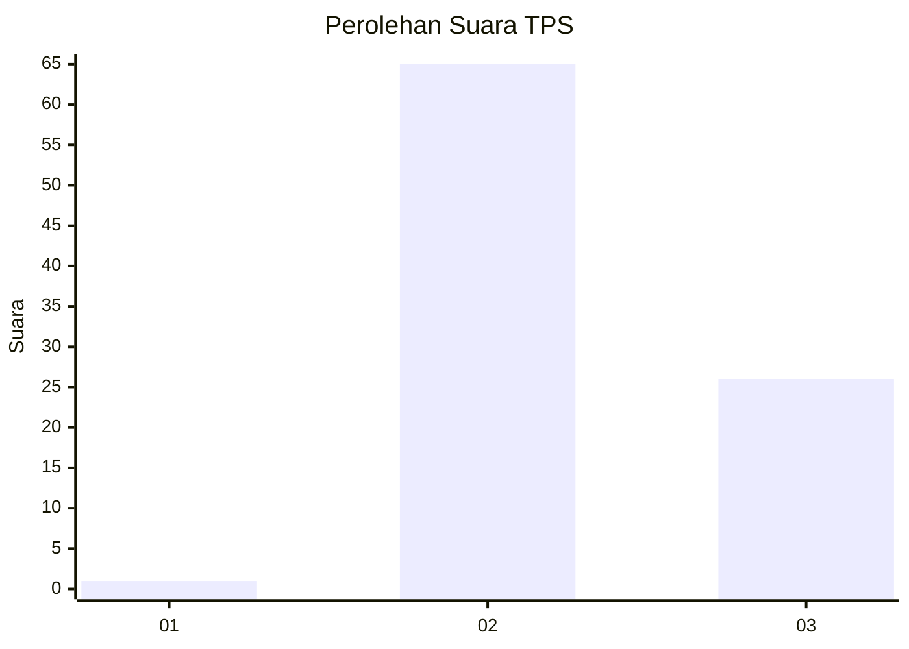
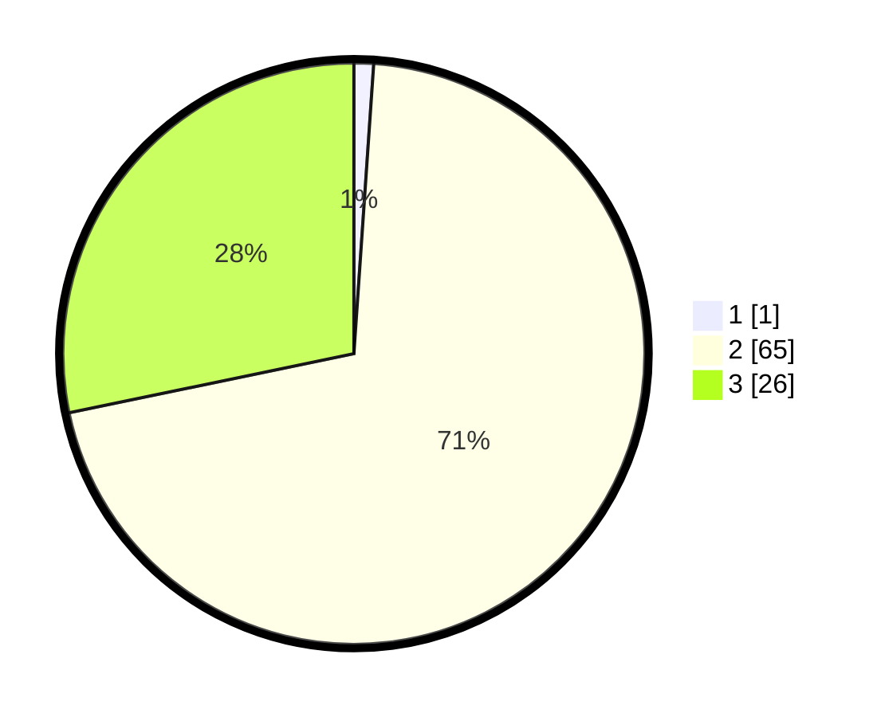

# Hasil

## Grafik

## Tabel

| No. | Nama Paslon    | Suara | Suara (raw) | Persentase |
|:--- |:-------------- | -----:| -----------:| ----------:|
| 1   | ANIES MUHAIMIN | 1     | [1][p-1]    | 1,09       |
| 2   | PRABOWO GIBRAN | 65    | [65][p-2]   | 70,65      |
| 3   | GANJAR MAHFUD  | 26    | [26][p-3]   | 28,26      |

[p-1]: https://github.com/gigit-pemilu/pemilu-2024-12-sumatera-utara/blob/main/pilpres/hitung-suara/sub/12-sumatera-utara/sub/14-nias-selatan/sub/20-huruna/sub/2002-bawohosi/sub/002-tps/sub/paslon-1.txt
[p-2]: https://github.com/gigit-pemilu/pemilu-2024-12-sumatera-utara/blob/main/pilpres/hitung-suara/sub/12-sumatera-utara/sub/14-nias-selatan/sub/20-huruna/sub/2002-bawohosi/sub/002-tps/sub/paslon-2.txt
[p-3]: https://github.com/gigit-pemilu/pemilu-2024-12-sumatera-utara/blob/main/pilpres/hitung-suara/sub/12-sumatera-utara/sub/14-nias-selatan/sub/20-huruna/sub/2002-bawohosi/sub/002-tps/sub/paslon-3.txt

## Foto C Plano

https://sirekap-obj-formc.kpu.go.id/860f/pemilu/ppwp/12/14/20/20/02/1214202002002-20240215-084325--93b0d898-91d7-4665-a211-2997f46c8204.jpg

https://sirekap-obj-formc.kpu.go.id/860f/pemilu/ppwp/12/14/20/20/02/1214202002002-20240215-001653--2160142a-b04c-4705-9a1c-49edfdf65643.jpg

https://sirekap-obj-formc.kpu.go.id/860f/pemilu/ppwp/12/14/20/20/02/1214202002002-20240215-081220--d5207ba5-e317-47d2-81c1-10a72312eb3d.jpg

## Metadata

| Key        | Value               |
| ---------- | ------------------- |
| Time Stamp | 2024-02-20 12:00:00 |

