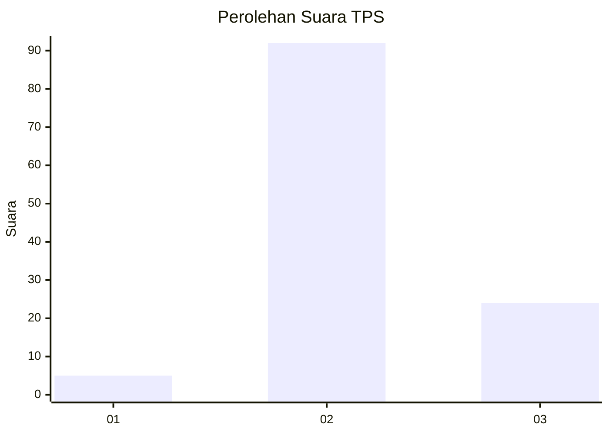
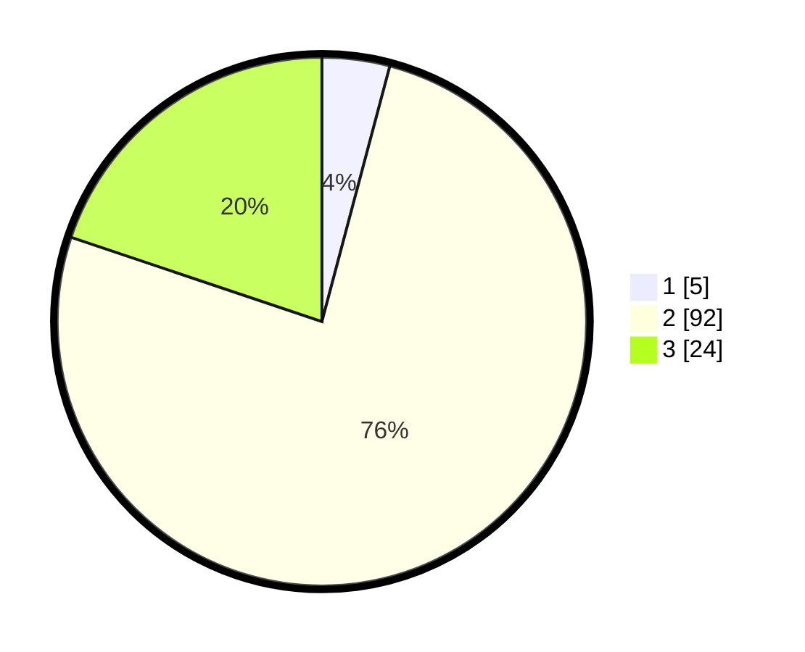

# Hasil

## Grafik

## Tabel

| No. | Nama Paslon    | Suara | Suara (raw) | Persentase |
|:--- |:-------------- | -----:| -----------:| ----------:|
| 1   | ANIES MUHAIMIN | 5     | [5][p-1]    | 4,13       |
| 2   | PRABOWO GIBRAN | 92    | [92][p-2]   | 76,03      |
| 3   | GANJAR MAHFUD  | 24    | [24][p-3]   | 19,83      |

[p-1]: https://github.com/gigit-pemilu/pemilu-2024-12-sumatera-utara/blob/main/pilpres/hitung-suara/sub/12-sumatera-utara/sub/14-nias-selatan/sub/20-huruna/sub/2005-sifaoroasi/sub/002-tps/sub/paslon-1.txt
[p-2]: https://github.com/gigit-pemilu/pemilu-2024-12-sumatera-utara/blob/main/pilpres/hitung-suara/sub/12-sumatera-utara/sub/14-nias-selatan/sub/20-huruna/sub/2005-sifaoroasi/sub/002-tps/sub/paslon-2.txt
[p-3]: https://github.com/gigit-pemilu/pemilu-2024-12-sumatera-utara/blob/main/pilpres/hitung-suara/sub/12-sumatera-utara/sub/14-nias-selatan/sub/20-huruna/sub/2005-sifaoroasi/sub/002-tps/sub/paslon-3.txt

## Foto C Plano

https://sirekap-obj-formc.kpu.go.id/5abb/pemilu/ppwp/12/14/20/20/05/1214202005002-20240215-075539--7f209981-4b6d-40be-98f3-2bc5ed0b9586.jpg

https://sirekap-obj-formc.kpu.go.id/5abb/pemilu/ppwp/12/14/20/20/05/1214202005002-20240214-225341--71bc72bc-5cad-4250-a8cb-6c54b3f55b62.jpg

https://sirekap-obj-formc.kpu.go.id/5abb/pemilu/ppwp/12/14/20/20/05/1214202005002-20240215-075756--7ae7fee1-30a5-47e7-9379-1a6e74b8c5ce.jpg

## Metadata

| Key        | Value               |
| ---------- | ------------------- |
| Time Stamp | 2024-02-15 21:30:27 |

