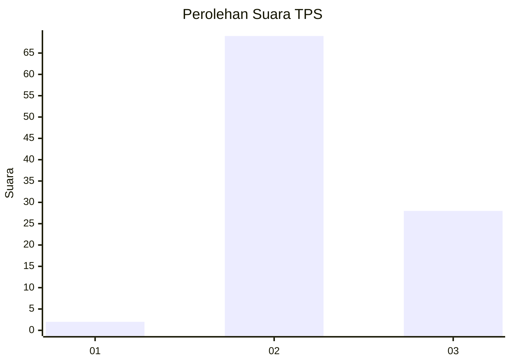
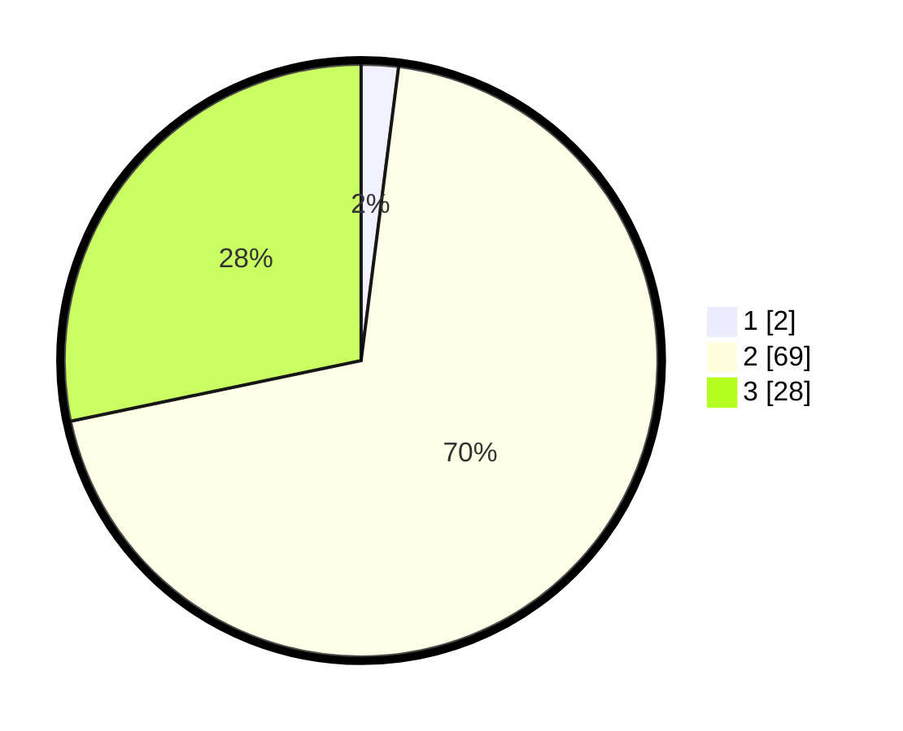

# Hasil

## Grafik

## Tabel

| No. | Nama Paslon    | Suara | Suara (raw) | Persentase |
|:--- |:-------------- | -----:| -----------:| ----------:|
| 1   | ANIES MUHAIMIN | 2     | [2][p-1]    | 2,02       |
| 2   | PRABOWO GIBRAN | 69    | [69][p-2]   | 69,70      |
| 3   | GANJAR MAHFUD  | 28    | [28][p-3]   | 28,28      |

[p-1]: https://github.com/gigit-pemilu/pemilu-2024-12-sumatera-utara/blob/main/pilpres/hitung-suara/sub/12-sumatera-utara/sub/14-nias-selatan/sub/20-huruna/sub/2005-sifaoroasi/sub/003-tps/sub/paslon-1.txt
[p-2]: https://github.com/gigit-pemilu/pemilu-2024-12-sumatera-utara/blob/main/pilpres/hitung-suara/sub/12-sumatera-utara/sub/14-nias-selatan/sub/20-huruna/sub/2005-sifaoroasi/sub/003-tps/sub/paslon-2.txt
[p-3]: https://github.com/gigit-pemilu/pemilu-2024-12-sumatera-utara/blob/main/pilpres/hitung-suara/sub/12-sumatera-utara/sub/14-nias-selatan/sub/20-huruna/sub/2005-sifaoroasi/sub/003-tps/sub/paslon-3.txt

## Foto C Plano

https://sirekap-obj-formc.kpu.go.id/06f0/pemilu/ppwp/12/14/20/20/05/1214202005003-20240215-022710--e0a96a70-3dac-4702-8360-b258a04e45e5.jpg

https://sirekap-obj-formc.kpu.go.id/06f0/pemilu/ppwp/12/14/20/20/05/1214202005003-20240215-022904--6de45f85-4b62-43aa-bb7a-05177a9fcc64.jpg

https://sirekap-obj-formc.kpu.go.id/06f0/pemilu/ppwp/12/14/20/20/05/1214202005003-20240215-023030--8e7379a5-ed72-4dbe-9f3b-e3815f9306bc.jpg

## Metadata

| Key        | Value               |
| ---------- | ------------------- |
| Time Stamp | 2024-02-20 12:00:00 |

