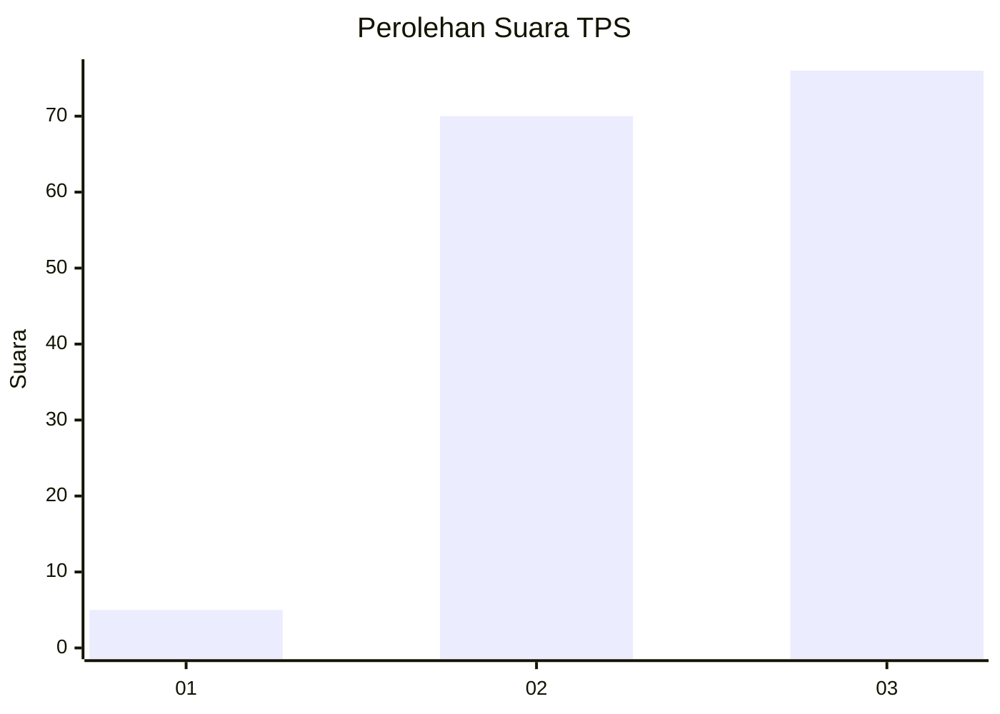
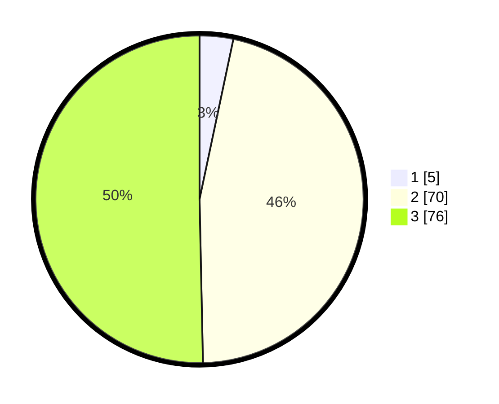

# Hasil

## Grafik

## Tabel

| No. | Nama Paslon    | Suara | Suara (raw) | Persentase |
|:--- |:-------------- | -----:| -----------:| ----------:|
| 1   | ANIES MUHAIMIN | 5     | [5][p-1]    | 3,31       |
| 2   | PRABOWO GIBRAN | 70    | [70][p-2]   | 46,36      |
| 3   | GANJAR MAHFUD  | 76    | [76][p-3]   | 50,33      |

[p-1]: https://github.com/gigit-pemilu/pemilu-2024/blob/main/pilpres/hitung-suara/sub/12-sumatera-utara/sub/14-nias-selatan/sub/20-huruna/sub/2015-sifaoroasi-huruna/sub/001-tps/sub/paslon-1.txt
[p-2]: https://github.com/gigit-pemilu/pemilu-2024/blob/main/pilpres/hitung-suara/sub/12-sumatera-utara/sub/14-nias-selatan/sub/20-huruna/sub/2015-sifaoroasi-huruna/sub/001-tps/sub/paslon-2.txt
[p-3]: https://github.com/gigit-pemilu/pemilu-2024/blob/main/pilpres/hitung-suara/sub/12-sumatera-utara/sub/14-nias-selatan/sub/20-huruna/sub/2015-sifaoroasi-huruna/sub/001-tps/sub/paslon-3.txt

## Foto C Plano

https://sirekap-obj-formc.kpu.go.id/fcc0/pemilu/ppwp/12/14/20/20/15/1214202015001-20240215-023515--d31745f2-d55c-4b65-9a58-3fe8dd8544fb.jpg

https://sirekap-obj-formc.kpu.go.id/fcc0/pemilu/ppwp/12/14/20/20/15/1214202015001-20240215-024633--11d754e9-68ef-4102-a64f-558d806fb605.jpg

https://sirekap-obj-formc.kpu.go.id/fcc0/pemilu/ppwp/12/14/20/20/15/1214202015001-20240215-024928--fb5cc05e-7ed4-4a53-a165-edff838429b4.jpg

## Metadata

| Key        | Value               |
| ---------- | ------------------- |
| Time Stamp | 2024-02-16 12:51:22 |

