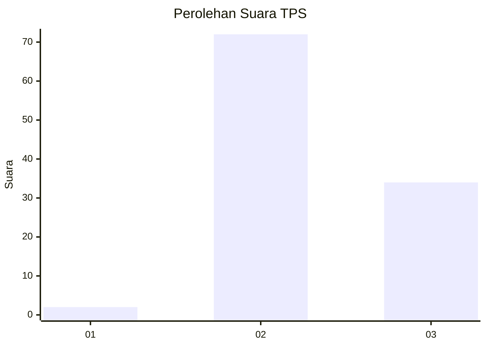
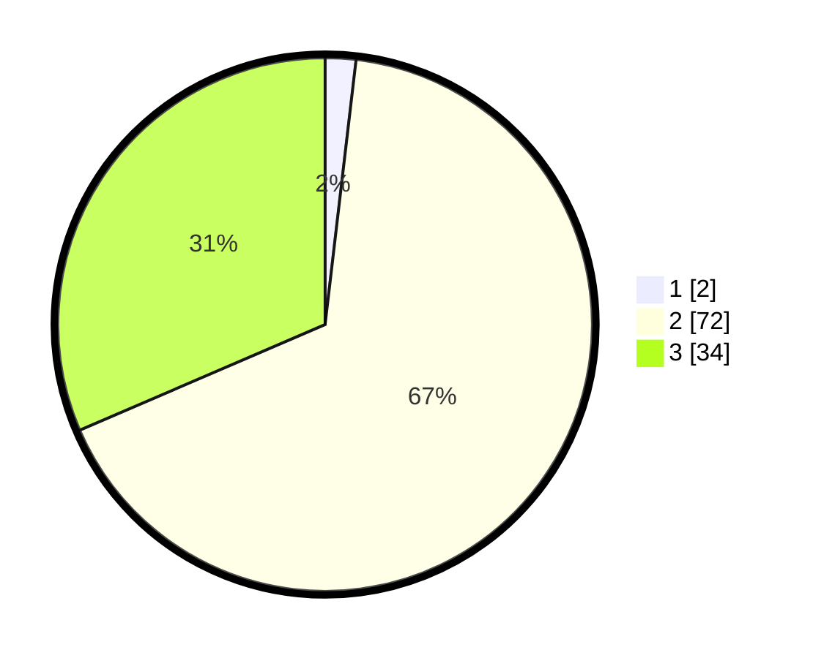

# Hasil

## Grafik

## Tabel

| No. | Nama Paslon    | Suara | Suara (raw) | Persentase |
|:--- |:-------------- | -----:| -----------:| ----------:|
| 1   | ANIES MUHAIMIN | 2     | [2][p-1]    | 1,85       |
| 2   | PRABOWO GIBRAN | 72    | [72][p-2]   | 66,67      |
| 3   | GANJAR MAHFUD  | 34    | [34][p-3]   | 31,48      |

[p-1]: https://github.com/gigit-pemilu/pemilu-2024-12-sumatera-utara/blob/main/pilpres/hitung-suara/sub/12-sumatera-utara/sub/14-nias-selatan/sub/20-huruna/sub/2015-sifaoroasi-huruna/sub/002-tps/sub/paslon-1.txt
[p-2]: https://github.com/gigit-pemilu/pemilu-2024-12-sumatera-utara/blob/main/pilpres/hitung-suara/sub/12-sumatera-utara/sub/14-nias-selatan/sub/20-huruna/sub/2015-sifaoroasi-huruna/sub/002-tps/sub/paslon-2.txt
[p-3]: https://github.com/gigit-pemilu/pemilu-2024-12-sumatera-utara/blob/main/pilpres/hitung-suara/sub/12-sumatera-utara/sub/14-nias-selatan/sub/20-huruna/sub/2015-sifaoroasi-huruna/sub/002-tps/sub/paslon-3.txt

## Foto C Plano

https://sirekap-obj-formc.kpu.go.id/ebd0/pemilu/ppwp/12/14/20/20/15/1214202015002-20240215-004847--31e347dc-ed7b-4438-b0f5-76568dfba7e1.jpg

https://sirekap-obj-formc.kpu.go.id/ebd0/pemilu/ppwp/12/14/20/20/15/1214202015002-20240215-005150--15eb19be-e32b-4874-acd2-11eefd30e518.jpg

https://sirekap-obj-formc.kpu.go.id/ebd0/pemilu/ppwp/12/14/20/20/15/1214202015002-20240215-005330--1d3ba9cd-84a4-420f-a235-d2efc52c083a.jpg

## Metadata

| Key        | Value               |
| ---------- | ------------------- |
| Time Stamp | 2024-02-20 12:00:00 |

