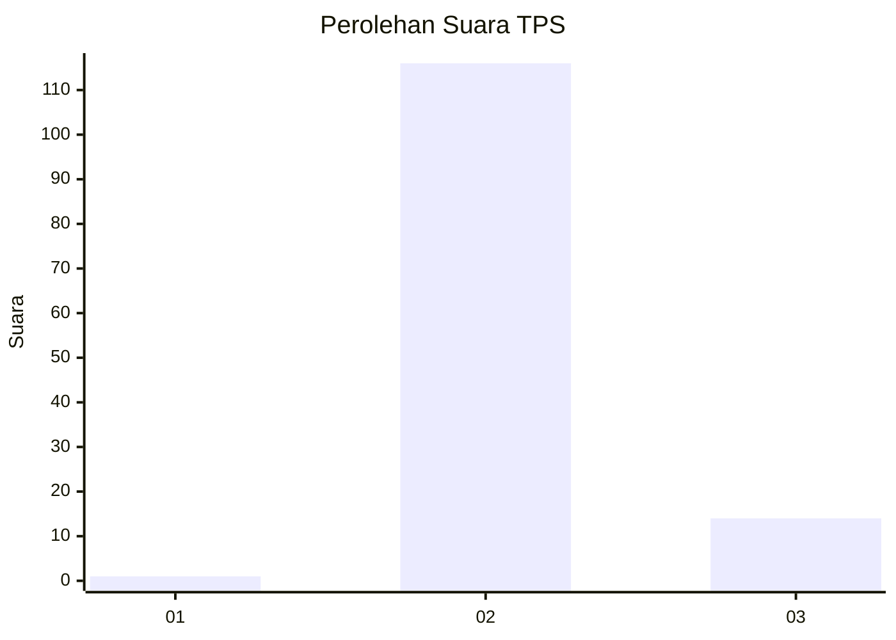
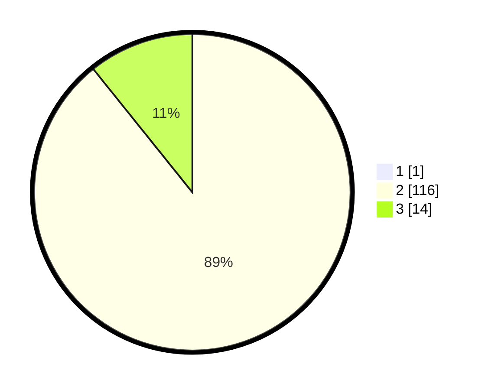

# Hasil

## Grafik

## Tabel

| No. | Nama Paslon    | Suara | Suara (raw) | Persentase |
|:--- |:-------------- | -----:| -----------:| ----------:|
| 1   | ANIES MUHAIMIN | 1     | [1][p-1]    | 0,76       |
| 2   | PRABOWO GIBRAN | 116   | [116][p-2]  | 88,55      |
| 3   | GANJAR MAHFUD  | 14    | [14][p-3]   | 10,69      |

[p-1]: https://github.com/gigit-pemilu/pemilu-2024/blob/main/pilpres/hitung-suara/sub/12-sumatera-utara/sub/14-nias-selatan/sub/21-o'o'u/sub/2003-simandraolo/sub/001-tps/sub/paslon-1.txt
[p-2]: https://github.com/gigit-pemilu/pemilu-2024/blob/main/pilpres/hitung-suara/sub/12-sumatera-utara/sub/14-nias-selatan/sub/21-o'o'u/sub/2003-simandraolo/sub/001-tps/sub/paslon-2.txt
[p-3]: https://github.com/gigit-pemilu/pemilu-2024/blob/main/pilpres/hitung-suara/sub/12-sumatera-utara/sub/14-nias-selatan/sub/21-o'o'u/sub/2003-simandraolo/sub/001-tps/sub/paslon-3.txt

## Foto C Plano

https://sirekap-obj-formc.kpu.go.id/ed34/pemilu/ppwp/12/14/21/20/03/1214212003001-20240215-010906--f51ed779-7155-46f8-8657-150186cfa88d.jpg

https://sirekap-obj-formc.kpu.go.id/ed34/pemilu/ppwp/12/14/21/20/03/1214212003001-20240215-011112--d260cda6-1fba-4656-8d4d-088f88d1dd1f.jpg

https://sirekap-obj-formc.kpu.go.id/ed34/pemilu/ppwp/12/14/21/20/03/1214212003001-20240215-011331--8a565321-b47d-4cb4-8c20-c6af5aa501aa.jpg

## Metadata

| Key        | Value               |
| ---------- | ------------------- |
| Time Stamp | 2024-02-15 23:29:50 |

