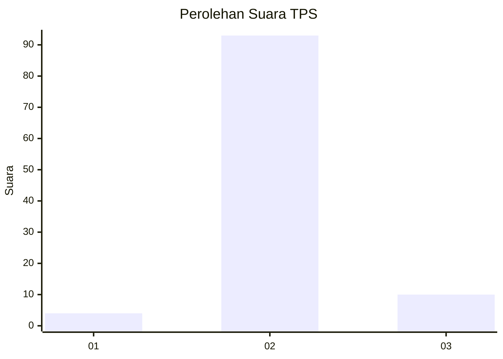
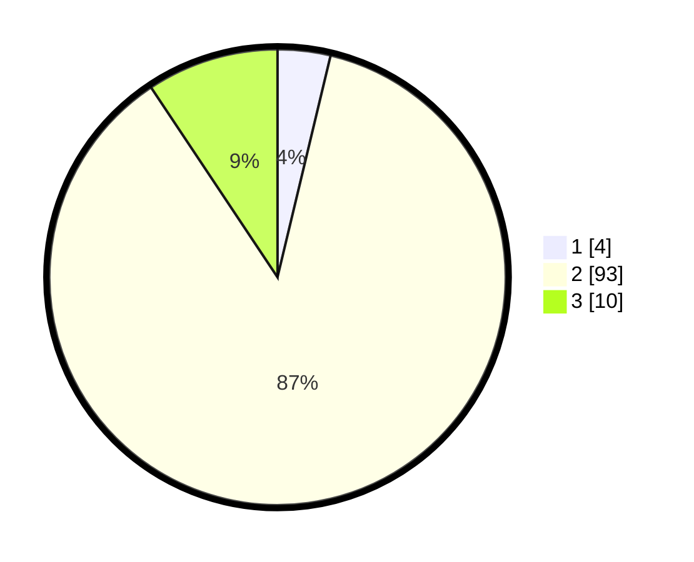

# Hasil

## Grafik

## Tabel

| No. | Nama Paslon    | Suara | Suara (raw) | Persentase |
|:--- |:-------------- | -----:| -----------:| ----------:|
| 1   | ANIES MUHAIMIN | 4     | [4][p-1]    | 3,74       |
| 2   | PRABOWO GIBRAN | 93    | [93][p-2]   | 86,92      |
| 3   | GANJAR MAHFUD  | 10    | [10][p-3]   | 9,35       |

[p-1]: https://github.com/gigit-pemilu/pemilu-2024-12-sumatera-utara/blob/main/pilpres/hitung-suara/sub/12-sumatera-utara/sub/14-nias-selatan/sub/21-o'o'u/sub/2003-simandraolo/sub/002-tps/sub/paslon-1.txt
[p-2]: https://github.com/gigit-pemilu/pemilu-2024-12-sumatera-utara/blob/main/pilpres/hitung-suara/sub/12-sumatera-utara/sub/14-nias-selatan/sub/21-o'o'u/sub/2003-simandraolo/sub/002-tps/sub/paslon-2.txt
[p-3]: https://github.com/gigit-pemilu/pemilu-2024-12-sumatera-utara/blob/main/pilpres/hitung-suara/sub/12-sumatera-utara/sub/14-nias-selatan/sub/21-o'o'u/sub/2003-simandraolo/sub/002-tps/sub/paslon-3.txt

## Foto C Plano

https://sirekap-obj-formc.kpu.go.id/dc62/pemilu/ppwp/12/14/21/20/03/1214212003002-20240215-011143--0972f04f-fafd-440b-9966-b8ca41fb801a.jpg

https://sirekap-obj-formc.kpu.go.id/dc62/pemilu/ppwp/12/14/21/20/03/1214212003002-20240215-010900--5c1a382a-569d-443e-b6e1-c1d8cd60e0b3.jpg

https://sirekap-obj-formc.kpu.go.id/dc62/pemilu/ppwp/12/14/21/20/03/1214212003002-20240215-011016--bef4f632-a3ff-43b2-bce4-3abdc32f4e41.jpg

## Metadata

| Key        | Value               |
| ---------- | ------------------- |
| Time Stamp | 2024-02-20 12:00:00 |

