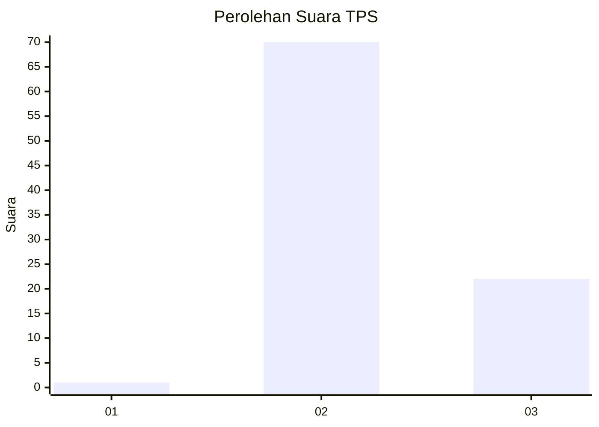
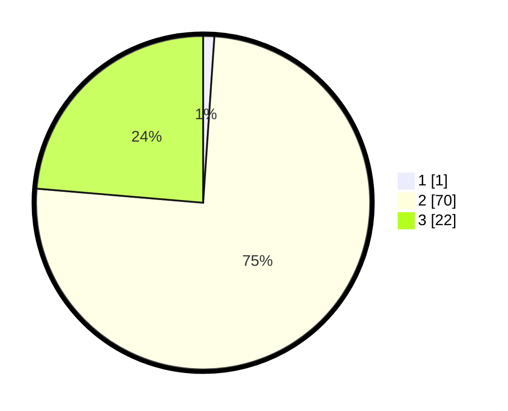

# Hasil

## Grafik

## Tabel

| No. | Nama Paslon    | Suara | Suara (raw) | Persentase |
|:--- |:-------------- | -----:| -----------:| ----------:|
| 1   | ANIES MUHAIMIN | 1     | [1][p-1]    | 1,08       |
| 2   | PRABOWO GIBRAN | 70    | [70][p-2]   | 75,27      |
| 3   | GANJAR MAHFUD  | 22    | [22][p-3]   | 23,66      |

[p-1]: https://github.com/gigit-pemilu/pemilu-2024-12-sumatera-utara/blob/main/pilpres/hitung-suara/sub/12-sumatera-utara/sub/14-nias-selatan/sub/21-o'o'u/sub/2003-simandraolo/sub/003-tps/sub/paslon-1.txt
[p-2]: https://github.com/gigit-pemilu/pemilu-2024-12-sumatera-utara/blob/main/pilpres/hitung-suara/sub/12-sumatera-utara/sub/14-nias-selatan/sub/21-o'o'u/sub/2003-simandraolo/sub/003-tps/sub/paslon-2.txt
[p-3]: https://github.com/gigit-pemilu/pemilu-2024-12-sumatera-utara/blob/main/pilpres/hitung-suara/sub/12-sumatera-utara/sub/14-nias-selatan/sub/21-o'o'u/sub/2003-simandraolo/sub/003-tps/sub/paslon-3.txt

## Foto C Plano

https://sirekap-obj-formc.kpu.go.id/bee7/pemilu/ppwp/12/14/21/20/03/1214212003003-20240215-011253--a0965172-af03-4ee9-b313-7654bd91d4b2.jpg

https://sirekap-obj-formc.kpu.go.id/bee7/pemilu/ppwp/12/14/21/20/03/1214212003003-20240215-011529--26a78b80-a0e1-4c87-9dba-c02c13180f34.jpg

https://sirekap-obj-formc.kpu.go.id/bee7/pemilu/ppwp/12/14/21/20/03/1214212003003-20240215-011712--527a36be-8931-4864-915d-587b67f4a927.jpg

## Metadata

| Key        | Value               |
| ---------- | ------------------- |
| Time Stamp | 2024-02-20 12:00:00 |

