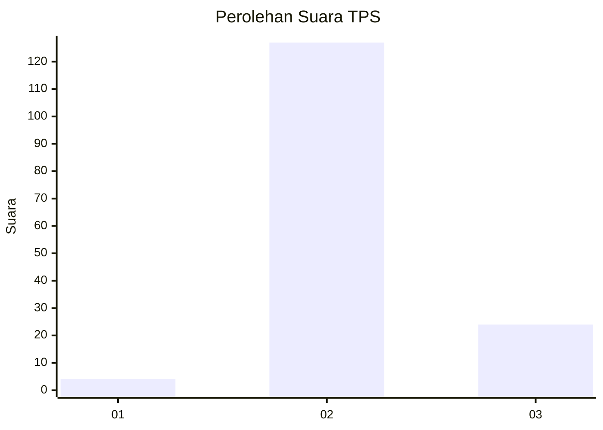

# Hasil

## Grafik

## Tabel

| No. | Nama Paslon    | Suara | Suara (raw) | Persentase |
|:--- |:-------------- | -----:| -----------:| ----------:|
| 1   | ANIES MUHAIMIN | 4     | [4][p-1]    | 2,58       |
| 2   | PRABOWO GIBRAN | 127   | [127][p-2]  | 81,94      |
| 3   | GANJAR MAHFUD  | 24    | [24][p-3]   | 15,48      |

[p-1]: https://github.com/gigit-pemilu/pemilu-2024/blob/main/pilpres/hitung-suara/sub/12-sumatera-utara/sub/14-nias-selatan/sub/21-o'o'u/sub/2004-bawosalo'o-bawoluo/sub/001-tps/sub/paslon-1.txt
[p-2]: https://github.com/gigit-pemilu/pemilu-2024/blob/main/pilpres/hitung-suara/sub/12-sumatera-utara/sub/14-nias-selatan/sub/21-o'o'u/sub/2004-bawosalo'o-bawoluo/sub/001-tps/sub/paslon-2.txt
[p-3]: https://github.com/gigit-pemilu/pemilu-2024/blob/main/pilpres/hitung-suara/sub/12-sumatera-utara/sub/14-nias-selatan/sub/21-o'o'u/sub/2004-bawosalo'o-bawoluo/sub/001-tps/sub/paslon-3.txt

## Foto C Plano

https://sirekap-obj-formc.kpu.go.id/75a7/pemilu/ppwp/12/14/21/20/04/1214212004001-20240215-120827--e687d831-4d50-44f9-8c7c-4d3a540ccca0.jpg

https://sirekap-obj-formc.kpu.go.id/75a7/pemilu/ppwp/12/14/21/20/04/1214212004001-20240215-120944--ad930db4-3a6d-4dfd-b652-2d26a99d8f1a.jpg

https://sirekap-obj-formc.kpu.go.id/75a7/pemilu/ppwp/12/14/21/20/04/1214212004001-20240215-121115--b3fce652-eac2-44ea-b628-bd46234e116b.jpg

## Metadata

| Key        | Value               |
| ---------- | ------------------- |
| Time Stamp | 2024-02-20 12:00:00 |

