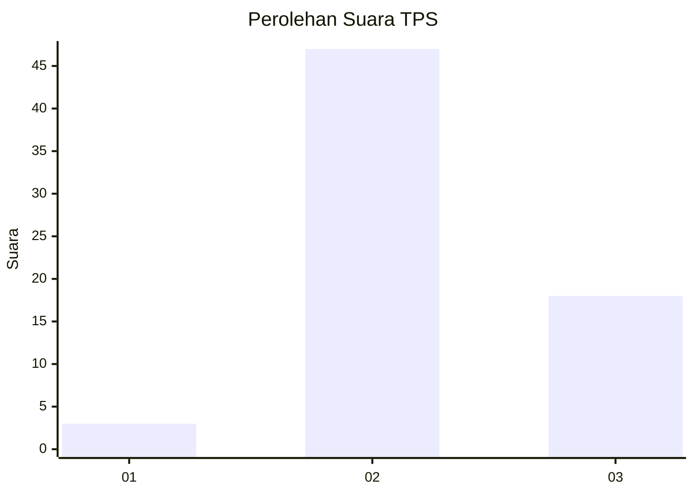
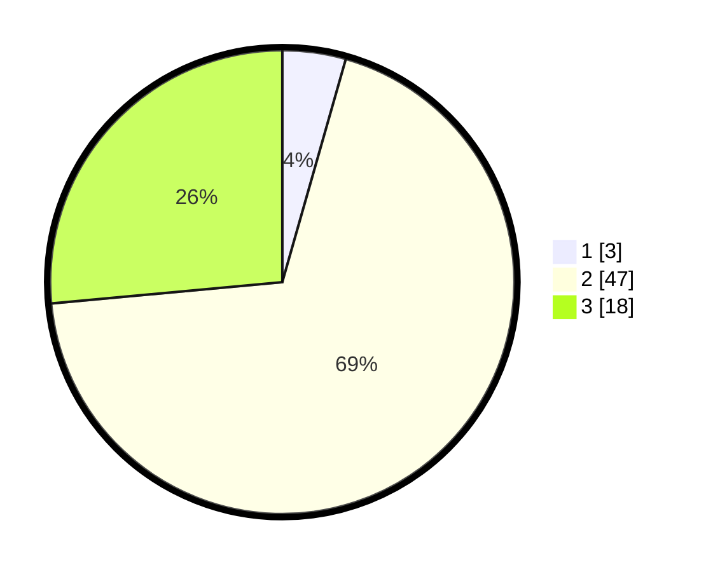

# Hasil

## Grafik

## Tabel

| No. | Nama Paslon    | Suara | Suara (raw) | Persentase |
|:--- |:-------------- | -----:| -----------:| ----------:|
| 1   | ANIES MUHAIMIN | 3     | [3][p-1]    | 4,41       |
| 2   | PRABOWO GIBRAN | 47    | [47][p-2]   | 69,12      |
| 3   | GANJAR MAHFUD  | 18    | [18][p-3]   | 26,47      |

[p-1]: https://github.com/gigit-pemilu/pemilu-2024/blob/main/pilpres/hitung-suara/sub/12-sumatera-utara/sub/14-nias-selatan/sub/21-o'o'u/sub/2004-bawosalo'o-bawoluo/sub/002-tps/sub/paslon-1.txt
[p-2]: https://github.com/gigit-pemilu/pemilu-2024/blob/main/pilpres/hitung-suara/sub/12-sumatera-utara/sub/14-nias-selatan/sub/21-o'o'u/sub/2004-bawosalo'o-bawoluo/sub/002-tps/sub/paslon-2.txt
[p-3]: https://github.com/gigit-pemilu/pemilu-2024/blob/main/pilpres/hitung-suara/sub/12-sumatera-utara/sub/14-nias-selatan/sub/21-o'o'u/sub/2004-bawosalo'o-bawoluo/sub/002-tps/sub/paslon-3.txt

## Foto C Plano

https://sirekap-obj-formc.kpu.go.id/39b6/pemilu/ppwp/12/14/21/20/04/1214212004002-20240215-095719--ede57052-4dd4-49ad-a820-344d4c678159.jpg

https://sirekap-obj-formc.kpu.go.id/39b6/pemilu/ppwp/12/14/21/20/04/1214212004002-20240215-095903--bdf78e4e-6b22-45c9-b414-c5c57320a1d7.jpg

https://sirekap-obj-formc.kpu.go.id/39b6/pemilu/ppwp/12/14/21/20/04/1214212004002-20240215-100036--95fe00f5-170e-4799-aa4c-8b80468ba036.jpg

## Metadata

| Key        | Value               |
| ---------- | ------------------- |
| Time Stamp | 2024-02-15 22:00:27 |

