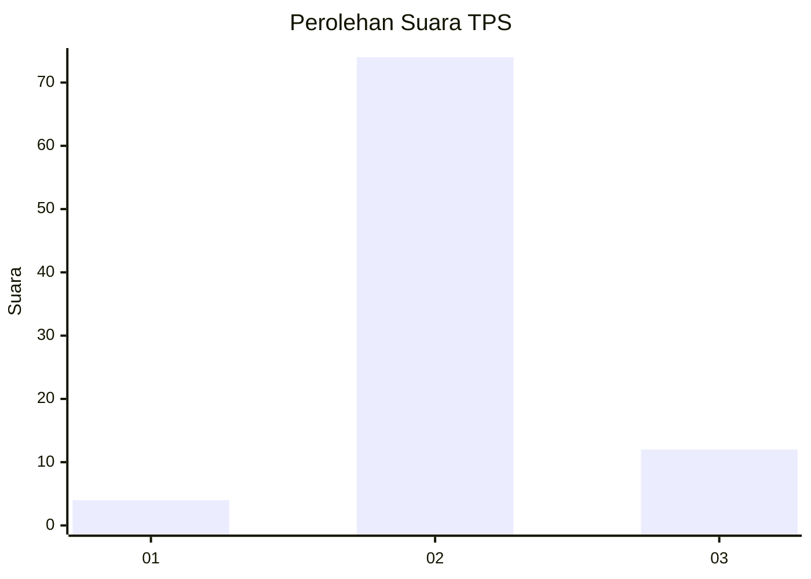
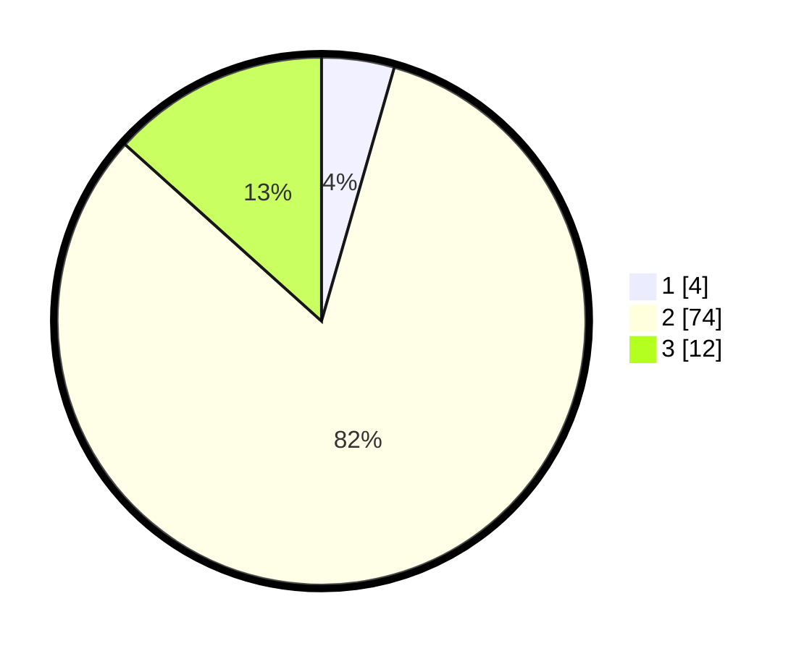

# Hasil

## Grafik

## Tabel

| No. | Nama Paslon    | Suara | Suara (raw) | Persentase |
|:--- |:-------------- | -----:| -----------:| ----------:|
| 1   | ANIES MUHAIMIN | 4     | [4][p-1]    | 4,44       |
| 2   | PRABOWO GIBRAN | 74    | [74][p-2]   | 82,22      |
| 3   | GANJAR MAHFUD  | 12    | [12][p-3]   | 13,33      |

[p-1]: https://github.com/gigit-pemilu/pemilu-2024-12-sumatera-utara/blob/main/pilpres/hitung-suara/sub/12-sumatera-utara/sub/14-nias-selatan/sub/21-o'o'u/sub/2006-simandraolo-o'o'u/sub/002-tps/sub/paslon-1.txt
[p-2]: https://github.com/gigit-pemilu/pemilu-2024-12-sumatera-utara/blob/main/pilpres/hitung-suara/sub/12-sumatera-utara/sub/14-nias-selatan/sub/21-o'o'u/sub/2006-simandraolo-o'o'u/sub/002-tps/sub/paslon-2.txt
[p-3]: https://github.com/gigit-pemilu/pemilu-2024-12-sumatera-utara/blob/main/pilpres/hitung-suara/sub/12-sumatera-utara/sub/14-nias-selatan/sub/21-o'o'u/sub/2006-simandraolo-o'o'u/sub/002-tps/sub/paslon-3.txt

## Foto C Plano

https://sirekap-obj-formc.kpu.go.id/e1bc/pemilu/ppwp/12/14/21/20/06/1214212006002-20240215-101846--e7500579-0407-429f-93e2-b782a1a2d669.jpg

https://sirekap-obj-formc.kpu.go.id/e1bc/pemilu/ppwp/12/14/21/20/06/1214212006002-20240215-101909--bf82bf5a-4021-467e-88a9-fe48ab8ed7dd.jpg

https://sirekap-obj-formc.kpu.go.id/e1bc/pemilu/ppwp/12/14/21/20/06/1214212006002-20240215-101938--e3bcbef0-9f79-495f-ad27-e808569ba25d.jpg

## Metadata

| Key        | Value               |
| ---------- | ------------------- |
| Time Stamp | 2024-02-20 12:00:00 |

