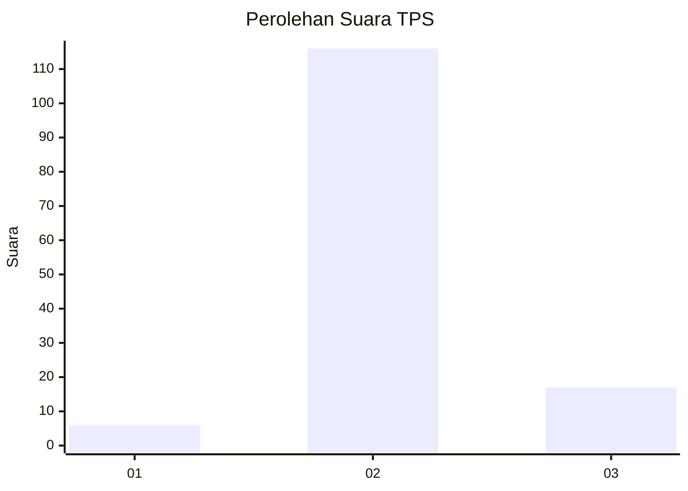
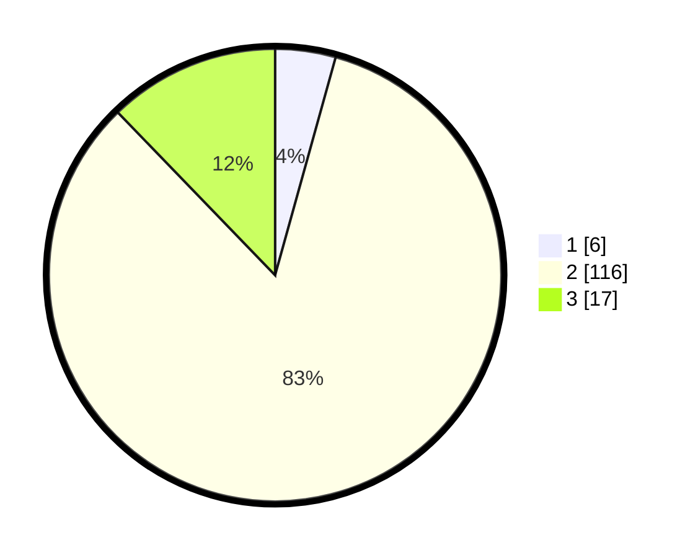

# Hasil

## Grafik

## Tabel

| No. | Nama Paslon    | Suara | Suara (raw) | Persentase |
|:--- |:-------------- | -----:| -----------:| ----------:|
| 1   | ANIES MUHAIMIN | 6     | [6][p-1]    | 4,32       |
| 2   | PRABOWO GIBRAN | 116   | [116][p-2]  | 83,45      |
| 3   | GANJAR MAHFUD  | 17    | [17][p-3]   | 12,23      |

[p-1]: https://github.com/gigit-pemilu/pemilu-2024-12-sumatera-utara/blob/main/pilpres/hitung-suara/sub/12-sumatera-utara/sub/14-nias-selatan/sub/21-o'o'u/sub/2010-hilinamazihono-moale/sub/002-tps/sub/paslon-1.txt
[p-2]: https://github.com/gigit-pemilu/pemilu-2024-12-sumatera-utara/blob/main/pilpres/hitung-suara/sub/12-sumatera-utara/sub/14-nias-selatan/sub/21-o'o'u/sub/2010-hilinamazihono-moale/sub/002-tps/sub/paslon-2.txt
[p-3]: https://github.com/gigit-pemilu/pemilu-2024-12-sumatera-utara/blob/main/pilpres/hitung-suara/sub/12-sumatera-utara/sub/14-nias-selatan/sub/21-o'o'u/sub/2010-hilinamazihono-moale/sub/002-tps/sub/paslon-3.txt

## Foto C Plano

https://sirekap-obj-formc.kpu.go.id/547f/pemilu/ppwp/12/14/21/20/10/1214212010002-20240214-213040--433e33b5-90a8-4b41-924c-364c653869a2.jpg

https://sirekap-obj-formc.kpu.go.id/547f/pemilu/ppwp/12/14/21/20/10/1214212010002-20240214-214010--97f15846-2502-4550-96c4-5469478dced8.jpg

https://sirekap-obj-formc.kpu.go.id/547f/pemilu/ppwp/12/14/21/20/10/1214212010002-20240214-214113--153689ef-0056-4e6a-91d3-98bfe01780da.jpg

## Metadata

| Key        | Value               |
| ---------- | ------------------- |
| Time Stamp | 2024-02-15 22:30:27 |

