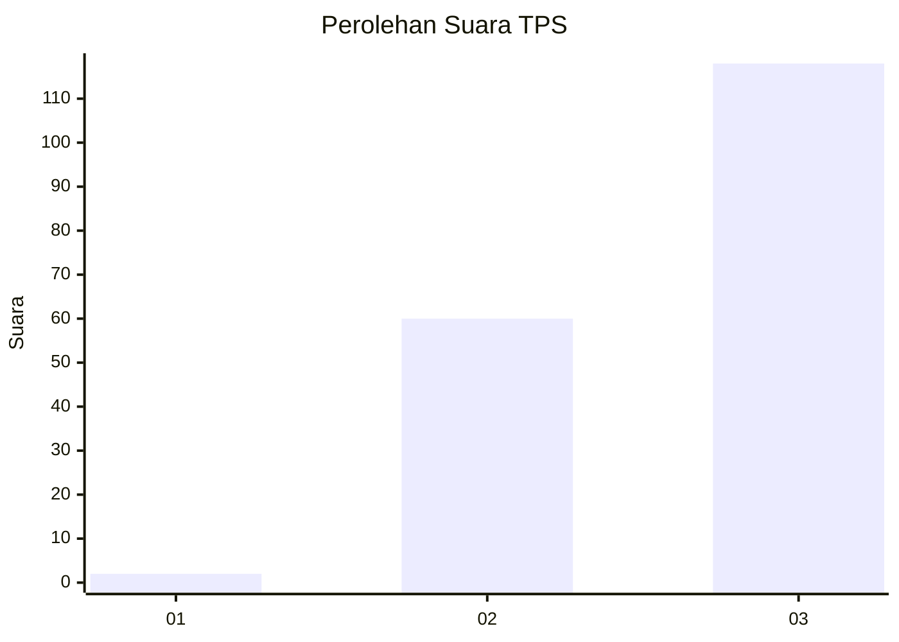
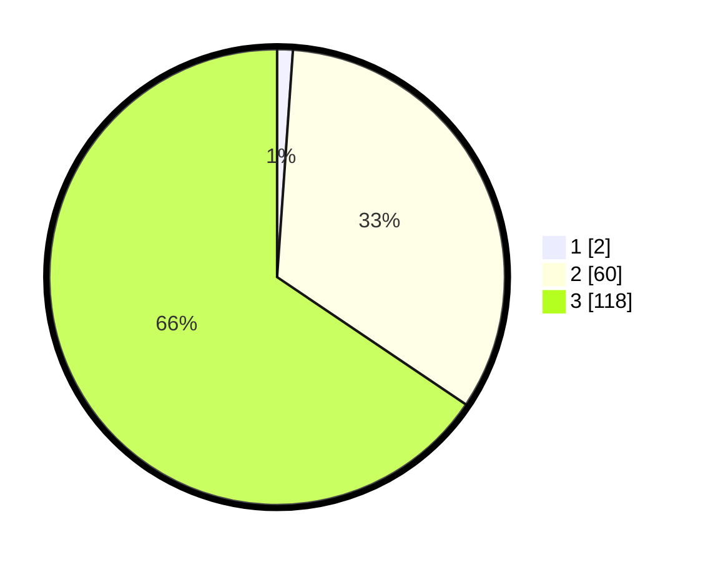

# Hasil

## Grafik

## Tabel

| No. | Nama Paslon    | Suara | Suara (raw) | Persentase |
|:--- |:-------------- | -----:| -----------:| ----------:|
| 1   | ANIES MUHAIMIN | 2     | [2][p-1]    | 1,11       |
| 2   | PRABOWO GIBRAN | 60    | [60][p-2]   | 33,33      |
| 3   | GANJAR MAHFUD  | 118   | [118][p-3]  | 65,56      |

[p-1]: https://github.com/gigit-pemilu/pemilu-2024/blob/main/pilpres/hitung-suara/sub/12-sumatera-utara/sub/14-nias-selatan/sub/22-onohazumba/sub/2001-fadoro-ewo/sub/001-tps/sub/paslon-1.txt
[p-2]: https://github.com/gigit-pemilu/pemilu-2024/blob/main/pilpres/hitung-suara/sub/12-sumatera-utara/sub/14-nias-selatan/sub/22-onohazumba/sub/2001-fadoro-ewo/sub/001-tps/sub/paslon-2.txt
[p-3]: https://github.com/gigit-pemilu/pemilu-2024/blob/main/pilpres/hitung-suara/sub/12-sumatera-utara/sub/14-nias-selatan/sub/22-onohazumba/sub/2001-fadoro-ewo/sub/001-tps/sub/paslon-3.txt

## Foto C Plano

https://sirekap-obj-formc.kpu.go.id/0c03/pemilu/ppwp/12/14/22/20/01/1214222001001-20240215-183511--cfd280e6-cde8-4072-806e-3d85aae4fc0e.jpg

https://sirekap-obj-formc.kpu.go.id/0c03/pemilu/ppwp/12/14/22/20/01/1214222001001-20240215-174100--f5ccea9f-2ffb-4bd9-9b7a-b591094a8baf.jpg

https://sirekap-obj-formc.kpu.go.id/0c03/pemilu/ppwp/12/14/22/20/01/1214222001001-20240215-174158--daad7f3c-b6b4-443d-b989-5d65e3bf4b5b.jpg

## Metadata

| Key        | Value               |
| ---------- | ------------------- |
| Time Stamp | 2024-02-20 12:00:00 |

