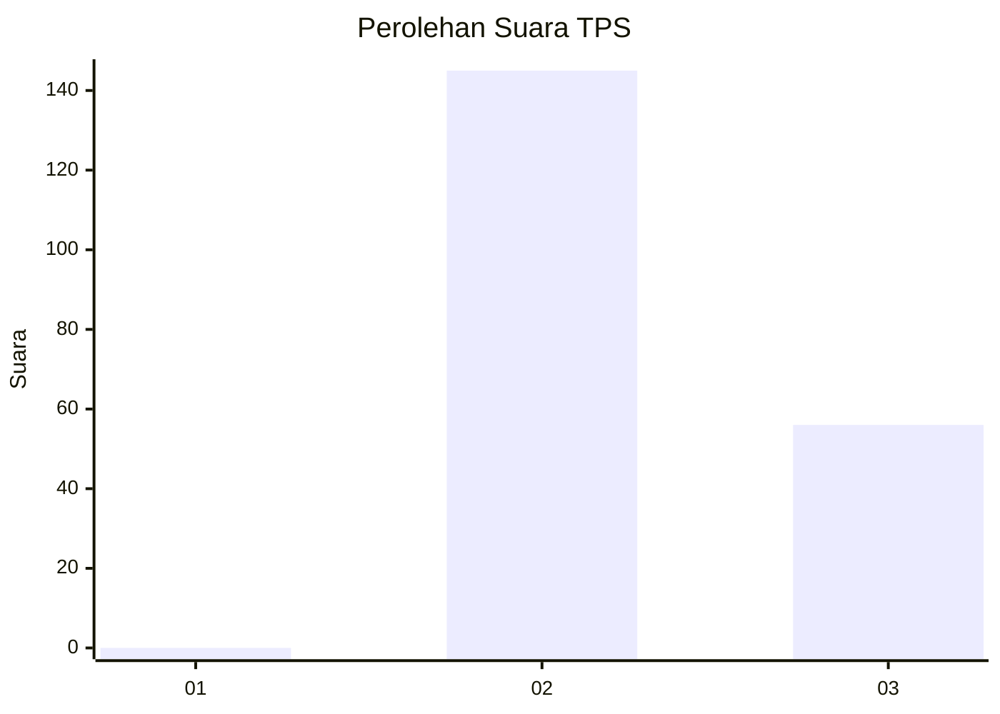
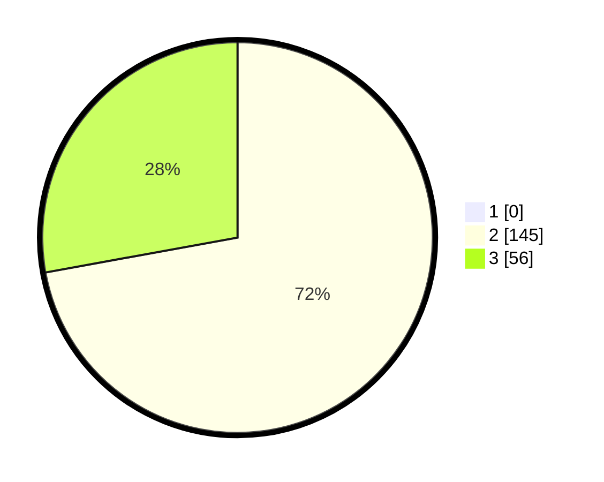

# Hasil

## Grafik

## Tabel

| No. | Nama Paslon    | Suara | Suara (raw) | Persentase |
|:--- |:-------------- | -----:| -----------:| ----------:|
| 1   | ANIES MUHAIMIN | 0     | [0][p-1]    | 0,00       |
| 2   | PRABOWO GIBRAN | 145   | [145][p-2]  | 72,14      |
| 3   | GANJAR MAHFUD  | 56    | [56][p-3]   | 27,86      |

[p-1]: https://github.com/gigit-pemilu/pemilu-2024-12-sumatera-utara/blob/main/pilpres/hitung-suara/sub/12-sumatera-utara/sub/14-nias-selatan/sub/22-onohazumba/sub/2001-fadoro-ewo/sub/002-tps/sub/paslon-1.txt
[p-2]: https://github.com/gigit-pemilu/pemilu-2024-12-sumatera-utara/blob/main/pilpres/hitung-suara/sub/12-sumatera-utara/sub/14-nias-selatan/sub/22-onohazumba/sub/2001-fadoro-ewo/sub/002-tps/sub/paslon-2.txt
[p-3]: https://github.com/gigit-pemilu/pemilu-2024-12-sumatera-utara/blob/main/pilpres/hitung-suara/sub/12-sumatera-utara/sub/14-nias-selatan/sub/22-onohazumba/sub/2001-fadoro-ewo/sub/002-tps/sub/paslon-3.txt

## Foto C Plano

https://sirekap-obj-formc.kpu.go.id/9eee/pemilu/ppwp/12/14/22/20/01/1214222001002-20240215-115241--4206def5-9991-4598-adf9-f5e9235a4bdf.jpg

https://sirekap-obj-formc.kpu.go.id/9eee/pemilu/ppwp/12/14/22/20/01/1214222001002-20240215-115519--e11dc9fc-bd75-4a75-8146-256b33a1770e.jpg

https://sirekap-obj-formc.kpu.go.id/9eee/pemilu/ppwp/12/14/22/20/01/1214222001002-20240215-115622--44cb6963-5929-4f12-a052-98912a9415bf.jpg

## Metadata

| Key        | Value               |
| ---------- | ------------------- |
| Time Stamp | 2024-02-15 22:30:27 |

